## 引言  

2 个月前初次体验了 syslab，感觉很多地方不完善，于是向官方提了一些建议，大概是如下内容

* 没有 linux 版本
* 数据文件强制要求装在 D 盘，实际上蛮多人已经不分区了，不太友好
* 开箱即用体验不咋地

这次更新幅度挺大，所以又有了体验一下的兴趣。

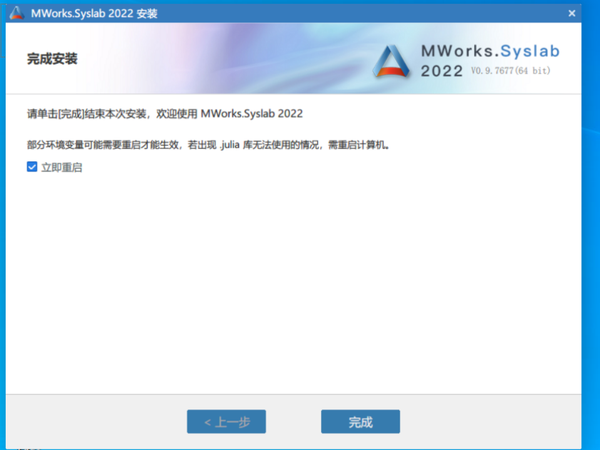

经过测试，安装的时候已经不需要存在 D 盘，而是直接装在了 C 盘（笑哭），单分区党可以使用了。Linux 版根据官方说法是需要向客服咨询，我认为可能是功能不完善或者出于商业的考虑，暂时不体验 Linux 版。我的系统上已经有了一套 julia 环境，为了防止冲突，我使用 win10 虚拟机进行体验。

## 体验

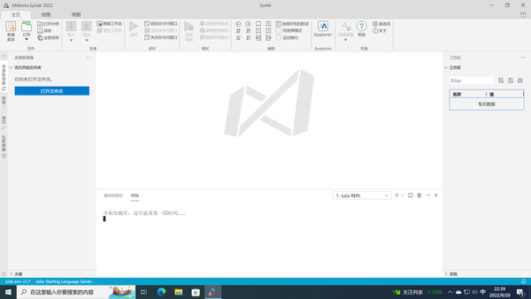

启动界面如图所示，跟之前没有什么区别，但是加载速度比之前版本快了很多倍，之前版本我在实机都需要 10 分钟初始化，新版 2 分钟不到就完成了，第二次启动只需要不到 1 分钟就可以加载好所有的库和 LSP。由于基于 vscode 修改，可以安装 vscode 插件，所以上面的主题也可以自行搜刮，先搞个 one dark pro。

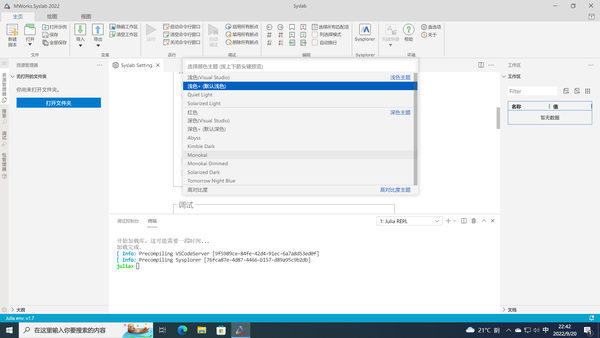  

自带了一些主题，也可以自行下载别的主题

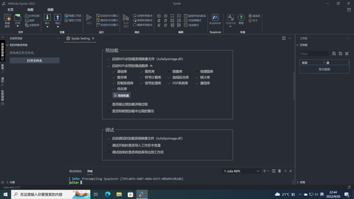  

前版本的预加载需要手动修改 `perloaded.jl` 文件，现在直接勾选即可，点击高级配置也可以跳转到 `perloaded.jl` 修改界面。

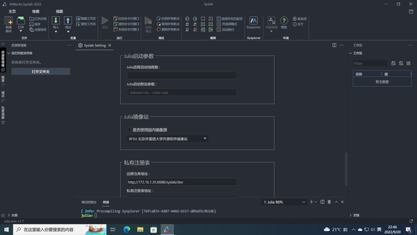  
可以切换镜像站和配置启动参数，再也不需要 `julia -t 5 XXX.jl` 了。

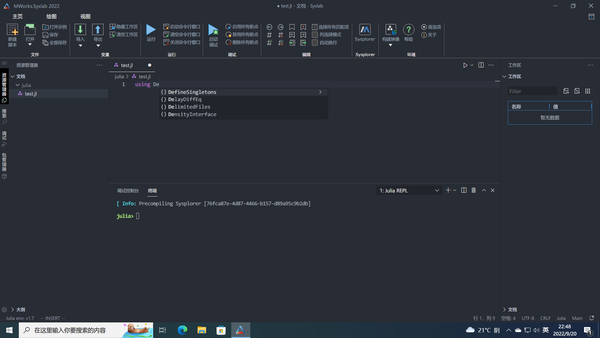  
自动补全功能正常，无需任何配置，开箱即用，但我感觉有点延迟，没有我用 vscode ssh 到 arch 虚拟机流畅，可能是虚拟机或者 windows 的原因。

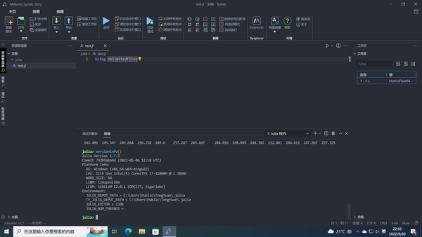  
julia 版本为 1.7.3，比最新的落后一个版本，不知道能不能升级。

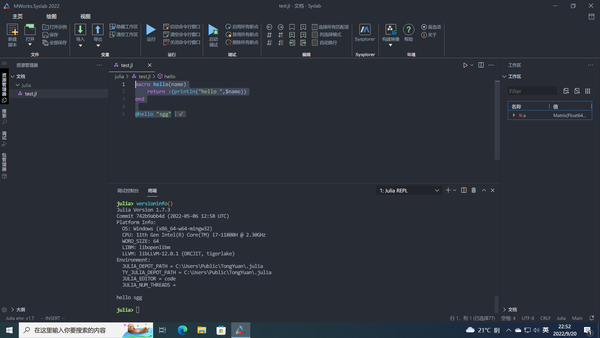  
先整个 hello 看看，没有问题。

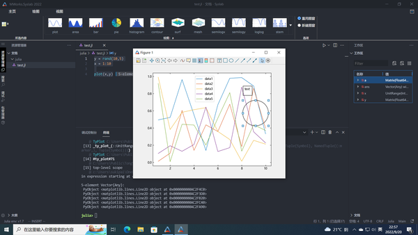  
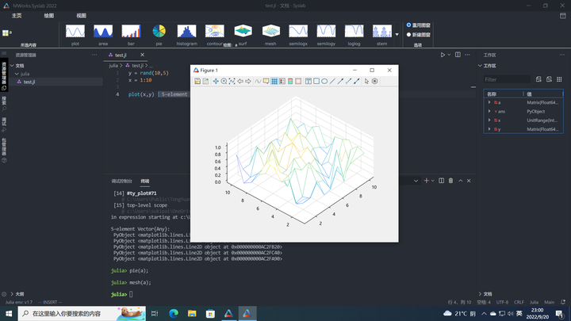  

绘图功能还挺方便的，还可以对图进行各种操作，有点 matlab 那味了。用原生 julia 的话需要添加 Plots 库才有这些功能，并且可视化功能较差。

julia 的调试功能我一直不太会用，这里就不说明了。下面是一些其他功能的展示

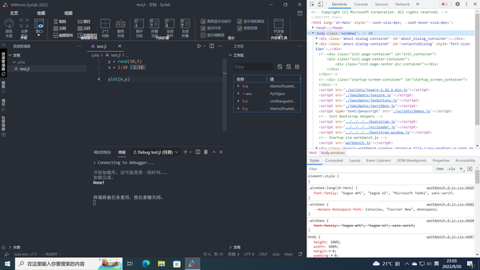  

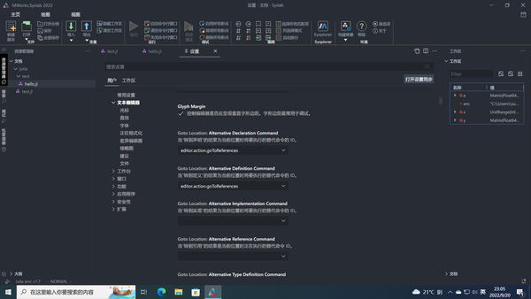  

设置界面，你会用 vscode 就会用这个，上手门槛 0

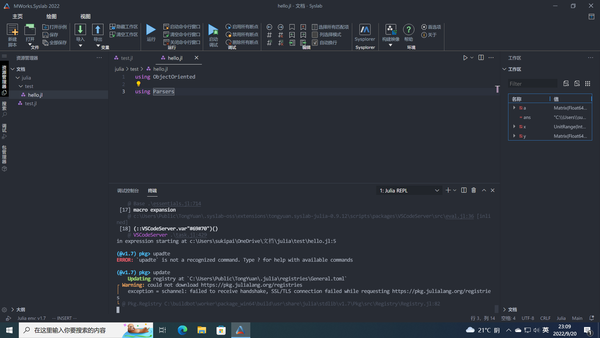  
  
升级包，卡了有一阵子，原因是无法联网，需要在设置里面换源，换源之后一切正常，不过我发现原本有的同元自己的库没有了，只剩了中科大源，清华源等。我觉得这样挺好，能够更好的接轨 julia 自身的生态。

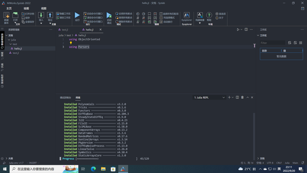

可以看到自带的软件包比较丰富，并行计算，绘图，python 调用都已经支持，无需额外做过多配置，这一点挺好的，但是，有几个包编译失败了，也许，不升级才是更好的选择。

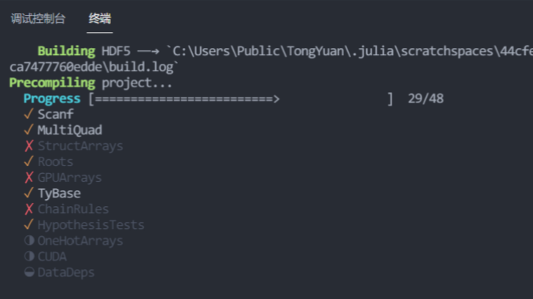  
  
emmm，升级之后好像出现了一些问题，建议开箱即用不要升级。

下面来跑一个 CART 试试，先添加 DecisionTree、DataFrames 库，还有 MLBase 库等。

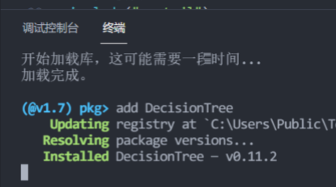

然后使用编写好的 CART 代码进行测试，一顿操作猛如虎，终于跑起来了

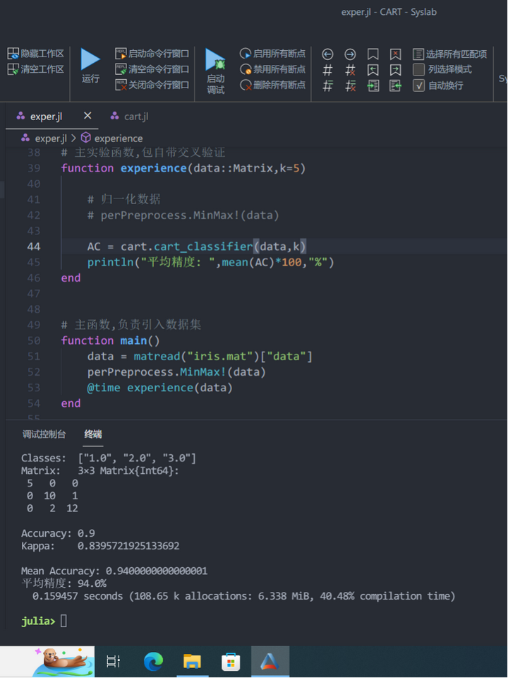

可以看到混淆矩阵和分类精度等信息。

## 总结

### 优点

1. 相比之前的版本进步很大（只针对 syslab），可以算是市面上最好的 Julia IDE 了，弥补了这方面的空缺。我尝试过多种 Julia 编辑方式，其中体验好的只有 vscode 和 neovim，编写非常舒适。但是他们的配置都挺复杂的，而且，vscode 具有通用性，插件装多了还挺慢的，neovim 对于图形的显示不太友好，必须用文件浏览器查看，所以，在此之前我都选择用 vscode remote 我的虚拟机使用，体验尚可（linux 编译速度比 windows 快很多）。而 syslab 我认为完全可以当做一款 IDE 使用了，无需配置开箱即用，希望能促进新人入坑。
2. 相比 matlab，功能方面还有很大的欠缺（toolbox 等），加载速度不及 matlab，但颜值和编辑器完爆 matlab。vscode 的主题可以提供多样的 UI 样式，vim 插件等可以提供多样的输入方式，matlab 则较为固定，只提供了一套 emacs 的快捷键。（但是，我觉得 syslab 右边的工作区真挺丑的，希望改改。。。）

### 缺点

1. 加载速度真的慢，不过这有 julia 语言本身的原因，估计是没办法了。
2. 较为重量级，安装的时候就把所有模块都安装了，但实际上很多是挺冗余的，如果能像 matlab 那样选模块装就好了。考虑到还要和其他产品联动，估计也有点困难（安装配置好后 6.5G，暂时也不需要考虑这个问题）。
3. 没有提供 julia 版本升级的方式，估计他的本意是安装即用，并不考虑升级包什么的。

体验得比较草率。。。总之，对于懒人而言，我觉得 syslab 是目前最好的 IDE，直接上手就行，对于爱折腾的或者硬盘空间吃紧的，这个软件并不是一个好的选择。目前这款软件替代 matlab 的希望为 0，但是单纯的把它看成一个 julia 的 IDE 的话，是非常优秀的，你值得拥有。