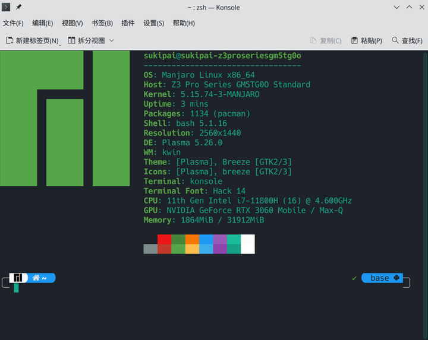
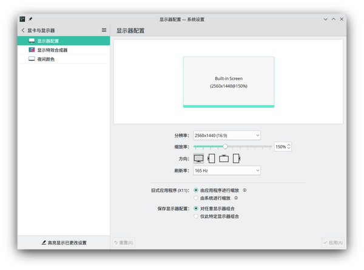
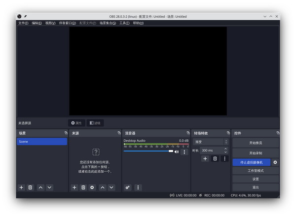

虽然标题被我改成这样，但我仍然不建议主力机使用 linux, 除非你一定不会使用以下功能之一：

* MSOffice
* onedrive
* 重度依赖 QQ 和微信
* 一些专用工业软件
* 公司独有软件
* iTunes
* visual studio 等
* 钉钉（视频分享模糊，其他功能正常）

以下用户请慎重使用 wayland，说不定会让你直接放弃 linux

* 使用 nvidia 单显卡

我的主力机体验了一下就回 win11 了，现在配的垃圾台式（e3 1230 + rx580）还坚持着 arch，用着还挺爽。

---

**2022 年 10 月 23 日更新一波**，之前因为一些软件用不了，我又回到了 win11，还小小的升级了一波配置（从 i7+3050 成为了 i7 加 3060）但是有些操作在 win 下面还是不太方便，于是我又把 linux 装上了，这次为了省事装的 manjaro，然后把源换成了 arch 的，但是，问题太多（我太天真了），最后还是换回了 arch




我的配置（开了独显直连）

经过几个月的发展，wayland 又取得了一些进步，我觉得离取代 xorg 只剩最后一步了（**Electron 输入法问题**）。

## nvidia 显卡的配置（intel 和 AMD 显卡无需配置）  
5.18 及之后的内核需要在内核启动参数中添加 ibt=off，才可以启动成功

### nvidia 单显卡（包括开启独显直连的情况）  
如果不开独显直连，那安装很简单，开了的话会复杂一点，类似于 nvidia 主机装 wayland.


```
GBM_BACKEND=nvidia-drm
__GLX_VENDOR_LIBRARY_NAME=nvidia
```

需要把这两行添加到 `/etc/profile` 中，然后修改内核 `/etc/defualt/grub`

也就是在这一行后面添加 `nvidia-drm.modeset=1`，也可以启动的时候添加，但每次都需要操作，麻烦，改完之后如下：


```
GRUB_CMDLINE_LINUX_DEFAULT="quiet udev.log_priority=3 nvidia-drm.modeset=1"
```

然后使用 `update-grub`（没有的话 AUR 安装）命令更新 grub，重启就可以使用 wayland-session 了，如果没有这个命令，或者直接

```
sudo grub-mkconfig -o /boot/grub/grub.cfg
```

## 也可以直接修改 /boot/grub/grub.cfg 文件，不过不太安全，慎用。  
### I+N 双显卡（笔记本推荐方案）  
在不做专门配置的情况下，默认使用了 intel 核显，在有需要的时候通过 `prime-run` 调用独显，因此不用过多的配置。但在 5.18 之后的内核仍然需要禁用 ibt。

笔记本推荐使用双显卡，主要是因为 nvidia 对 wayland 支持实在太差，当然，如果你使用 x11，那么开独显直连也不错。

## 缩放功能的改进  
这个改进是 KDE 做的，因此只适用于 KDE，并且版本必须高于 5.26.

之前有说到，xwayland 应用在 wayland 缩放下面会很糊，这是由于 xwayland 的缩放策略是直接按比例放大所导致的，而我之前给出的解决方案是**不缩放 wayland，而是使用大字体曲线救国**，xwayland 应用在内部单独缩放。这样做能解决一些问题，但也带来了一些问题，例如不美观等。而 KDE5.26 提供了**x 应用单独缩放**的功能，

 

可以看到 x11 应用可以单独走自身的缩放，经过测试，这个功能非常好。electron 应用对 wayland 支持较差，主要表现在中文输入法无法使用（目前无解），也就是说，在以前，你必须二选一：不缩放，使用 xwayland，拥有输入法功能；缩放，使用 wayland 后端，但输入法无了，只能用剪切板。而现在，你可以使用 xwayland 二者得兼。

经过测试，**edge、vscode、vscode-insider 完全正常**，无模糊现象。

而其他平台对 wayland 支持越来越好，奇怪的问题或许会少很多。

### 一个小小的猜想  
之前有提到，我在双显卡模式下，无法外接显示器，这是因为 HDMI 和 TypeC 接口都是连接在 nvidia 显卡上导致的，因此，无法独显直连的笔记本修改了 nvidia 后端和 grub 之后，或许可以使用外接屏（纯猜想，我就不折腾了）

现在的 linux 发行版对于 wayland 的支持都做得还算不错了，但是有些问题还是需要自己解决，所以很想写一篇体验文 + 排坑文。

我所使用的桌面环境为 plasma 5.25 版本，从 X11 切换到 wayland 十分方便

```bash
pacman -S plasma-wayland-session plasma-wayland-protocols qt5-wayland qt6-wayland xorg-xwayland
```
装上这些个玩意之后，就可以在 sddm 中看见 plasma(wayland) 选项，选择之后就可以进入 wayland 的 kde.

从 设置 - 关于本系统 中可以看到图形平台为 **wayland**.

## wayland 的优点  
整体动画和特效很惊艳，没有了 X11 那种山寨的感觉，纯 wayland 环境下完全没有屏幕撕裂，实时帧率远高于 X11 环境（gnome 尤其明显，kde 不仔细感受倒是看不出来）。

## wayland 的缺点  
* 软件兼容性一般，许多应用还没有做适配，实际是跑在 xwayland 上面的。
* wine 兼容性不太好，wine-qq 容易出现拖影和花屏的情况（无解）。
* 报废了绝大多数录屏和截图软件，必须寻找**适配 wayland**的（建议 spectacle 和 obs-studio）。
* 不能全局缩放，会导致字体模糊发虚，没找到解决方法，但是在一些应用中，可以手动指定启动参数，使应用单独缩放，并且字体不会发虚（KDE5.26 已经解决）。
* 不再是 Client-Server 模式，天生远程功能差（可以用 wayvnc）。

整体来看，kde 在 wayland 下表现非常好，用作日常使用完全没有问题，但是最好在一开始，就先解决一些问题。

## 界面字体太小（以解决，安装 KDE5.26 即可）  
X11 下往往通过全局缩放来解决，但 wayland 下我们只能退而求其次，通过修改字体大小来解决。

根据我测试，字体修改之后，UI 也被跟着一起修改了，不会出现奇怪的视觉效果，体验还不错（比起发虚）。

设置 - 外观 - 字体

将字号调大为之前的 n 倍即可

然后在 edge、chrome、vscode 等 electron 软件中单独设置界面缩放。

## Alacritty 无法显示输入法  
我使用 Alacritty 终端，在 wayland 下只能输入英文，所以我们用 X 启动它，在 /usr/share/applications/Alacritty.desktop 中修改带 Exec 的行为

```
  3 TryExec=env WINIT_UNIX_BACKEND=x11 alacritty
  4 Exec=env WINIT_UNIX_BACKEND=x11 alacritty
```
即可解决输入问题，其他终端类似。

也可以更换支持 xwayland 和 wayland 的终端，例如 electerm 和 konsole，但这个软件性能太差，不推荐使用。

7 月 22 日：我用回了 kde 自带的 konsole，慢点就慢点吧，还算好用。。。。

## wechat-uos 字体太小  
electron 应用大多数默认跑在 xwayland，**无法通过全局缩放方式解决（除非你能忍受字体发虚）在 KDE 中，已经不存在这个问题，x 应用能够单独设置缩放，绝对是个划时代功能。**

修改 /usr/share/applications/wechat-uos.desktop 中的 Exec 行

```
  3 Exec=wechat-uos --force-device-scale-factor=1.5 %U
```
可以缩放为之前的 1.5 倍

部分软件可以实现缩放（**迅雷**也可以），部分不行（例如 steam），感觉基于 electron 开发的大多数都可行。

我们也可以指定参数跑在 wayland 上（后文）


6 月 20 日更新

## steam 游戏问题  
steam 上的一些游戏是支持 wayland 的，但也有个别不支持，比如 dota2

steam 允许为每个游戏单独指定运行环境

右键 dota2-属性 - 启动选项

填入

```
SDL_VIDEODRIVER=x11 prime-run %COMMAND% -perfectworld
```
SDL\_VIDEODRIVER=x11：以 x11 运行游戏

prime-run：使用独显运行（仅限 nvidia 双显卡，**独显直连无需操作**）

%COMMAND% （启动命令）

-perfectworld（进入国服）

进入游戏之后没有自动全屏，需要根据你的快捷键设置（我是 F11）手动全屏

### 题外话  
steam 本身也是不支持 wayland 的，他本身就跑在 xwayland 上

启动 steam 后输入命令


```
xlsclients -a
```
可以看到输出有：


```
<user>  electron
<user>  microsoft-edge
<user>  steam
```
steam、edge 和 icalingua++（就是那个 electron）都是跑在 xwayland 上的，wechat-uos 也是跑在 xwayland 上。

### steam 的缩放功能  
steam 无法使用系统的缩放比例，但它本身是可以缩放的，在 steam.desktop 文件的 Exec 行添加


```
GDK_SCALE=2
```
就可以进行 2 倍缩放，目前只支持两倍，所以 1080p 的用户就忍忍吧，2k 可以 2 倍没有问题

## 将 electron 应用跑在 wayland 上  
很简单，加参数就行，仍然以 wechat-uos 为例


```bash
sudo vim /usr/share/applications/wechat-uos.desktop
```

### 启动选项修改为  

```
Exec=wechat-uos --enable-features=UseOzonePlatform  --ozone-platform=wayland %U
```
**注意，wayland 参数与前文缩放参数只能选一个，否则无法启动！！**

**electron12 及以后的程序几乎都可以这么设置**

**发现一件有趣的事：wechat-uos 可以通过 ctrl+"+"进行放大，不必指定参数，直接冲 wayland 吧。**

**又发现一件可悲的事，wayland 下的 electron 输入法直接无了，只能依靠剪切板，如何抉择，见仁见智了。**

听说等 wayland 支持 gtk4 之后，输入法问题将会解决。

---

7 月 23 日 更新一波

## 多屏显示问题（已解决）  
在我的设备上 wayland-session 无法检测到第二块屏幕，无论是 kde 还是 gnome。**切换到 x11 后均正常**，但是我查了很多资料，都没能解决这个问题。。。所以欢迎已经解决这个问题的朋友教教我（求）。

**2022.10 月更新**

这是由于笔记本 HDMI 接口和 T-c 接口直连了 nvidia 显卡导致的解决方案在最上面已经给出，但目前只是猜想（不想拿主力机做实验了）

## 腾讯会议问题  
众所周知，腾讯会议不支持 wayland，可以用，但不能使用屏幕分享，解决方案：使用 obs 的虚拟摄像头连接屏幕，然后腾讯会议连摄像头即可

### 安装 obs-studio  
据说在 gnome 上有一个专门的录屏软件，叫做 **kooha，**不过我用的是 kde，这款软件在 kde 上是无法使用的，所以我们最好通过 OBS Studio 进行录屏。

但是要确保你安装使用了 pipewire.


```bash
pacman -S obs-studio
```
除此之外，还需要安装两个软件包


```bash
pacman -S xdg-desktop-portal-wlr libpipewire02
```
如果不安装这两个软件包，在 obs 中是不会显示 **屏幕采集 (pipewire) 选项的。**

安装好之后打开 obs 

2022_年用 Wayland 开启 linux_EberyThingSay/v2-e32ea9af148b5d86a93ea0081d691ef2_b.jpg)  
然后就可以进行 屏幕录制，视频播放器我选择了 mpv，非常好用。


```bash
pacman -S mpv
```
### 安装 v4l2loopback 虚拟摄像机功能  

```bash
sudo pacman -S v4l2loopback
```
新版 obs 已经原生支持虚拟摄像机，所以无需过多配置

重点是下面两个命令


```bash
sudo modprobe --remove v4l2loopback
sudo modprobe v4l2loopback devices=2
```
第一行是移除虚拟相机

第二行是添加虚拟相机

可以 alias 一下


```bash
alias vcam='sudo modprobe --remove v4l2loopback && sudo modprobe v4l2loopback devices=2'
```
这样每次 vcam 一下就可以开启虚拟摄像机功能了

  
如果点了虚拟摄像机没反应，vcam 一下就行了，这个摄像机将会出现在腾讯会议中，实现屏幕共享。

**其他直播软件，包括钉钉在内，只要可以连接摄像头，理论上都是可行的**

