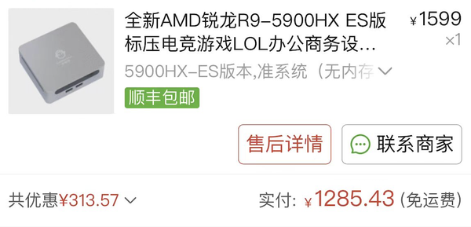
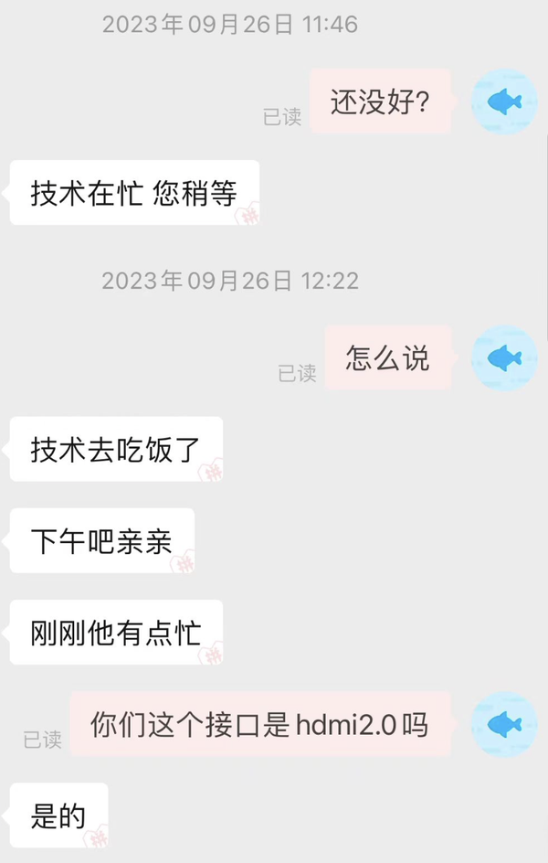
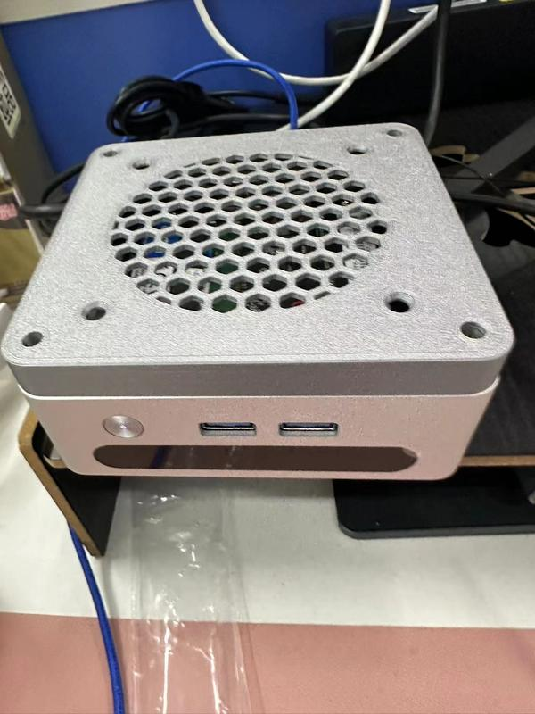
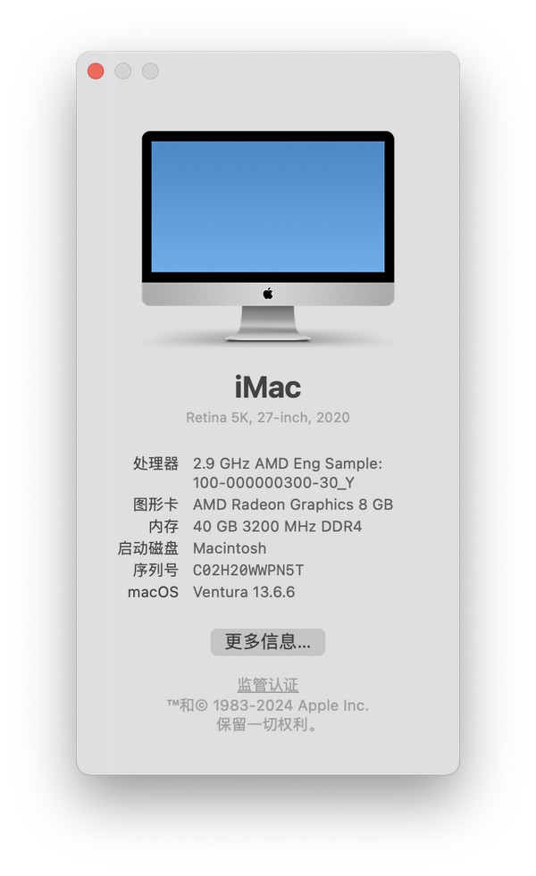

## 为什么市面上会出现迷你主机  
我已经忘记了迷你主机是什么时候开始在市场上占有一席之地的，隐约记得是 NUC 带动的。我记得有一款 intel i5-8259U 的 NUC，在黑苹果市场特别火，在更换免驱网卡之后几乎可以完美黑苹果。在接下来的几年中，也不断有新款的迷你主机问世，但是并没有引起广泛关注。2022 年到 2023 年之间，多出了很多厂商做这款业务，这款产品才逐渐进入大众视野。

我在去年（2023）入手了一台机械君的 R9-5900HX ES 版的准系统主机，1299 元。这也是目前我入手过的唯一一台，说实在的，我最开始并没有指望这款机器有多耐用，抑或是有多么强的性能，我只是单纯的好奇这样的产品。顺带一提，我一直是 macos 党，手里的笔记本是 macbook pro，入手这样一款小主机也能够弥补我没有 windows 的问题，这也是我选择 ES 版的原因，比较便宜，能够用上我闲置的笔记本 DDR4 内存。

下面，我将从我自身使用的角度，以及一些预想的场景，来写一写，迷你主机究竟适合那些用户，以及笔记本电脑的痛点是什么。

### 场景一：大学生上课  
这个场景是我虚构的场景，但我好歹也曾经上过课，因此可以大胆的假设一下。

在七点的早晨，要赶早八的你将桌面上的迷你主机装进背包，将电源线和键盘鼠标装进背包的第二格，腋下夹着一块便携屏，嘴里含着一块面包。你急匆匆的走到教室，那个你往常都在的座位，但很不幸，不知道是谁已经坐在了那里。你心想完蛋了，整个教室就那一个座位有插头。幸运的是，你带了排插，当你拿出所有的设备，却发现 HDMI 线没带。（**设备太杂乱容易忘带某件物品**）。你看着身边带着笔记本电脑的同学，觉得自己也应该，买一台。

### 场景二：移动办公  
你在办公室放了一台迷你主机，下班后，你将他带回家，接上 oculink 拓展坞，爽玩游戏。反正办公室和家里都有显示器和键鼠，一台轻巧的小主机能够满足你所有的需求，还不用把数据倒来倒去，岂不美哉？

该场景同样适用于**大学生放假回家**等情况。

### 场景三：小型服务器  
你已经有了一台其他的设备，但你需要一台 24 小时不间断工作的设备，以完成一些自动化工作。你将迷你主机配置好之后，直接 ssh 进去，将自动化工作挂在后台。此后的一个月，你都没有去碰它，但它却默默地为你付出着。（前提是机器质量要好，别跑几天就熄火了）。

在背后付出的他，不需要键盘鼠标，不需要显示器，放在一个角落，插着电即可。

### 场景四：多平台  
你有一台 macbook，但是出于某些原因，你需要一台 windows 电脑和一台 linux 电脑。他们不常用，但不能没有。你选择了一台迷你主机，装好 windows，再用虚拟机装一个 linux，在你有需要的时候，他就会派上用场。而这只需要 1000 出头的价格。你心想，如果买笔记本或者配一台相同性能的台式机，怎么也得几千块吧，还占地方。

### 场景五：跑路  
你不想干了，看着桌子下面几十斤重的 4090 主机，你想让老板来帮你抬一抬，但这是不可能的。要是把 4090 放家里，公司留一台迷你主机多好，你跑路都没人追得上你。

### 总结  
虚构了五个场景，有些情况有些极端。但我相信，你看完之后一定能够有所思考。需要明白的是，迷你主机，始终是主机，他对标的应该是台式机而不是笔记本（迷你笔记本对标笔记本）。迷你主机相比主机而言，便宜、便携性强，但是、性能差、散热差，这是他们差异化的表现。我总结了以下几点容易陷入的误区。

1. 迷你主机不适合随叫随到型移动办公：要想使用迷你主机，你需要带齐一整套外设。经常移动的话，反而是一种负担，这种情况应该购买笔记本。
2. 迷你主机不适合高性能追求者：迷你主机用的 cpu 和显卡都是移动端的，散热也比主机更差，因此性能比不过是可以理解的。现在可以通过外接显卡的方式实现高性能，但这着实是麻烦了一点。如果你的使用场景契合场景二，可以考虑购入。
3. 迷你主机不适合小白：对电脑的了解程度直接决定你是否应该买迷你主机。目前迷你主机的水很深，有可能会买到不心仪的产品。比如说，机械君的这台迷你主机，客服说 HDMI 接口是 2.0，但其实是虚假宣传，4k 根本跑不到 60 帧，如果你不懂电脑，可能注意不到这些偷工减料的地方。提供几个参考名词：Ryzen、IPC、NVME、DP、RGB、内存、硬盘。如果你不知道这些名词的意思，建议不买（有懂哥帮忙除外）。
4. 迷你主机适合已经有一台笔记本的人：由于笔记本已经能够满足移动办公需求，迷你主机刚好可以跟笔记本互补。如果你不喜欢主机的傻大黑粗，那就更适合了。

## 机械君迷你主机使用指南 (刚买的一定要来看看)

之前我有写过一篇关于迷你主机的杂谈，但是没有什么有深度的内容。今天这篇文章将会详细描述我使用机械君以来的真实感受，并附上真实的折腾过程。

### 我应不应该购买机械君？  
  
以上是我购买的迷你主机，可以看到价格确实很香，但是价格香代表问题多，后面我会详细描述。先说结论，针对地球上的所有人，我都不建议你购买这一款迷你主机，哪怕他价格很香，哪怕他性能很强，但是带来的糟心体验是真的很难受。

我购买的原因是，手里有一块闲置的 2T 固态和一根 8g 内存条，想着利用起来，就买了这台主机，还另外买了一根 32g 内存，凑成了 40g。

第一次发的货风扇不转，就换货了，所以图上能看到有一个售后详情。换的货二手痕迹非常严重，但是使用正常，我也不想再折腾了，就拿下了，然而麻烦才刚刚开始。

### 遇到的问题及解决方案  
#### HDMI 接口问题  
  
拿到手装上了驱动，用 HDMI 线接上了我的 4k 显示器，然后……

**怎么只能使用 4k 30HZ？**

立马找到客服确认，客服说是 HDMI2.0，说我驱动有问题，还找了个人工装模作样的帮我解决了一下问题（但最后并没有解决）。

但是我发现**typec 接口可以实现 4k 60**，就不想跟他争辩了。

网上也有人有这种情况（查资料的时候刷到过好几次，写文章的时候反而找不到了），我可以打包票，这两个 HDMI 接口一定是 1.4，绝非 2.0，如果你有接 4k 的需求，直接走人吧。

#### 3.5mm 怎么没声音  
该问题无解，很多人也有这个情况，可以看这篇帖子[https://post.smzdm.com/p/a8xgz856/](https://post.smzdm.com/p/a8xgz856/)。

#### 蓝牙怎么搜不到其他设备？  
该主机用的原装网卡是，8852BE，有多垃圾我就不想描述了。但是，光换网卡是不够的，因为天线也有问题。所以你还需要一个

 机械君迷你主机使用指南刚买的一定要来看看_EberyThingSay/v2-1eb58a10ccadb2ed3abc553d6c2bc6ba_b.jpg)  
把内置的天线干掉，你会发现，信号怎么这么好，网速怎么这么快，蓝牙怎么一点问题都没了。

问题好解决，但是排查起来相当痛苦。

### 温度怎么这么高？  
迷你主机体积小是一个很大的优点，但是带来的散热问题也是无法忽略的。

[https://tieba.baidu.com/p/8873148967](https://tieba.baidu.com/p/8873148967)

我买的咸鱼一个做 3D 打印的后盖，就不给链接了。

  
卖家预留了 8010 风扇接口，但我感觉没必要，下面开了口之后散热已经好很多了，再加上风扇只能用 usb 的，会占用一个接口，我个人感觉得不偿失。

#### 接口太少  
还好有一个 typec 接口，多接一个扩展坞吧。

#### 总结  
把以上步骤做完，其实也要花一两百块钱了，为什么不一步到位买个大牌的，而是买这么个玩意折腾自己。

### 软件方面的折腾  
#### BIOS 更改显存  
这个倒不是机械君的问题，因为很多锐龙的 U 都把显存默认限制在 512M，但还好，留了修改的接口。

[https://www.bilibili.com/video/BV1w84y167ep/](https://www.bilibili.com/video/BV1w84y167ep/)

16g 内存设 2-4g，32g 内存就可以直接设 8g，16g 显存的话……应该没必要吧。

如果是黑苹果的话，建议改到 4g 以上，可以有效减少花屏概率。

**你刚刚说了啥？黑苹果？？？？**

#### 显卡驱动  
虽然客服让你安装 5900HX 的驱动，但这个主机的显卡驱动是不能装 5900HX 的，而是要装 5800H 的……

至于为什么，我不好评判……

[https://www.amd.com/zh-hans/support/apu/amd-ryzen-processors/amd-ryzen-7-mobile-processors-radeon-graphics/amd-ryzen-7-5800h](https://www.amd.com/zh-hans/support/apu/amd-ryzen-processors/amd-ryzen-7-mobile-processors-radeon-graphics/amd-ryzen-7-5800h)

#### 黑苹果  
这台机器可以直接使用 零氪 5800H 迷你主机的 EFI，功能基本正常，网卡需要更换为 AX210。我提供一个 EFI：

[https://github.com/songguokunsgg/jixiejun-5900hx-es-hackintosh-efi](https://github.com/songguokunsgg/jixiejun-5900hx-es-hackintosh-efi)

5800H/5900HX 的迷你主机可用

但是使用过程中，可能会不定期自动重启（从早一直用到晚可能会触发，频次低），这个问题我没有排查出来，可能跟硬盘有关。

不过每次几秒钟就会重新启动，窗口数据也都还在，倒也不是很影响使用。

注意，安装过程中需要禁用 nootedred，安装完成，进入系统后再启用 nootedred，详细操作就不描述了，使用 OCAT 就可以搞定。

推荐使用 13.6.6 系统，屏蔽 macOS 14 的更新，实测很稳定。

## 总结
时间有限，先写这么多吧，如果后面有什么好玩的，我会再分享出来。

如果你还没有购买机械君，建议换别的品牌，如果你已经买了，相信这篇文章会为你提供一些帮助。

文中出现的问题仅限于我这台机器，如果你的机器没有，请不要喷我，我都是实话实说。

