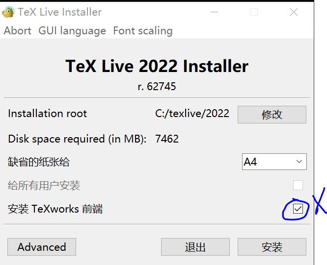
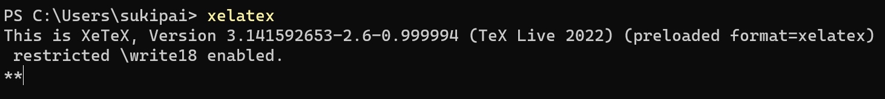
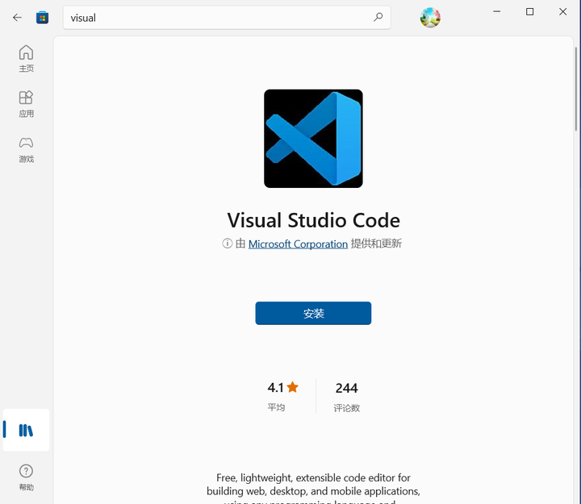
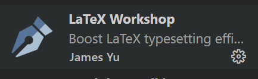

2024 年 4 月 20 日诈尸更新，内容如下：

* 去掉了使用第三方 PDF 阅读器的方法，因为浏览器已经足够好用，且跨平台性能强。
* 修改了配置文件，去除传统的 xe->bib->xe\*2 类型的编译链，转为全部使用性能更好，使用更加简单的 latexmk。
* 去掉了可能有坑的配置项，尽量减少对插件默认配置的修改，代码量大幅缩水。

我只说三点理由，劝你使用 latexmk 取代传统方法：

1. 排错功能。latexmk 对于错误容忍度低，一点小错都不会放过，可以对你起监督作用，避免写出屎山还不自知。
2. 增量编译。xe 和 pdf 都是全量编译的，十分之慢，latexmk 只会编译你改动的部分，大大减少编译时间，不会出现你明明什么都没改，不小心点到编译还是会进行全量编译的情况（笔记本电池说谢谢你）。
3. 智能编译链。从此再也不用管什么先 xe 后 bib 了，latexmk 直接一键搞定。


---

2023 年 6 月 8 日更新，内容如下：

* 修改了增加了使用浏览器进行外部查看的方式
* 添加了自定义编译脚本的相关说明，并附有一个通用编译模板
* 增加了 macOS 的安装说明


---

2023 年 1 月 22 日大年初一更新一次，更新内容如下：

* 修改了文章标题。。。与时俱进


---

2022 年 12 月 19 日更新一次，增加了用 winget 安装 okular 的配置方法


---

2022 年 11 月 20 日更新一次，优化了 okular 路径的填写方法

git bash 可以找到 okular 程序路径，直接定位到路径即可，并不需要定位到图标


---

2022 年 11 月 13 日更新一次，增加了一些 linux 端 (Archlinux 为例) 配置的说明


---

为什么我不用 texwork 或者 texstudio？因为 vscode 太香了，不多 bb

## 安装 texlive  
### windows 端的安装  
[https://mirrors.tuna.tsinghua.edu.cn/CTAN/systems/texlive/Images/](https://mirrors.tuna.tsinghua.edu.cn/CTAN/systems/texlive/Images/)

直接下载 texlive.iso，运行里面的 install-tl-windows.bat

  
取消勾选这个没用的 texwork（如果你觉得好用，请别打我）

等待一阵漫长的安装（什么时候才能用包管理器一键安装啊……）

### linux 端的安装（windows 用户跳过）  
linux 端 通过命令或者文件管理器挂载文件


```bash
sudo mount -o loop texlive.iso /mnt
```
如果需要使用图形界面安装的话，需要安装下面两个软件包


```bash
sudo pacman -S perl perl-tk
```
perl 一般发行版都自带了，perl-tk 可能需要自行安装，然后使用命令


```bash
sudo ./install -gui
```
就会打开与 windows 相同的图形安装界面，直接点安装即可，也可以自行更改安装路径（建议 /usr/local 或者 /opt/）

有些发行版可以通过包管理器一键安装，不过需要网络，以 Archlinux 为例：

添加竹林源

[https://pacman.ltd/](https://pacman.ltd/)

然后


```bash
sudo pacman -S texlive-full
```
最近这个源好像出了一些问题，有些包没有了，如果无法下载可以本地安装。

最后需要添加 windows 字体，不然 tex 编译的字体可能不正确，也很简单，直接找一台 windows 电脑，把 C:/windows/fonts 复制到 /usr/share/fonts/ 下面，然后


```bash
sudo fc-cache -fsv
```
就可以了，解决字体办法有很多，我认为这是最简单的一种了，双系统用户 0 难度。

这里默认 linux 用户都是懂电脑的，所以就不配图了。

### 验证安装  
打开终端，输入 xelatex，如果有以下输出，说明安装成功：

  
### macOS 端的安装  
最简单无脑的就是 macOS，安装包与前面 Linux 和 Windows 用的不同，下载地址：

[https://tug.org/mactex/mactex-download.html](https://tug.org/mactex/mactex-download.html)

这个包是 universe 的，inter 和 m 芯片的都可以用。直接像装普通软件一样安装即可，安装后会多出几个这玩意

  
除了 BibDesk 之外，用得都不多，BibDesk 也可以用别的文献管理软件替代。

进一步验证安装，在终端输入：


```bash
latex -v
```
有形如下图的输出即可


```txt
pdfTeX 3.141592653-2.6-1.40.25 (TeX Live 2023)
kpathsea version 6.3.5
Copyright 2023 Han The Thanh (pdfTeX) et al.
There is NO warranty.  Redistribution of this software is
covered by the terms of both the pdfTeX copyright and
the Lesser GNU General Public License.
For more information about these matters, see the file
named COPYING and the pdfTeX source.
Primary author of pdfTeX: Han The Thanh (pdfTeX) et al.
Compiled with libpng 1.6.39; using libpng 1.6.39
Compiled with zlib 1.2.13; using zlib 1.2.13
Compiled with xpdf version 4.04
```
## 安装 visual studio code（windows）  
这个不用说了，应用商店一键安装，也可以下载安装包安装

  
设置中文之类的就不说了（我的 vscode 用作代码编辑，insider 版本当文档编辑，配置都是一样的）

## 安装 visual studio code（linux）  
下载 deb 安装，通过包管理器安装都可以，ubuntu 用 ppa，arch 用 yay，略过。

我现在切换到了 NixOS，就顺便提一句，只能使用 vscode-fhs 才行（懂得都懂我在说什么，不懂的你也没必要懂）。

### 安装 visual studio code（macOS）  
下载 universe 的版本安装即可，略过。

## 配置 latex  
### 安装插件  
  
就这一个玩意就可以满足基本需求

### 使用浏览器作为 PDF 阅读器  
这种方式可以很便携的实现反向定位和自动刷新。以下几种浏览器我都测过可以完美实现：

* Chrome，Edge，Arc
* Firefox
* Safari

### 配置 latex-workshop[1]  
直接复制粘贴即可，


```json
{
  "latex-workshop.intellisense.package.enabled": true,
  "latex-workshop.latex.autoBuild.run"         : "onSave",
    // 文件清理
  "latex-workshop.latex.clean.fileTypes": [
    "*.log"
  ],
  "latex-workshop.latex.recipe.default": "lastUsed",
    // 用于配置编译链
  "latex-workshop.latex.recipes": [
    {
      "name" : "latexmk",
      "tools": [
        "latexmk"
      ]
    },
    {
      "name" : "xelatex-latexmk",
      "tools": [
        "xelatex-latexmk"
      ]
    },
    {
      "name" : "pdflatex-latexmk",
      "tools": [
        "pdflatex-latexmk"
      ]
    },
    {
      "name" : "xelatex-latexmk-with-shell-escape",
      "tools": [
        "xelatex-latexmk-with-shell-escape"
      ]
    },
    {
      "name" : "pdflatex-latexmk-with-shell-escape",
      "tools": [
        "pdflatex-latexmk-with-shell-escape"
      ]
    },
    {
      "name" : "BibTeX",
      "tools": [
        "bibtex"
      ]
    }
  ],
  "latex-workshop.latex.tools": [
    {
      "args": [
        "-f",
        "-synctex=1",
        "-interaction=nonstopmode",
        "-file-line-error",
        "-xelatex",
        "-outdir=%OUTDIR%",
        "%DOC%"
      ],
      "command": "latexmk",
      "name"   : "xelatex-latexmk"
    },
    {
      "args": [
        "-f",
        "-synctex=1",
        "-interaction=nonstopmode",
        "-file-line-error",
        "-pdf",
        "-outdir=%OUTDIR%",
        "%DOC%"
      ],
      "command": "latexmk",
      "name"   : "pdflatex-latexmk"
    },
    {
      "args": [
        "-f",
        "--shell-escape",
        "-synctex=1",
        "-interaction=nonstopmode",
        "-file-line-error",
        "-xelatex",
        "-outdir=%OUTDIR%",
        "%DOC%"
      ],
      "command": "latexmk",
      "name"   : "xelatex-latexmk-with-shell-escape"
    },
    {
      "args": [
        "-f",
        "--shell-escape",
        "-synctex=1",
        "-interaction=nonstopmode",
        "-file-line-error",
        "-pdf",
        "-outdir=%OUTDIR%",
        "%DOC%"
      ],
      "command": "latexmk",
      "name"   : "pdflatex-latexmk-with-shell-escape"
    },
    {
      "args": [
        "-f",
        "-synctex=1",
        "-interaction=nonstopmode",
        "-file-line-error",
        "-pdf",
        "%DOC%"
      ],
      "command": "latexmk",
      "name"   : "latexmk"
    },
    {
      "args": [
        "%DOCFILE%"
      ],
      "command": "bibtex",
      "name"   : "bibtex"
    }
  ],
  "latex-workshop.showContextMenu"              : true,
  "latex-workshop.view.pdf.external.viewer.args": [
    "%PDF%"
  ],
  "latex-workshop.view.pdf.internal.synctex.keybinding": "double-click",
  "latex-workshop.view.pdf.ref.viewer"                 : "auto",
  "latex-workshop.view.pdf.viewer"                     : "browser",
}  
```

之前在每一个配置项上都写了注释，这里全部删了，因为但你把他们粘贴到 vscode 配置文件中时，鼠标移动到对应选项上都会出现相关说明，没有必要长篇大论。

### 自编译脚本（可选）  
针对一些比较特殊的需求，可增加一个自定义编译脚本选项。


```
"latex-workshop.latex.external.build.command": "./compile.sh"
```
意思是，但你编译（无论自动还是手动）时，不使用 latexshop 的编译链，而是执行 compile.sh 脚本，这种方式能够控制得更加底层，我提供一个模板 [http://compile.sh/](http://compile.sh/)，编译链为*tex -> bibtex -> tex^2*，可按需修改：


```bash
#!/bin/bash
# 脚本用于编译latex

# 主文件名
filename="<NAME>"

# 编译器
# command="pdflatex"
command="xelatex"

# 编译参数
args="-synctex=1 -interaction=nonstopmode -file-line-error -pdf"

# 编译链
# xetex -> bibtex -> xetex^2
for i in {1 .. 3}
do
	$command $args $filename.tex
	if [ $i -eq 1 ]; then
		bibtex $filename
	fi
done
```
该脚本可以完成大多数论文的编译工作。

### 注意事项  
latexmk 对于错误容忍度比较低，连 bib 不正确都会显示为编译失败（但是文档可以正确输出），这可以在一定程度上帮助你排错，但是如果你错误太多可能会比较烦，这时候可以考虑用自编译脚本。

## 参考  
1. 相比之前的版本有所改动