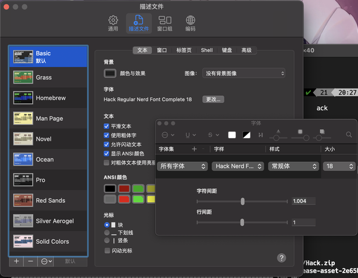
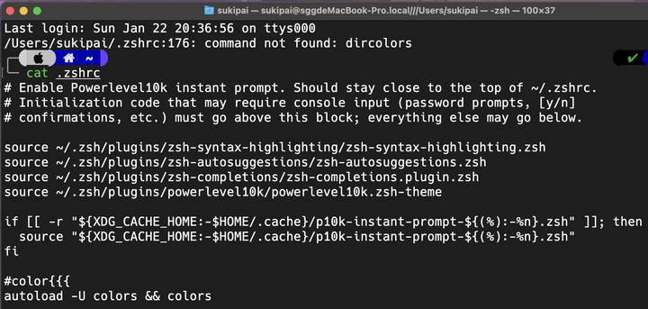
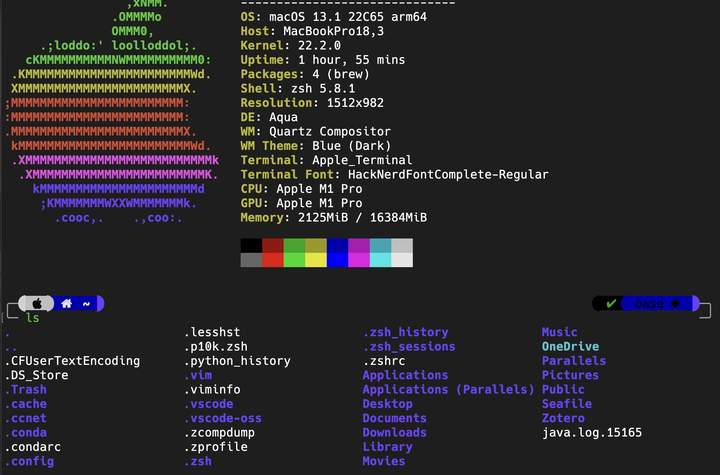

更新原因：用了很久的 homebrew，感觉不是很完美，就尝试切换到了 nix，挺香的。

不过本文仅适合入门，nix 也仅配置了 flake 和 configuration，不包括 home-manager（macos 上问题太多）。


---

游戏本 xxxx

macbook ++++

自己拿一台游戏本，整天折腾 linux，消磨了我很多时光。遂重新审视自己的需求，发现其实游戏玩的不多，故卖之，换 macbook。

但是终端不像 Arch 那么好配置了，所以还是记录一下吧。

## 安装 Darwin-nix  
一行代码解决


```bash
sh <(curl -L https://nixos.org/nix/install)
```
终端输入 nix，有输出则说明成功，使用 nix 必须使用科学上网工具，如果没有请滑走。

## nix 基本方案说明  
本人仅使用 nix 配置终端工具，且不包括 python（我使用自带 python+pdm，更方便，nix 先天不善于处理 python）

## nix 简单配置  
在 ~/.zprofile 中添加


```
export NIX_PATH=darwin-config=$HOME/.nixpkgs/darwin-configuration.nix:/nix/var/nix/profiles/per-user/root/channels:$HOME/.nix-defexpr/channels:nixpkgs-overlays=$HOME/.nixpkgs/overlays/:nixpkgs-overlays=$HOME/.nixpkgs/overlays/
```
然后 clone 我的模板仓库[https://github.com/songguokunsgg/nixos-darwin-config](https://github.com/songguokunsgg/nixos-darwin-config)

将 clone 下来的文件夹移动为 `~/.nixpkgs`

将 flake.nix 中的主机名修改为你自己的主机名

然后 cd 到~/.nixpkgs, 使用以下命令进行第一次安装


```bash
nix run nix-darwin --extra-experimental-features nix-command --extra-experimental-features flakes -- switch --flake .
```
后续使用这两行命令进行升级


```bash
nix flake update ~/.nixpkgs
darwin-rebuild switch --flake ~/.nixpkgs
```
如果没有找到 darwin-rebuild，检查环境变量。

仓库的 README 有一些其他说明，可酌情查看。

## zsh 配置  
### 配置思路  
主要用到 4 个插件：

* zsh-autosuggestions
* zsh-syntax-highlighting
* zsh-completions（可选）
* zsh-theme-powerlevel10k（可选）

前三个是功能性插件，最后一个是主题插件，如果对美观要求不高的话，可以不装最后一个

### 拉取功能插件  

```bash
# 自动补全
git clone --depth=1 https://github.com/zsh-users/zsh-autosuggestions ~/.zsh/plugins/zsh-autosuggestions

# 语法高亮
git clone --depth=1 https://github.com/zsh-users/zsh-syntax-highlighting ~/.zsh/plugins/zsh-syntax-highlighting

# 这个插件我也没弄明白是干嘛的，可选。。。。
git clone --depth=1 https://github.com/zsh-users/zsh-completions ~/.zsh/plugins/zsh-completions

# p10k 主题
git clone --depth=1 https://github.com/romkatv/powerlevel10k.git ~/.zsh/plugins/powerlevel10k
```
将 zsh 的插件统一放置在 ~/.zsh/plugins/ 下

### 安装字体  
推荐使用 nerd-fonts-hack 字体作为终端字体

  
### 编写 zsh 配置文件  
环境变量存放位置为 ～/.zprofile，配置文件在 ~/.zshrc，主要编写 ～/. zshrc 文件

将以下代码加入 .zshrc 以使用插件


```bash
source ~/.zsh/plugins/zsh-syntax-highlighting/zsh-syntax-highlighting.zsh
source ~/.zsh/plugins/zsh-autosuggestions/zsh-autosuggestions.zsh
source ~/.zsh/plugins/zsh-completions/zsh-completions.plugin.zsh
source ~/.zsh/plugins/powerlevel10k/powerlevel10k.zsh-theme
```
然后进行功能配置，直接复制粘贴下面代码即可


```zsh
#color{{{
autoload -U colors && colors

#命令别名 {{{
alias cp='cp -i'
alias mv='mv -i'
alias rm='rm -i'
alias ls='ls -a --color=auto'
alias grep='grep --color=auto'
alias vim='nvim'
alias vi='nvim'

# 更新软件
function update() {
	nix flake update ~/.nixpkgs
	darwin-rebuild switch --flake ~/.nixpkgs
}

# 清理垃圾
function clean() {
	nix-collect-garbage -d
}

#终端代理
hostip="127.0.0.1"
# hostip=$(cat /etc/resolv.conf |grep -oP '(?<=nameserver\ ).*')
function proxy_on() {
    proxy_statu="on"
    export https_proxy="http://${hostip}:7890"
    export http_proxy="http://${hostip}:7890"
    export all_proxy="socks5://${hostip}:7890"
    echo -e "终端代理已开启。"
}

function proxy_off(){
    unset http_proxy https_proxy all_proxy
    echo -e "终端代理已关闭。"
    proxy_statu="off"
}

for color in RED GREEN YELLOW BLUE MAGENTA CYAN WHITE; do
	eval _$color='%{$terminfo[bold]$fg[${(L)color}]%}'
	eval $color='%{$fg[${(L)color}]%}'
	(( count = $count + 1 ))
done
FINISH="%{$terminfo[sgr0]%}"
#}}}

#命令提示符
RPROMPT=$(echo "$RED%D %T$FINISH")
PROMPT=$(echo "$CYAN%n@$YELLOW%M:$GREEN%/$_YELLOW>$FINISH ")

#PROMPT=$(echo "$BLUE%M$GREEN%/
#$CYAN%n@$BLUE%M:$GREEN%/$_YELLOW>>>$FINISH ")
#标题栏、任务栏样式{{{
case $TERM in (*xterm*|*rxvt*|(dt|k|E)term)
	precmd () { print -Pn "\e]0;%n@%M//%/\a" }
	preexec () { print -Pn "\e]0;%n@%M//%/\ $1\a" }
	;;
esac
#}}}

#编辑器
export EDITOR=vim
#关于历史纪录的配置 {{{
#历史纪录条目数量
export HISTSIZE=10000
#注销后保存的历史纪录条目数量
export SAVEHIST=10000
#历史纪录文件
export HISTFILE=~/.zhistory
#以附加的方式写入历史纪录
setopt INC_APPEND_HISTORY
#如果连续输入的命令相同，历史纪录中只保留一个
setopt HIST_IGNORE_DUPS
#为历史纪录中的命令添加时间戳
setopt EXTENDED_HISTORY      

#启用 cd 命令的历史纪录，cd -[TAB]进入历史路径
setopt AUTO_PUSHD
#相同的历史路径只保留一个
setopt PUSHD_IGNORE_DUPS

#每个目录使用独立的历史纪录{{{
cd() {
	builtin cd "$@"                             # do actual cd
	fc -W                                       # write current history  file
	local HISTDIR="$HOME/.zsh_history$PWD"      # use nested folders for history
	if  [ ! -d "$HISTDIR" ] ; then          # create folder if needed
		mkdir -p "$HISTDIR"
	fi
	export HISTFILE="$HISTDIR/zhistory"     # set new history file
	touch $HISTFILE
	local ohistsize=$HISTSIZE
	HISTSIZE=0                              # Discard previous dir's history
	HISTSIZE=$ohistsize                     # Prepare for new dir's history
	fc -R                                       #read from current histfile
}
mkdir -p $HOME/.zsh_history$PWD
export HISTFILE="$HOME/.zsh_history$PWD/zhistory"

function allhistory {
	cat $(find $HOME/.zsh_history -name zhistory)
}

function convhistory {
	sort $1 | uniq |
		sed 's/^:[0−9]∗:[0-9]*;.∗/\1::::::\2/' |
		awk -F"::::::" '{ $1=strftime("%Y-%m-%d %T",$1) "|"; print }'
	}

#使用 histall 命令查看全部历史纪录
function histall {
	convhistory =(allhistory) | sed '/^.\{20\} *cd/i\\' 
}

#使用 hist 查看当前目录历史纪录
function hist {
	convhistory $HISTFILE
}

#全部历史纪录 top50
function top50 { allhistory | awk -F':[ 0-9]*:[0-9]*;' '{ $1="" ; print }' | sed 's/ /\n/g' | sed '/^$/d' | sort | uniq -c | sort -nr | head -n 50 }

#允许在交互模式中使用注释  例如：
setopt INTERACTIVE_COMMENTS      

#启用自动 cd，输入目录名回车进入目录
setopt AUTO_CD

#扩展路径
setopt complete_in_word

#禁用 core dumps
limit coredumpsize 0

#Emacs风格 键绑定
bindkey -e

#以下字符视为单词的一部分
WORDCHARS='*?_-[]~=&;!#$%^(){}<>'
#}}}

#自动补全功能 {{{
setopt AUTO_LIST
setopt AUTO_MENU

#开启此选项，补全时会直接选中菜单项
setopt MENU_COMPLETE

autoload -U compinit
compinit

#自动补全缓存
zstyle ':completion::complete:*' use-cache on
zstyle ':completion::complete:*' cache-path .zcache
zstyle ':completion:*:cd:*' ignore-parents parent pwd

#自动补全选项
zstyle ':completion:*' verbose yes
zstyle ':completion:*' menu select
zstyle ':completion:*:*:default' force-list always
zstyle ':completion:*' select-prompt '%SSelect:  lines: %L  matches: %M  [%p]'

zstyle ':completion:*:match:*' original only
zstyle ':completion::prefix-1:*' completer _complete
zstyle ':completion:predict:*' completer _complete
zstyle ':completion:incremental:*' completer _complete _correct
zstyle ':completion:*' completer _complete _prefix _correct _prefix _match _approximate

#路径补全
zstyle ':completion:*' expand 'yes'
zstyle ':completion:*' squeeze-shlashes 'yes'
zstyle ':completion::complete:*' '\\'

#彩色补全菜单
export CLICOLOR=1
export LSCOLORS=ExGxFxdaCxDaDahbadeche
zmodload zsh/complist
zstyle ':completion:*' list-colors ${(s.:.)LS_COLORS}
zstyle ':completion:*:*:kill:*:processes' list-colors '=(#b) #([0-9]#)*=0=01;31'

#修正大小写
zstyle ':completion:*' matcher-list '' 'm:{a-zA-Z}={A-Za-z}'
#错误校正
zstyle ':completion:*' completer _complete _match _approximate
zstyle ':completion:*:match:*' original only
zstyle ':completion:*:approximate:*' max-errors 1 numeric

#kill 命令补全
compdef pkill=kill
compdef pkill=killall
zstyle ':completion:*:*:kill:*' menu yes select
zstyle ':completion:*:*:*:*:processes' force-list always
zstyle ':completion:*:processes' command 'ps -au$USER'

#补全类型提示分组
zstyle ':completion:*:matches' group 'yes'
zstyle ':completion:*' group-name ''
zstyle ':completion:*:options' description 'yes'
zstyle ':completion:*:options' auto-description '%d'
zstyle ':completion:*:descriptions' format $'\e[01;33m -- %d --\e[0m'
zstyle ':completion:*:messages' format $'\e[01;35m -- %d --\e[0m'
zstyle ':completion:*:warnings' format $'\e[01;31m -- No Matches Found --\e[0m'
zstyle ':completion:*:corrections' format $'\e[01;32m -- %d (errors: %e) --\e[0m'

# cd ~ 补全顺序
zstyle ':completion:*:-tilde-:*' group-order 'named-directories' 'path-directories' 'users' 'expand'
#}}}

##行编辑高亮模式
# Ctrl+@ 设置标记，标记和光标点之间为 region
zle_highlight=(region:bg=magenta #选中区域
	special:bold      #特殊字符
	isearch:underline)#搜索时使用的关键字

##空行(光标在行首)补全 "cd " {{{
user-complete(){
case $BUFFER in
	"" )                       # 空行填入 "cd "
		BUFFER="cd "
		zle end-of-line
		zle expand-or-complete
		;;
	"cd --" )                  # "cd --" 替换为 "cd +"
		BUFFER="cd +"
		zle end-of-line
		zle expand-or-complete
		;;
	"cd +-" )                  # "cd +-" 替换为 "cd -"
		BUFFER="cd -"
		zle end-of-line
		zle expand-or-complete
		;;
	* )
		zle expand-or-complete
		;;
esac
}
zle -N user-complete
bindkey "\t" user-complete
#}}}

##在命令前插入 sudo {{{
#定义功能
sudo-command-line() {
[[ -z $BUFFER ]] && zle up-history
[[ $BUFFER != sudo\ * ]] && BUFFER="sudo $BUFFER"
zle end-of-line                 #光标移动到行末
}
zle -N sudo-command-line
#定义快捷键为： [Esc] [Esc]
bindkey "\e\e" sudo-command-line
#}}}
#[Esc][h] man 当前命令时，显示简短说明
alias run-help >&/dev/null && unalias run-help
autoload run-help

#历史命令 top10
alias top10='print -l  ${(o)history%% *} | uniq -c | sort -nr | head -n 10'
#}}}

#路径别名 {{{
#进入相应的路径时只要 cd ~xxx
hash -d A="/media/ayu/dearest"
hash -d H="/media/data/backup/ayu"
hash -d E="/etc/"
hash -d D="/home/ayumi/Documents"
#}}}

#补全 ping
zstyle ':completion:*:ping:*' hosts 192.168.1.{1,50,51,100,101} www.google.com

#补全 ssh scp sftp 等
zstyle -e ':completion::*:*:*:hosts' hosts 'reply=(${=${${(f)"$(cat {/etc/ssh_,~/.ssh/known_}hosts(|2)(N) /dev/null)"}%%[# ]*}//,/ })'

#F1 计算器
arith-eval-echo() {
LBUFFER="${LBUFFER}echo \$(( "
RBUFFER=" ))$RBUFFER"
}
zle -N arith-eval-echo
bindkey "^[[11~" arith-eval-echo

function timeconv { date -d @$1 +"%Y-%m-%d %T" }

zmodload zsh/mathfunc
autoload -U zsh-mime-setup
zsh-mime-setup
setopt EXTENDED_GLOB

setopt correctall
autoload compinstall

#漂亮又实用的命令高亮界面
setopt extended_glob
TOKENS_FOLLOWED_BY_COMMANDS=('|' '||' ';' '&' '&&' 'sudo' 'do' 'time' 'strace')

recolor-cmd() {
region_highlight=()
colorize=true
start_pos=0
for arg in ${(z)BUFFER}; do
	((start_pos+=${#BUFFER[$start_pos+1,-1]}-${#${BUFFER[$start_pos+1,-1]## #}}))
	((end_pos=$start_pos+${#arg}))
	if $colorize; then
		colorize=false
		res=$(LC_ALL=C builtin type $arg 2>/dev/null)
		case $res in
			*'reserved word'*)   style="fg=magenta,bold";;
			*'alias for'*)       style="fg=cyan,bold";;
			*'shell builtin'*)   style="fg=yellow,bold";;
			*'shell function'*)  style='fg=green,bold';;
			*"$arg is"*)
				[[ $arg = 'sudo' ]] && style="fg=red,bold" || style="fg=blue,bold";;
			*)                   style='none,bold';;
		esac
		region_highlight+=("$start_pos $end_pos $style")
	fi
	[[ ${${TOKENS_FOLLOWED_BY_COMMANDS[(r)${arg//|/\|}]}:+yes} = 'yes' ]] && colorize=true
	start_pos=$end_pos
done
}
check-cmd-self-insert() { zle .self-insert && recolor-cmd }
check-cmd-backward-delete-char() { zle .backward-delete-char && recolor-cmd }

zle -N self-insert check-cmd-self-insert
zle -N backward-delete-char check-cmd-backward-delete-char
```
### 主题配置  
p10k 在首次进入时需要进行配置，按照提示进行即可，配置之后，会在 zshrc 行首和行尾分别添加


```
if [[ -r "${XDG_CACHE_HOME:-$HOME/.cache}/p10k-instant-prompt-${(%):-%n}.zsh" ]]; then
  source "${XDG_CACHE_HOME:-$HOME/.cache}/p10k-instant-prompt-${(%):-%n}.zsh"
fi
```
以及


```
# To customize prompt, run `p10k configure` or edit ~/.p10k.zsh.
[[ ! -f ~/.p10k.zsh ]] || source ~/.p10k.zsh
```
需要把上面三句代码移动到 4 个 source 的后面，否则每次启动终端都会报错

  
### 搞定收工  
  
