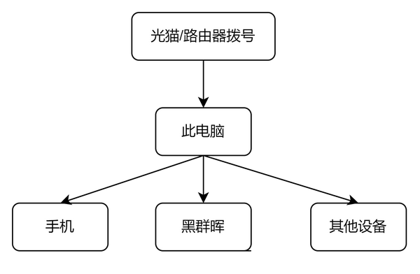
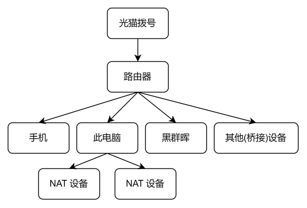
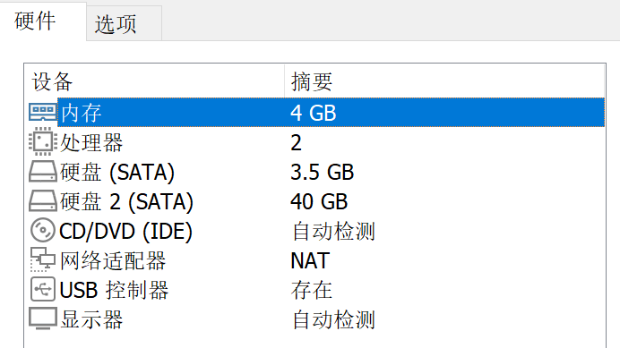
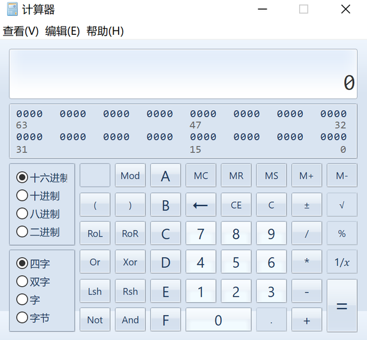
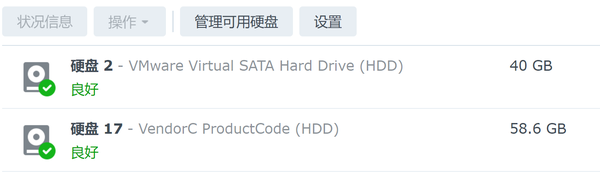
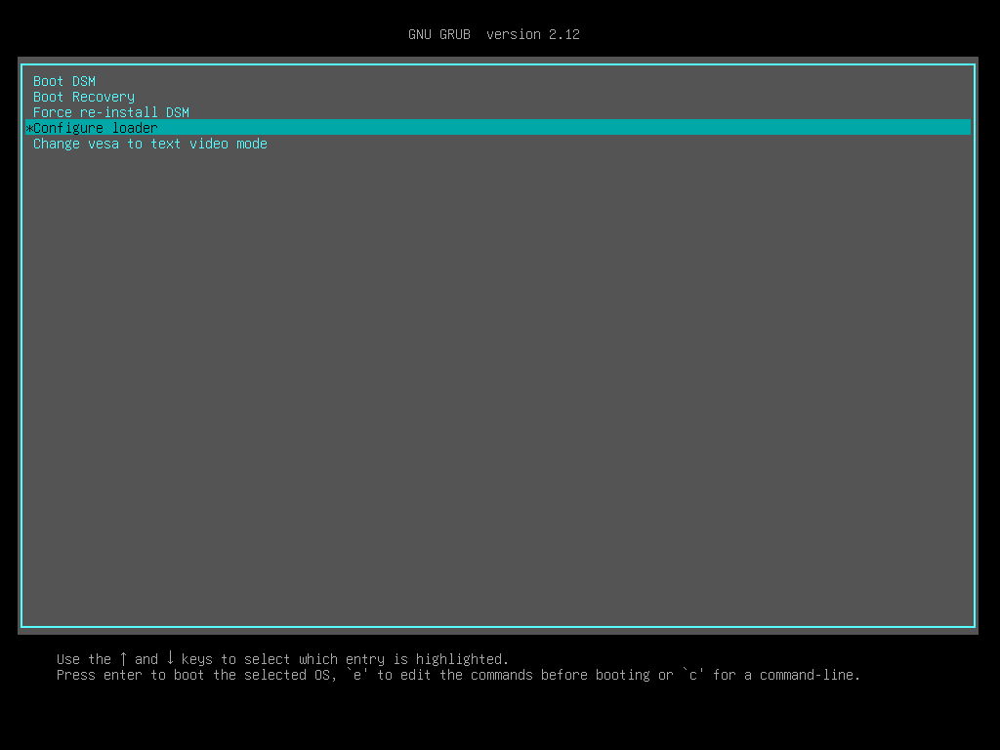
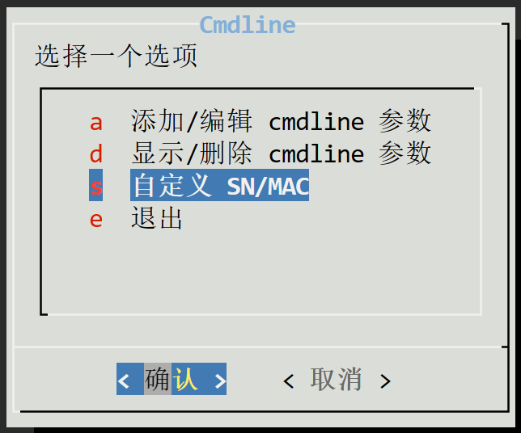

## 简介

在校期间试了很多类型的网盘，包括 Onedrive, seafile（学校搭建），百度网盘等，都不是很满意。

Onedrive：网速慢

seafile：综合体验最好，学校自建。但是学校运维不太行，隔三差五崩掉，急用的时候简直崩溃。

百度网盘：你还是老实做个资源站吧

最终我决定搞一个黑群晖，正好快毕业了，把手里的机械君利用起来，做一个小型 All in One。

### 为什么用 windows 做 host？  
其实我一开始是用的 NixOS，搭配 KVM 做虚拟黑群晖，其实这样做没啥问题，非常稳定，但是我偶尔要用一下电脑的话，就还得再开一个 windows 虚拟机，以使用 office、raylink 等软件。

考虑到有虚拟 NAS 之后，本地存储需求将会急剧减少，所以我觉得把闲置的 128G 硬盘拿来装 win10 LTSC（稳定），然后装几个常用软件和 vmware，存储需求就用 vmware 虚拟黑群晖，NAT 方案，我表达能力不太行，用图说话。

  
  
等毕业之后，如果有路由器的话，也可以从 NAT 很方便地改为**桥接**，从而满足不同的需求。

  
  
注：由于需要做内网穿透，所以最好令内网访问与公网访问端口一致，方便做 DNS 劫持，从而实现内外网只能切换，所以可能需要做端口转发或者**直接修改端口（推荐），**让 5001 端口映射或修改为内网穿透的端口。这种情况下，将群晖链接到一台可以做 DNS 劫持的设备最合适。

第一张图中，电脑本身可以做 DNS 劫持（选择 **NAT** 的原因）。

第二张图中，路由器可以做 DNS 劫持，或者直接修改群晖端口好（**桥接**的原因）。

不过还是得根据实际需求来。

例如，穿透后的公网为 [http://example.com:58819](http://example.com:58819)

进行端口转发或修改端口 5001 -> 58819

这时候，你可以用 `192.168.XX.XX:58819` 进行内网访问，也可以用 [http://example.com:58819/](http://example.com:58819/) 进行公网访问。

此时，将内网的 [http://example.com/](http://example.com/) 进行劫持，[http://example.com/](http://example.com/) -> 192.168.XX.XX。

就可以实现，连路由器的时候用内网，否则联公网（想出这个方案的真是人才）。

这个是后话，可能后面会对这篇文章进行补充。

## 安装 DS918+ 黑群晖  
### 参考  
[https://www.bilibili.com/read/cv30010953/](https://www.bilibili.com/read/cv30010953/) （USB 改内置）

[https://github.com/RROrg/rr/releases](https://github.com/RROrg/rr/releases) （黑群晖引导文件）下载 rr-<version>.img.zip 文件解压

### 硬盘格式转换  
[https://www.starwindsoftware.com/download-starwind-products](https://www.starwindsoftware.com/download-starwind-products)

使用这个软件将 img 的 raw 硬盘转换为 vmdk

### 虚拟机创建  
使用 vmware 创建一台 linux64 虚拟机，使用转换好的硬盘，除此之外，还需要添加一块 sata 系统盘，留下这些硬件即可（CD/DVD 也可以不要），配置不用太高，内存最好 4G+。



启动模式可以调成 UEFI。

注：群晖跟一般的电脑系统不一样，每插一块硬盘，该硬盘上面都会安装一个系统，从而实现硬盘拔插或坏掉不影响系统使用。这里添加的硬盘只是装系统用的，后面会使用 sata 或 usb 的实体硬盘进行数据存储。如果系统稳定的话，这块 sata 盘可以删掉。

### 安装黑群晖系统  
[https://post.smzdm.com/p/am3epen4/](https://post.smzdm.com/p/am3epen4/)

根据这篇文章安装即可，主要为四个步骤

1. 更换语言
2. 选择型号（如果只使用 SATA，可以选择 DS923+；如果需要外接 USB 硬盘，选 DS918+）
3. 版本选择：最新版
4. 编译引导并启动

然后浏览器 ip:5000 进入系统安装页面，点击安装，不要启动数据收集和更新等等服务。

注：这一步直接选择**自动下载**即可，一般都能安装成功，如果不行再手动下载安装。

 基于_windows_hostUSB_外接虚拟黑群晖方案分享_EberyThingSay/v2-857af01419147db1d74e957aa1e63dc1_b.jpg)  
装好之后进入系统，进行一些初始化啥的，不赘述。

### 将 USB 设定为内置硬盘  
[https://www.bilibili.com/read/cv30010953/](https://www.bilibili.com/read/cv30010953/)

直接跳到，**使用 RR 的设置方法**。

跟着教程走就行，主要说一下计算。

打开计算器

  
功能比较简陋，需要在“查看”调成程序员模式，并调成程序员模式

  
然后用“or”按钮计算 usbportcfg | internalportcfg

然后设定 usbportcfg=0，internalportcfg=计算出的值即可，以我为例

```bash
root@HeiSynology:/etc.defaults$ cat synoinfo.conf  | grep usbport
usbportcfg="0x3f00000"
root@HeiSynology:/etc.defaults$ cat synoinfo.conf  | grep internalport
internalportcfg="0xfffff"
```
计算 `0x3f00000 | 0xffff = 3FFFFFF`

所以设定

```bash
usbportcfg=0
internalportcfg=0x3FFFFFF
```
然后重新编译引导，启动，就可以看到 usb 硬盘被识别为内置。

  
硬盘 2 是虚拟硬盘，硬盘 17 是我的测使用 U 盘。

### 固定 ip  
vmware 创建的虚拟机 ipv4 地址似乎不会变，不用动。

## 公网访问  
[https://doc.natfrp.com/app/synology.html](https://doc.natfrp.com/app/synology.html)

在群晖系统中把访问端口修改为你申请到的内网穿透端口，例如 58819。

确认你此时能够在内网通过 内网 ip:58819 访问管理页面

然后做好内网穿透。

实测，穿透 5001 => 58819 端口基本上够用了，内网里面手机电脑连接 photos，drive 都可以直接用 5001 => 58819 端口进行登陆。

**但是外网有坑**

[https://zhuanlan.zhihu.com/p/679868467](https://zhuanlan.zhihu.com/p/679868467)

如果电脑端需要外网连接 Drive，需要再映射一下 6690 端口，手机端和内网不用，直接 58819 访问即可。

## 功能修复  
[https://post.smzdm.com/p/a7pw05r9/](https://post.smzdm.com/p/a7pw05r9/)

主要是视频解码方面的内容，按以上文章一键修复。

### 洗白：修复除 QC 外功能  
  
  
找到这个自定义 SN/MAC 的选项，输入购买的 SN /MAC 即可。

## Drive 空文件夹问题  
表现：某文件夹在网页端有内容，但使用 Drive 进行按需同步的时候，文件夹显示为空。

[https://zhuanlan.zhihu.com/p/681513928](https://zhuanlan.zhihu.com/p/681513928)

将 homes/user 的属性勾选“应用到这个文件夹、子文件夹及文件夹”即可。

## 注意事项  
1. 如果虚拟机关机了，启动虚拟机时要把硬盘及时连通进去。
2. 如果 host 不常使用的话，还是建议用 PVE 或者 linux 做 host，windows 还是有些不稳定。
3. 如果 host windows 要搞操作，先关掉虚拟机再操作，比如垃圾清理内存释放之类的。
4. 如果你不幸在操作之后，群晖系统出现**硬盘损坏的提示**，不用慌，重启一下虚拟机，自动修复硬盘即可。
