## 前言

作为一个计算机爱好者（\*\*\*，毕业了都不敢说自己是学计算机的，只敢说自己是个爱好者），由于以下原因，让我有了入一台 NAS 的想法：

1. 看网上的在线电视剧和电影总是卡，体验感不佳。
2. 刚需 onedrive，但由于 E5 被大面积封杀的原因，不再是长久之计，但又很馋它的功能。
3. 不想再开音乐会员，反正就听那么几首歌而已。

在决定入手之前，我用手上的 mini 主机虚拟了一台黑群晖使用，发现体验不错，自带的 Drive, Photos, Audio 和 video 都很好用，所以我直接上网买了一台 N100 的 NAS。

（当时很想买绿联的 4800，但是怕翻车，就买了台小厂的成品 8 盘位 NAS，不到 1100。当时想的是这种组装机方便折腾，结果买回来之后出人意料的很好用……对比起来绿联真的是……）

我家是电信的宽带，并且一直都是使用路由器拨号，因此 ipv6 很简单就可以配置好，这也为 NAS 提供了一个良好的网络条件。

为什么说是激进向呢？因为本文将不会考虑任何公网 ipv4 相关的使用，包括 frp 等，只战未来（懒）。

## 需求分析  
从前言的三点可以看出，核心的需求就四点。

* 存储
* 音乐
* 视频
* 相册

这些可以通过 docker 容器或者是群辉的套件进行解决。

## 系统安装  
[https://sspai.com/post/88898](https://sspai.com/post/88898)

这个教程很多，就不重复造轮子了。

## 公网 ipv6 访问  
### 域名解析  
[https://home.console.aliyun.com/home/dashboard/ProductAndService](https://home.console.aliyun.com/home/dashboard/ProductAndService)

首先购买一个阿里云的域名，找个便宜的就行，我买的是 icu 后缀的，9 块一年。

  
在域名管理中进行解析，假如你买的域名是 http://example.com

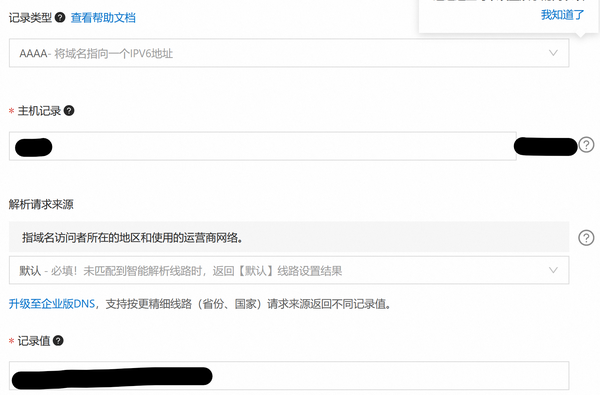  
记录类型为 AAAA，意思是把域名指向一个 ipv6 地址。主机记录填写子域名，例如 storage、nas、stg 等，本文以 nas 为例。记录值可以临时写一个::1，表示环回地址，类似于 127.0.0.1，后面会用 DDNS-GO 自动更新公网 ip。TTL 设置为 10 分钟即可。

### DDNS-GO  
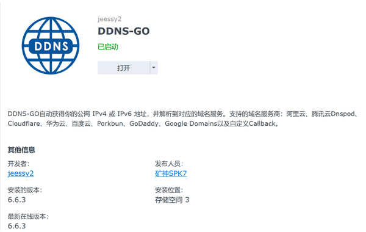  
在套件中心中安装这个 DDNS-GO 套件，打开。登陆到 ddns 服务的后台后，主要填写这几个内容。在阿里云服务中填入 AccessKey 的 ID 和 Secret。这个相当于阿里云 ddns 服务的账号和密码。AccessKey 的 ID 和 Secret 可以在阿里云控制台中申请。现在阿里云不可以查看 Secret 了，所以你只有一次保存的机会，请务必保存好，不然就要重新创建了。

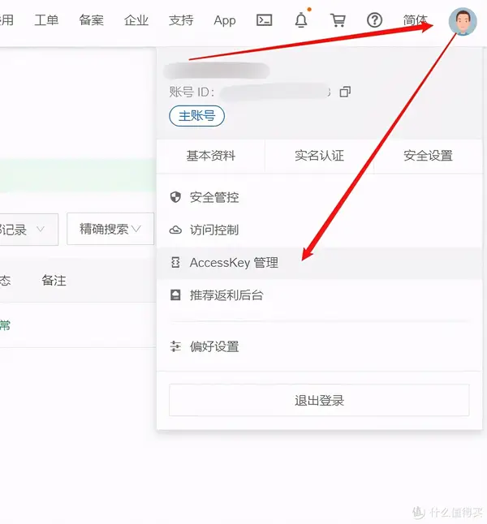  
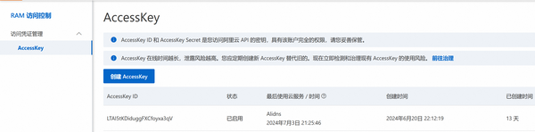  
DDNS-GO 设置如下

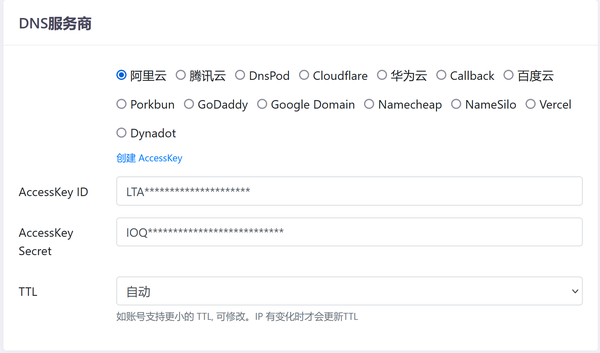  
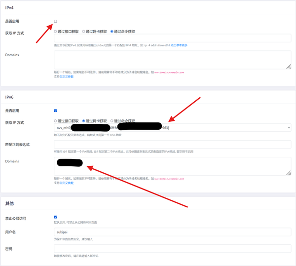  
不启用 ipv4，获取 ip 方式为通过网卡获取，domains 为 子域名。域名，例如 http://nas.example.com，主要就修改这个地方，点击保存。如果设置无误。网页左边就会有解析成功的提示了。解析成功之后，我们就可以尝试用域名 [http://nas.example.com/](http://nas.example.com/) 登陆 nas。这回应该非常方便就可以登录，包括套件也可以用这个域名登录。

### SSL 证书  
这一块其实很简单，但被我弄复杂了。建议域名是谁家的，就用谁家的 SSL。

我用的腾讯云 SSL，需要在阿里云域名解析下面添加一条 CNAME 解析，挺麻烦的，这里就不过多解释了。

如果域名和 SSL 是一家的话很简单，就不赘述了。

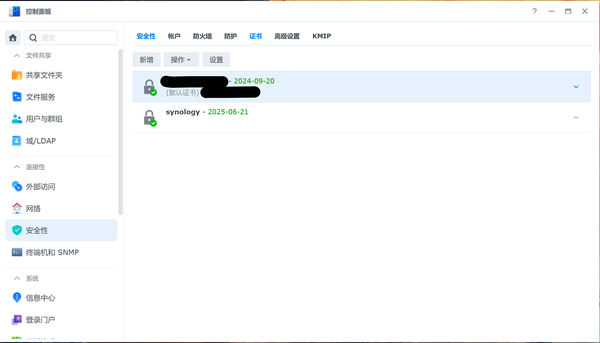  
在这里添加证书即可，用 https 访问就不会再有“不安全“的提示了。

### UPS  
如果家里的电不稳定，可以购置一台 UPS，我用的山特 TG-BOX 600，毕竟市面上就这一款排插型的 UPS，比较实用，可以插一些别的东西。

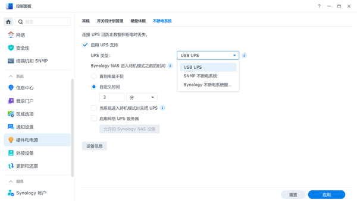  
在控制面板图示位置启用 UPS 即可。

## Synology Drive 解决存储需求  
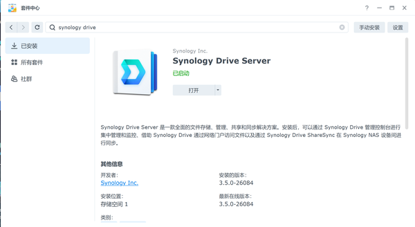  

安装这个套件

  
  
一般在第一次进入系统时就会询问你是否安装这个套件，直接安装即可。

然后在电脑上也要下载对应的软件：

[https://www.synology.cn/zh-cn/support/download](https://www.synology.cn/zh-cn/support/download)

然后使用你的域名 [http://nas.example.com/](http://nas.example.com/)，再加上账号和密码登录即可使用，如果开启按需同步功能的话，就和 onedrive 类似。

[https://kb.synology.cn/zh-cn/DSM/tutorial/What\_is\_On-demand\_Sync#:~:text=按需同步 是用于在计算机和 Synology NAS 之间配置 Synology Drive，同步任务的选项。启用此选项后，仅当您打开、修改本地副本或将其固定到计算机时，文件才会下载到本地计算机。下表提供了有关指示已启用 按需同步 的文件的同步状态的图标的详细信息。](https://kb.synology.cn/zh-cn/DSM/tutorial/What\_is\_On-demand\_Sync#:~:text=按需同步 是用于在计算机和Synology NAS之间配置 Synology Drive,同步任务的选项。 启用此选项后，仅当您打开、修改本地副本或将其固定到计算机时，文件才会下载到本地计算机。 下表提供了有关指示已启用 按需同步 的文件的同步状态的图标的详细信息。)

按需同步这个功能对于我来说是刚需，如果你只需要一个网盘磁盘功能的话，就不需要安装这个，自带的 smb 访问就挺好了。这个功能目前好像就群辉有，别的平替我暂时没找到。

## Synology Photos 实现相册备份  
安装这个套件，这个套件使用比较简单，就不多说了，可以参考以下链接。

[https://www.zabit.cn/support/9289/](https://www.zabit.cn/support/9289/)

但是需要解释一下这些功能。

1. 人物相册应该是需要显卡才能正常使用，不过我没用过，没有这个需求。
2. AME 的安装还挺麻烦，需要完美黑才能在套件中心直接安装，这里提供一个安装方法[https://imnks.com/385.html](https://imnks.com/385.html)。**这一步一定要做，不然后续很多功能都会受限。**

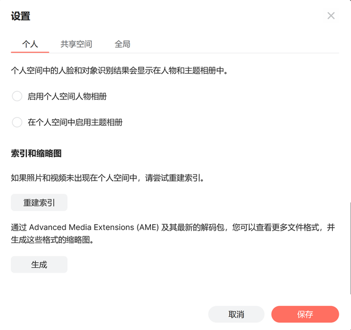  
## Jellyfin 媒体服务器  
其实我最初使用群辉官方的 Video Station，但怎么说呢？这个程序有以下几个问题：

1. 刮削器老刮出英文源信息。
2. 电视端播放器根本用不了。
3. 手机端播放器不支持倍速，转码等功能。

综上所述，基本没啥用，所以最近给换成了 Jellyfin。

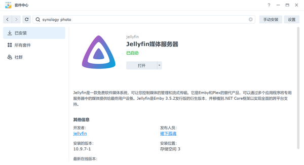  
在套件中心安装这个套件。打开，会提示你创建管理员账户，自便即可。

进入之后，需要进行几项设置，主要是要把**语言和国家**选择正确。

语言选 chinese，国家好像是 People's Republic of China。

这种设定，刮削的信息会以中文优先。

### 开启 ipv6 访问  
Jellyfin 默认不支持 ipv6 访问，需要手动开启。

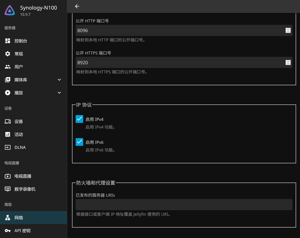  
勾选启用 ipv4 和启用 ipv6 保存，需要重启一下套件才会生效，可以等我们所有内容设置完之后再重启套件。

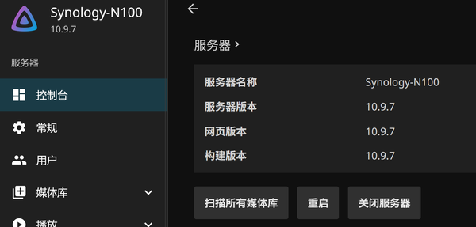  
### 硬件加速设置  
有了这个，CPU 在转码的时候就不会 100% 了。

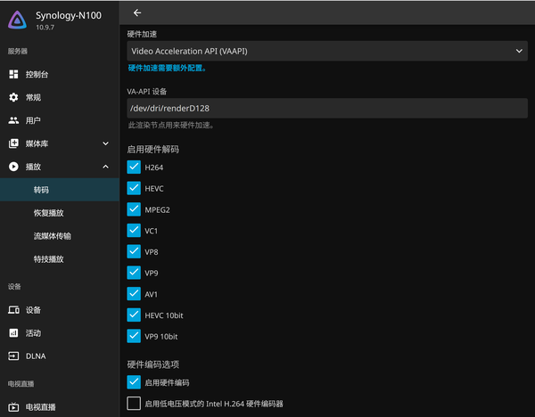  
按图示设置即可。

### 测试硬件转码是否有效  
在手机的 jellyfin 上播放一段视频，然后选择 360p 播放，看 NAS 的 CPU 使用率是否低于 50%，如果达到了八九十，就说明硬件加速没有生效。

### 创建一个用于观影的普通用户  
我以前觉得这个操作没必要，直到我在电视上把整个媒体库清空。

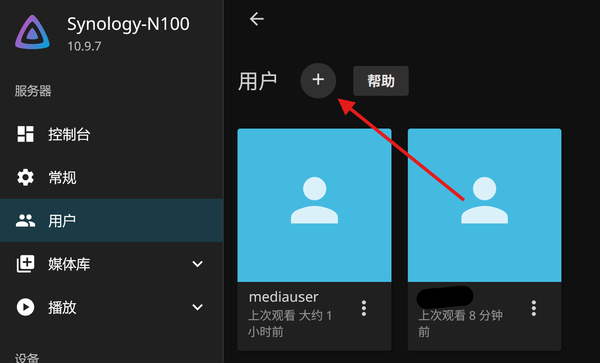  
点击这个加号添加用户，把箭头所指的三个地方取消勾选（其实默认就是取消的）。

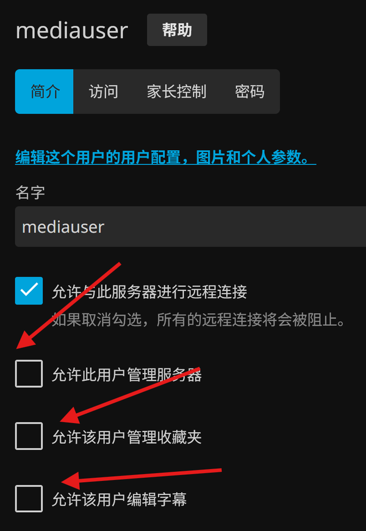  
然后就可以在电视和手机上愉快的观影了。

### 开启强制 https  
参考该文即可，主要就是把群辉的证书转换为 PFX 格式。

[https://www.bilibili.com/read/cv9244919/](https://www.bilibili.com/read/cv9244919/)

 强制 https 可开可不开，建议开启（不然搞 SSL 证书干嘛）。

## Navidrome 音乐服务器  
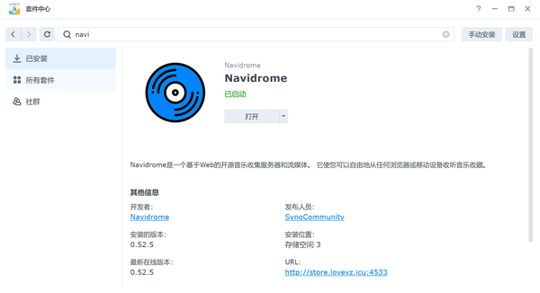  
安装这个套件，打开，同样会提示你设置管理员账户。

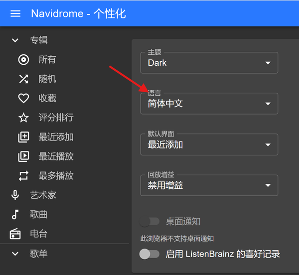  
在个性化设置中可以调整为中文，注意，每个用户的配置文件是分开的，需要分别设定。

### 创建只读权限用户  
理由同上，在图示位置创建即可。

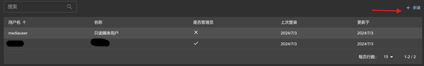  
### 手机上播放音乐  
直接打开网站 [http://nas.example.com:8096/](http://nas.example.com:8096/) 即可，苹果手机和 mac 都可以把网页创建成一个 app 使用，安卓手机可以创建一个快捷方式。

也可以下载第三方的音乐 APP，例如 substreamer，但是体验我感觉一般，歌词支持不完善，还容易闪退，我建议直接网页。

### 配合 MusicTag 软件搭建个人音乐库  
网上下载的音乐多少带点私货，使用 MusicTag 可以实现：

1. 按规则（如：歌手 - 歌曲）重命名歌曲。
2. 自动爬取歌曲的封面和歌词等信息。
3. 判定重复、无效等音乐文件，供你删除。

功能很强大，建议人手一个。

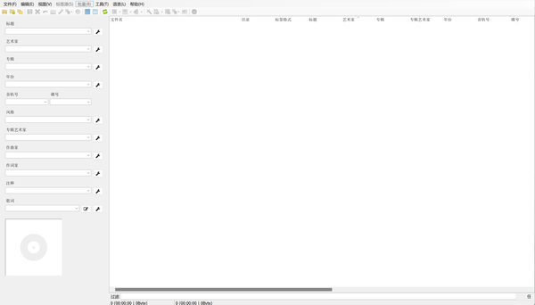  
## 小结  
到目前为止，我们实现了存储、相册、视频、音乐四个功能。但是头顶上还有两座乌云停留。

1. 数据的安全性如何保证。
2. 如何实现无缝切换内网公网，也就是说，使用同一个域名，在家里的时候走内网，在外面的时候走公网。

这两点恰恰是最难处理的，尤其是第二点，需要路由器支持 DNS 劫持。如果不支持也没关系，我们也有其他方法应对。

## Hyper Backup 备份到天翼云盘  
我个人认为，只要是存储在本地硬盘的内容，就没有绝对的安全一说，在备份这件事情上，还真得相信云盘。电信给了我家 4T 的空间，用来备份正合适。

天翼云盘不能直接挂载，需要通过 Alist 挂载 webdav 实现。

### Alist 挂载天翼云盘  
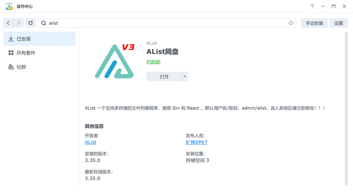  
下载这个套件，打开，改掉默认的账户密码。

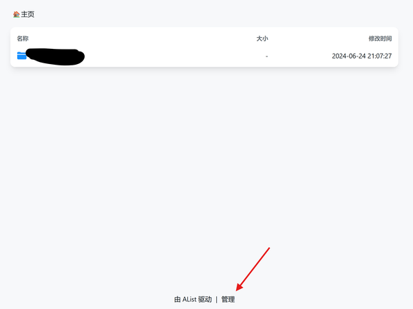  
点击管理，进入管理页面。

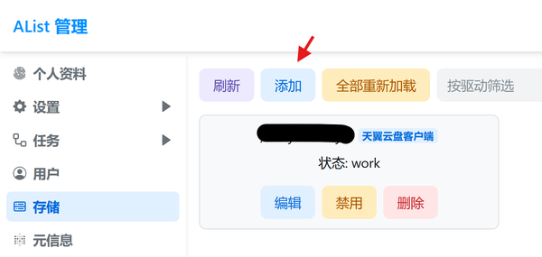  
添加一个客户端，需要设置的地方如下

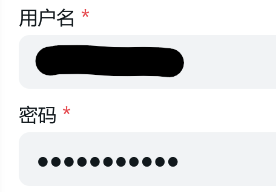  
用户名就是你的手机号。

然后点及保存，看到状态为 work 的话就成功了。重新打开 alist，可以看到挂载的网盘，

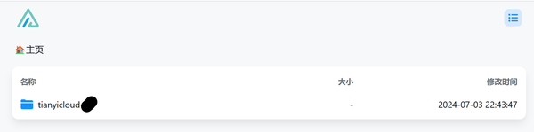  
点进去，有文件就行

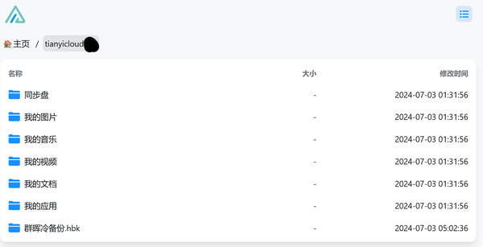  
### 用户文件备份到天翼云盘  
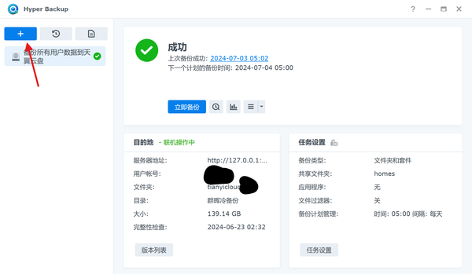  
点击 + 创建备份任务

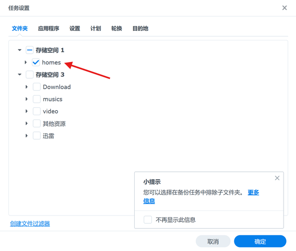  
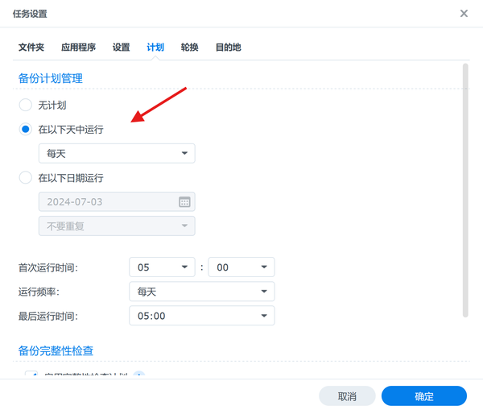  
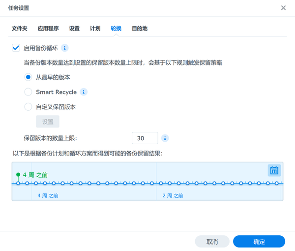  
以上内容根据你的实际情况填写即可。

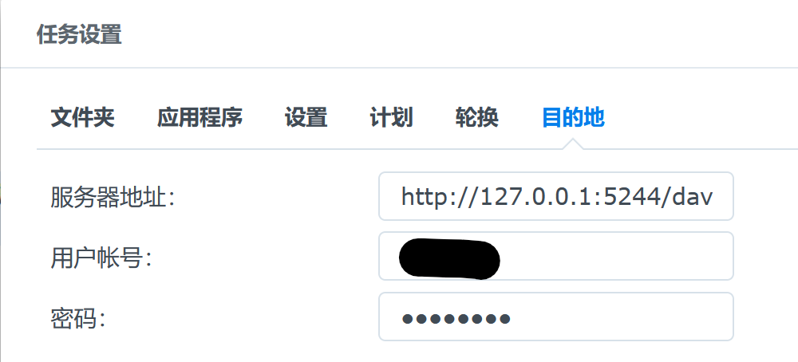  
目的地这个地方需要注意，服务器地址抄我的即可，用户账号和密码是你在**alist 中所设置的账户和密码**，而不是天翼云的账户和密码。

创建好任务之后，可以手动备份一次，后面他自己备份就行。Hyper Backup 的备份是增量的，每次只会备份修改过的内容，这一点非常好。

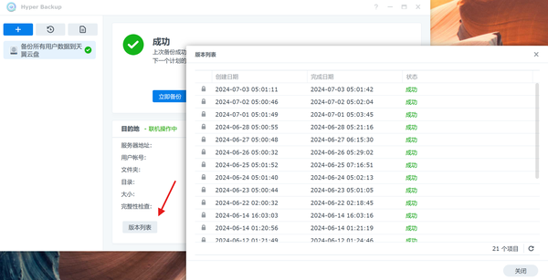  
在版本列表中可以追溯以前的文件，这个功能也非常实用。

### 如果群辉崩了，但我需要继续使用上面的文件怎么办？  
这个情况虽然很少出现，但一出现就会很致命，因此，我们需要一个可靠的 plan B。

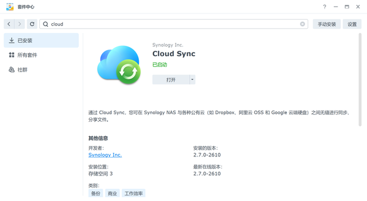  
安装这个同步插件。

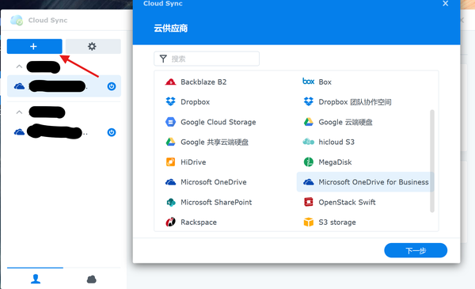  
选择你拥有的网盘，登录账号设置即可，比较简单，就不赘述了。

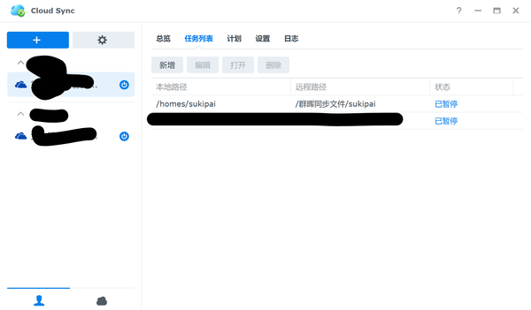  
在任务列表中可以查看连接情况，途中的意思是同步群辉的 /homes/sukipai 文件夹和 onedrive 中的 /群辉同步文件/sukipai 文件夹。这样设定主要是考虑到 onedrive 中可能自动在根目录生成一些文件，这些没用的文件会反向同步到 NAS，因此同步文件夹最好不要放在根目录。当然，这个你可以自行设定。

  
这是我女朋友单纯备份照片的实例，她只使用群辉的相册功能，因此同步相册就够了。

## 路由器 DNS 劫持实现内外网访问

这一块比较复杂，这里仅简单讲解一下思路，后面我可能会单独拿一篇文章来写这个功能。

在阿里云的 DNS 解析中，我们将域名 [http://nas.example.com/](http://nas.example.com/) 解析为了 [ipv6] 地址，因此，理论上无论在何方，我都可以通过域名 [http://nas.example.com/](http://nas.example.com/) 来访问 NAS。在家中，除了使用域名，我们还可以直接使用内网的 ipv4 地址来访问 NAS，从而实现更快的访问速度，拒绝中间商。

而对比内外网，多了一个什么设备？路由器。如何在路由器中劫持域名 http://nas.example.com，让他不通过 DNS 服务器来进行域名解析，而是直接被解析为群辉主机的 ipv4 地址，不就可以实现这个功能了吗？

这样的话，我们在外面，通过 DNS 服务器解析域名为 [ipv6]，在家中，通过路由器解析为 ipv4，岂不美哉。

不过这事说起来容易做起来难，路由器不支持的话，就需要虚拟一个旁路网关（旁路由）来实现 DNS 劫持——这样做不需要购买额外的设备，效果如下。

  
在内网直接将 [http://nas.example.com/](http://nas.example.com/) 劫持为 192.168.9.100（群辉 ipv4 地址）。

但这在实际操作会存在一些问题，内网解析 IPv4，公网解析 IPv6，实际上是把这个域名在内网变成了双栈（也就是既可以解析到 v6 地址，也可以解析到 v4 地址）。而在操作系统中，几乎都会优先使用 IPv6 解析地址，这是因为 v6 是下一代标准，未来肯定会全面向 v6 过渡。

这就导致我们的确在 v4 层面劫持了这一域名，但实际上并没有起到效果。

再者，我实测在同一局域网下，公网 v6 的传输速度与内网 v4 差不多，只是网页加载速度 v4 会快一些。所以，我觉得只使用公网 v6 也够了，不用多加配置，也不用添加旁路由，用 v4 的时候可以用 ip 地址访问。

## 那么域名挟持真的一点用也没有吗？

其实也不是的，域名挟持对于做内网穿透的用户有大用，能够真正实现内外网无缝切换。

例如：我首先把群晖的访问端口改为 52491（v4 用户默认端口必改）穿透为 `192.168.9.100:52491 -> frp-example.cc:52491`。然后在内网劫持`frp-example.cc`为`192.168.9.100`，

由于 v4 之间不存在优先级关系，劫持了就是劫持了，内网下面只能放问到 `192.168.9.100`，所以就很完美地实现了内外网无缝衔接。

只要注意群晖访问端口与穿透端口一致即可。

本来说不讲 v4 的，结果还是说了这么一大堆。。。。。。

下一篇文章还是会稍微讲讲旁路由和域名劫持相关的内容。
