## 说明

前面挖了一个坑，利用旁路由域名劫持实现内外网无缝访问 NAS。在浏览下面的内容之前，请确保你现在的路由器本身没有域名劫持（挟持）功能。就是下图这个：

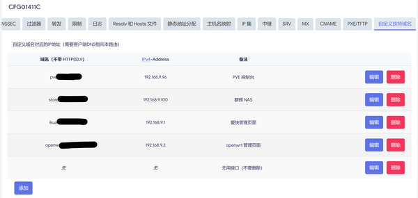  

openwrt 的域名劫持功能

如果你的路由器已经支持这个功能，那么只需要添加几个劫持域名即可，不需要配置旁路由。

## 虚拟 OpenWRT  
可以通过虚拟机或者 docker 虚拟，我没有试过 docker 的方式，理论可行，但我能预想到会有很多坑，比如桥接网络等，为了省事就用虚拟机就好。如果你有单独的旁路由硬件，可以使用 PVE 来虚拟，或者直装虚拟机；如果没有多余的设备，那就用群辉的虚拟机套件就好了。

多说一句，如果仅仅是为了域名劫持功能就搞一个单独的硬件，我认为有些过头了，毕竟功耗再低的主机也有个 10W 吧，天天开着也是一笔不小的费用。

### 下载 OpenWRT 系统包  
方式有很多，给大家推荐 [https://openwrt.ai/?target=x86/64&id=generic](https://openwrt.ai/?target=x86/64&id=generic) 这个网站，可以免费定制，也可以免费下载作者编译好的，我们直接下载编译好的版本即可。

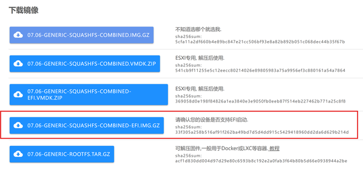  
下载带 EFI 的版本即可，这个版本在虚拟机中不使用 UEFI 也可以启动。当然，你要下第一个也可以，应该没啥影响。

### 安装群辉虚拟机套件或 PVE  
 PVE 的安装就不详细说了，网上随便就能搜到。

### 群辉创建 OpenWRT 虚拟机  
群辉套件安装虚拟机，这里借用一下 [https://blog.yanghong.dev/synology-nas-openwrt/](https://blog.yanghong.dev/synology-nas-openwrt/) 的文章，写得很详细。

在选择硬件配置那一步，我们刚开始不需要很高的配置，可以选择单核 512M 内存，如果后续有去广告等需求，再提高配置。

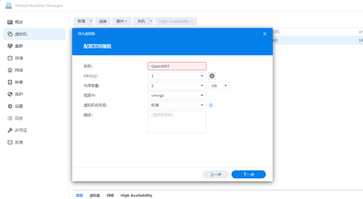  


OpenWRT 配置选择

  
  
PVE 安装 OpenWRT 虚拟机

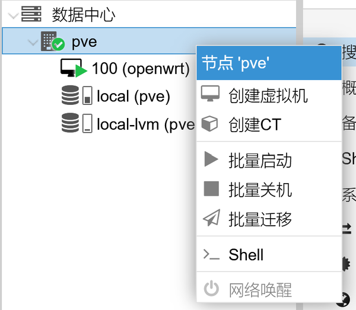  
右键 pve 节点创建虚拟机。

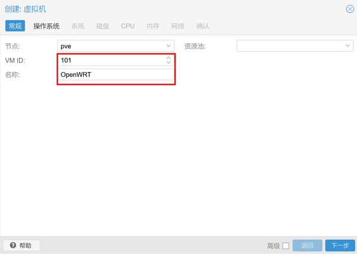  
ID 用默认的即可，一般为 99+N，N 为你创建的虚拟机数量，这里假设为 100。名称随便写。

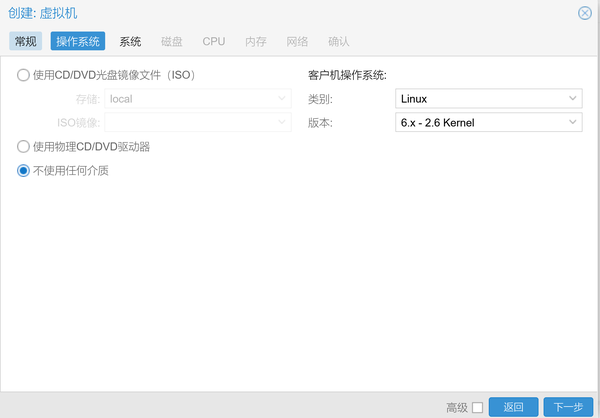  
选择不使用任何介质。

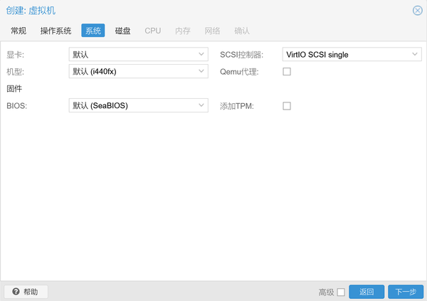  
系统这一栏全部默认。

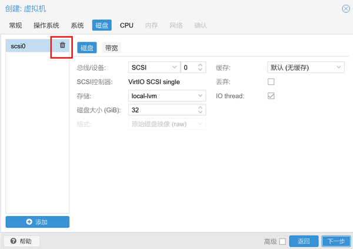  
删除这个磁盘，后面几个标签页就改改 CPU 核心数和内存即可，其他全部默认。

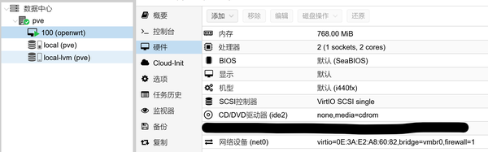  
创建好的虚拟机应该类似这样，然后需要为他添加一块磁盘，也就是我打码的地方。

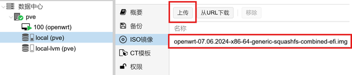  
上传系统文件，然后进入终端。

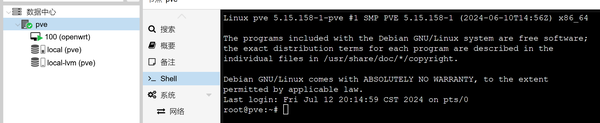  
cd 到 /var/lib/vz/template/iso 中，这个目录存放了你上传的系统镜像


```
root@pve:~# cd /var/lib/vz/template/iso
root@pve:/var/lib/vz/template/iso# ls
openwrt-07.06.2024-x86-64-generic-squashfs-combined-efi.img
```
然后把系统镜像转换为磁盘镜像。


```
qm importdisk 100 openwrt-07.06.2024-x86-64-generic-squashfs-combined-efi.img local-lvm
```
里面的 100 为虚拟机编号，openwrt-07.06.2024-x86-64-generic-squashfs-combined-efi.img 为系统镜像名称。

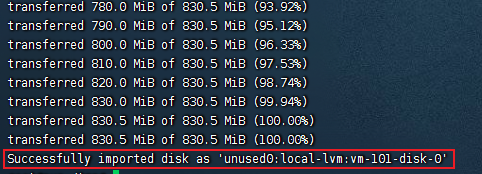  
出现类似的输出代表导入完成，然后虚拟机 100 中会多一个未使用的磁盘，编辑它。

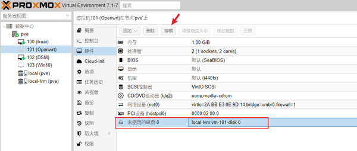  
总线/设备那里选择 SCSI0，添加即可。

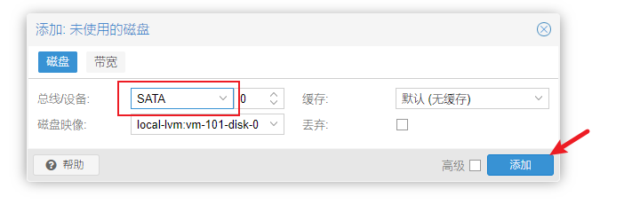  
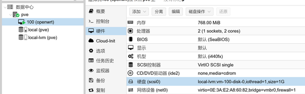  
这样的话虚拟机硬件就配置完成了，最后在在启动顺序把 scsi 硬盘调整到第一项，打开开机自启动即可。

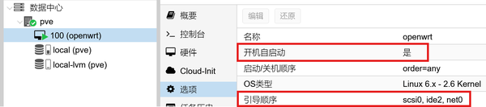  
然后开机测试，如果开不了机的话检查一下 BIOS 是不是选成 EFI 启动了。

## 配置 OpenWRT 实现域名劫持  
开机进入控制台，先用 passwd 命令改密码。

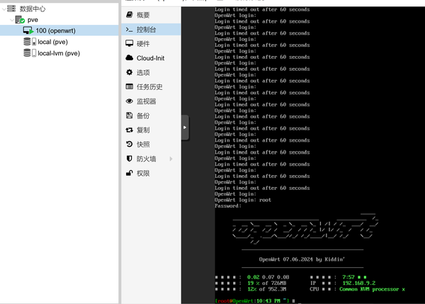  
### 修改 OpenWRT 的 ip、dns、网关  

```
vim /etc/config/network
```
vim 操作请自学。先添加或修改这些内容：

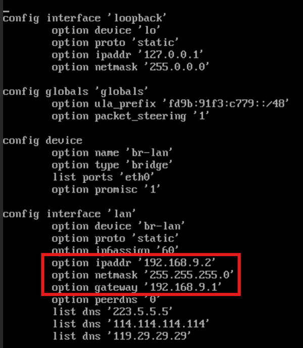  
* ipaddr 的地址确保和你的路由器在同一网段，如果用户没有特别修改的话路由器地址一般为 192.168.X.1，那么 ip 填 192.168.X.{2,3,4,5 等等} 都可以。比如小米为 192.168.31.1，爱快是 192.168.9.1。netmask 是子网掩码，跟我一样就行。gateway 是网关，甜 192.168.X.1。
* 填好之后保存重启，然后在电脑浏览器中输入 [http://192.168.X.2](http://192.168.X.2) (你自己设置的地址)，就可以访问 OpenWRT 的主页了。

### 接口配置  
把除了 LAN 之外的接口全部删除，旁路由不需要它们，然后编辑 LAN 接口。

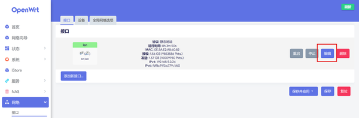  
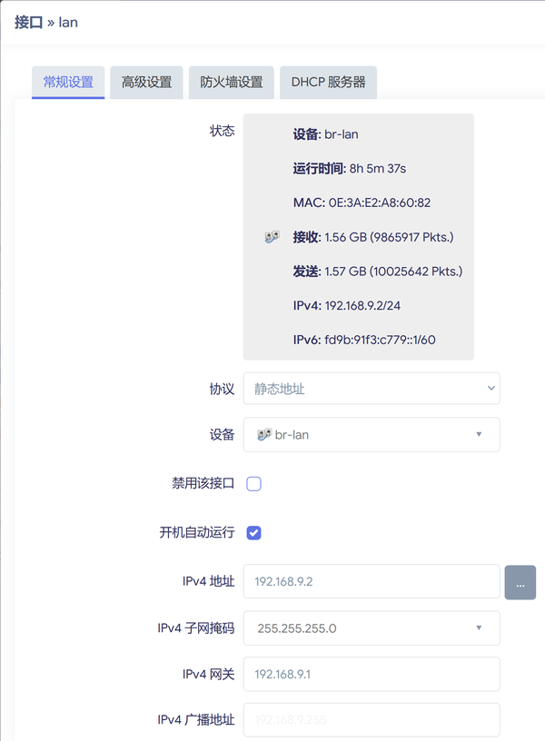  
常规设置里面我们已经通过命令行设置了，不用再动它。

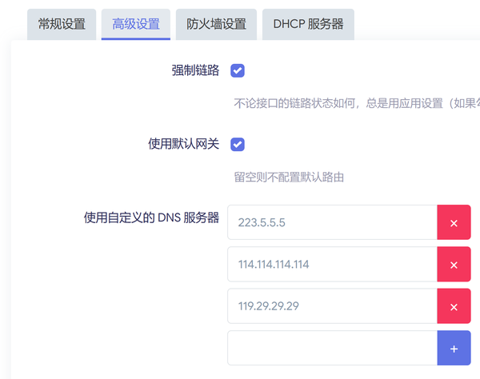  
高级设置里面，将 DNS 服务器地址填写为主路由（图片错误）,192.168.9.1。

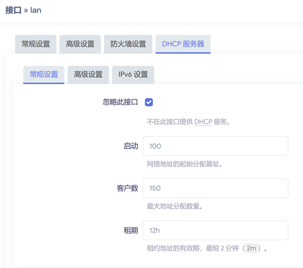  
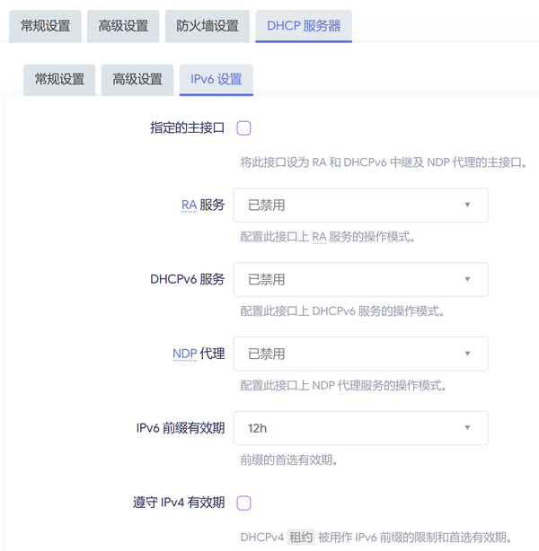  
DHCP 由主路由负责，并禁用所有 ipv6 相关的内容（内网中使用 ipv4 更方便）。

### 防火墙设置  
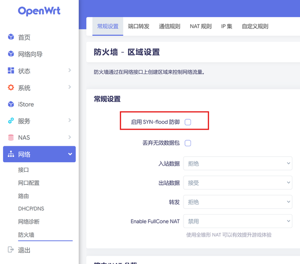  
取消勾选 SYN-flood 防御。

  
删除所有与 LAN 口无关的规则，主要是 WAN 口和 docker 相关规则。

### 联网检测  
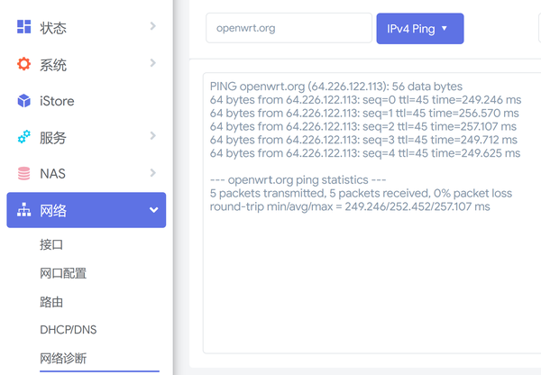  
ping 一下能联网就行了。

### 设置域名劫持  
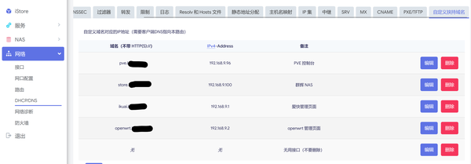  
注意，**要添加一栏无用的接口**，因为该版本的 OpenWRT 无法存储最后一个劫持数据。

### 主路由设置  
以爱快为例，网关和首选 DNS 更改为 OpenWRT 的 IP 地址即可，可能设备需要重连一下路由器，以重新分配网关和 DNS。

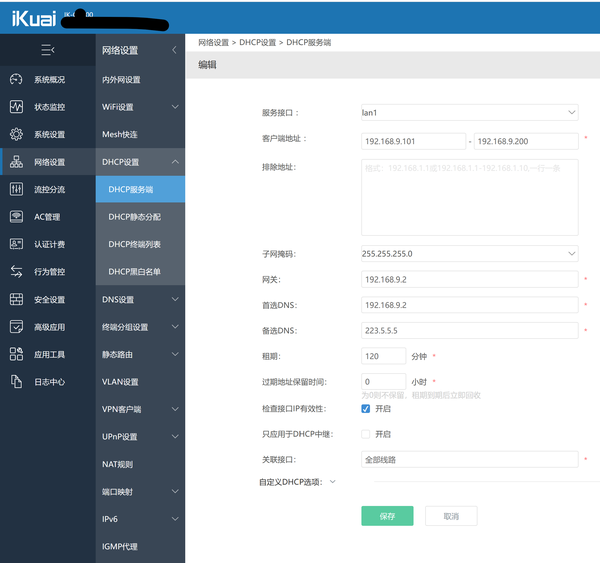  
有些路由器不支持修改网关和 DNS，那么需要在终端设备手动设定，要麻烦一些。

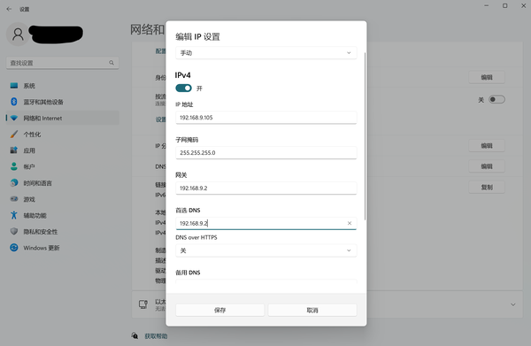

## 主机设置

### 这部分仅供参考，我这里不起作用

家用的 windows 系统一般是优先 ipv6，如果解析不到 ipv6 再使用 ipv4，这导致我们做的域名劫持使得域名成为了双栈，虽然可以解析到内网的 ipv4 地址，但系统还是会默认使用 ipv6 地址。因此还需要在电脑上更改一下 v4 和 v6 的优先级。

参考这篇博客的方法：[Windows 10/11 设置 IPv4 优先访问](https://blog.xiaoz.org/archives/20079)

以管理员身份运行终端，然后输入下面的命令查看优先级：

```cmd
netsh interface ipv6 show prefixpolicies
```

没有修改系统的输出如下：

```
查询活动状态...

优先顺序    标签   前缀
----------  -----  --------------------------------
        50      0  ::1/128
        40      1  ::/0
        35      4  ::ffff:0:0/96
        30      2  2002::/16
         5      5  2001::/32
         3     13  fc00::/7
         1     11  fec0::/10
         1     12  3ffe::/16
         1      3  ::/96
```

然后修改优先级

```cmd
netsh interface ipv6 set prefixpolicy ::ffff:0:0/96 100 4
```

这样设置后，将优先使用 IPv4 而不是 IPv6 进行访问。

ping 一下内网域名，可以看到优先返回了 v4 地址：

```
$ ping debian12.example

正在 Ping debian12.example [192.168.9.99] 具有 32 字节的数据:
来自 192.168.9.99 的回复: 字节=32 时间<1ms TTL=64
来自 192.168.9.99 的回复: 字节=32 时间=1ms TTL=64

192.168.9.99 的 Ping 统计信息:
    数据包: 已发送 = 2，已接收 = 2，丢失 = 0 (0% 丢失)，
往返行程的估计时间(以毫秒为单位):
    最短 = 0ms，最长 = 1ms，平均 = 0ms
```

这个方法重启就会失效，不建议使用。实测下来直接使用 ipv6 的速度也不算慢。如果觉得麻烦的话，不做域名劫持也无所谓。

最近学习了一下 IPv6 的寻址方式，其实 IPv6 的寻址方式和 DNS 递归解析服务器比较像，都是一层层寻找的。因此你在自家路由器这一层就已经完成了寻址，所以用这个公网 IP 的速率与内网并没有什么区别。

## 域名劫持的其他作用

域名劫持可以很方便地管理内网的设备，尤其是主机数量多的时候，例如。

- 服务器 192.168.9.99
- openwrt 192.168.9.77
- 群晖 192.168.9.106
- ikuai 192.168.9.1

把这些设备的 ip 都记下来还是很有难度的。通过域名劫持搭建小型家用 DNS 服务器的话，可以很方便管理这些设备。如：

- linux.example -> 192.168.9.99
- openwrt.example -> 192.168.9.77
- nas.example -> 192.168.9.106
- ikuai.example -> 192.168.9.1

这样的域名看着也比冷冰冰的数字更舒服。

## 最终效果

假如我在阿里云中将域名 store.domain 解析到了群辉的 ipv6 地址 240e::1，那么当我在外面时，就会通过 ipv6 来访问家中的群辉。而我在家中，与群辉同处于一个内网时，OpenWRT 将我的域名解析请求劫持，并返回 ipv4 地址 192.168.9.100。

这个功能确实能够实现，但如上篇文章所说，并没有实际效果。

## 能不能把域名劫持为 IPv6？从而实现与 v4 类似的功能

这个思路其实是可以的，但效果并不比直接用公网地址好多少，并且容易出现一些切换错误的问题，所以在带宽不受限的情况下，不推荐用这种方式。

要使用这种方式，你需要修改路由器的 `/etc/hosts` 文件，添加以下的内容：

```
fe80::91e3  nas.example.com
```

将你的内网 v6 (这个地址在 windows 中叫本地链路回环地址，是固定的地址，系统不重装的话一般不会发生变化，可以放心劫持，其他系统在网络设置中找到 fe80 开头的就行) 劫持。

## 真正有用的用户

建议无公网 ip 的 v4 内网穿透用户采用这种方式，实测可以在公网与内网之间无缝切换，顶多就是重启一下 app，Synology Photos, Drive Server 等软件，Jellyfin，navidrome 等服务都可以正常使用。

例如：我首先把群晖的访问端口改为 52491（v4 用户默认端口必改）穿透为 `192.168.9.100:52491 -> frp-example.cc:52491`。然后在内网劫持`frp-example.cc`为`192.168.9.100`，

由于 v4 之间不存在优先级关系，劫持了就是劫持了，内网下面只能放问到 `192.168.9.100`，所以就很完美地实现了内外网无缝衔接。并且由于内网穿透往往上行带宽受限，这样做的效果是十分显著的，可以跑满内网带宽。只要注意群晖访问端口与穿透端口一致即可。

## 总结

文章修修改改了很多次，自己也是在摸索中前进，想要把 NAS 做到完美，但后来发现，其实就用公网 v6 是最方便省事的。

文章被搞的比较杂乱，有空再进行整理。