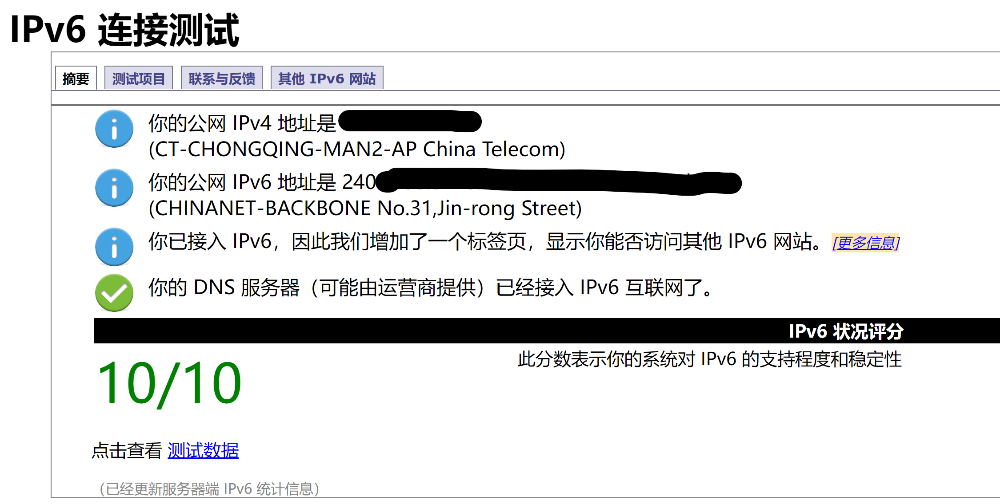
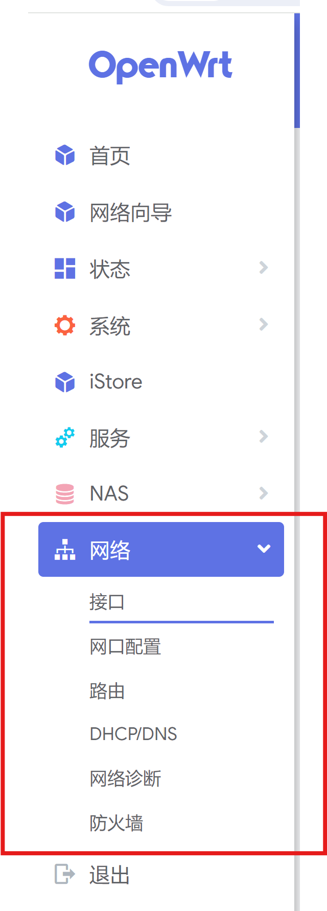
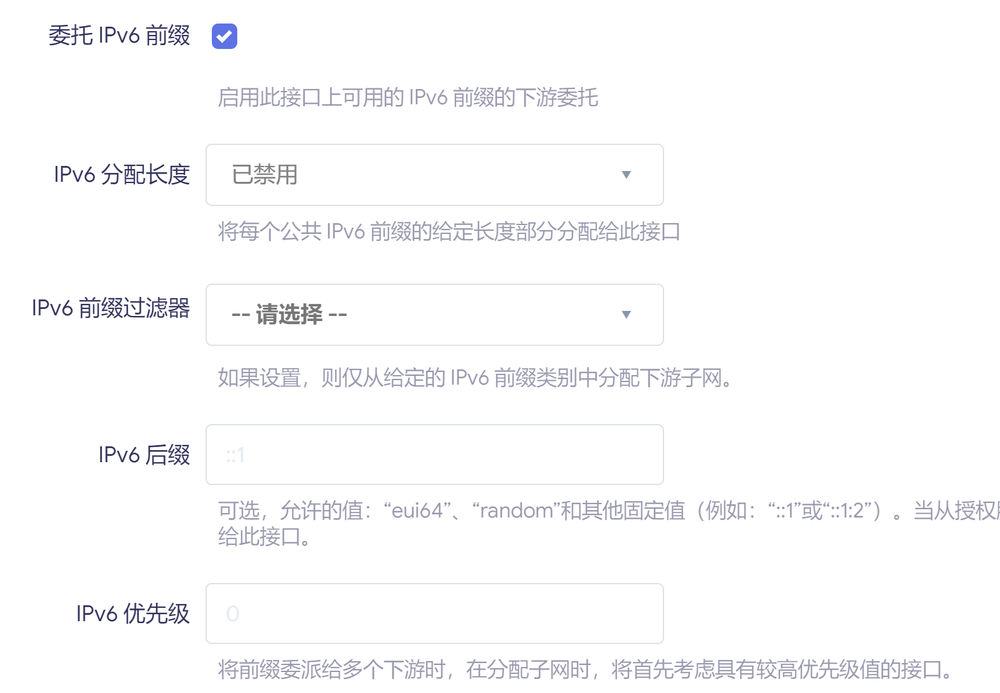
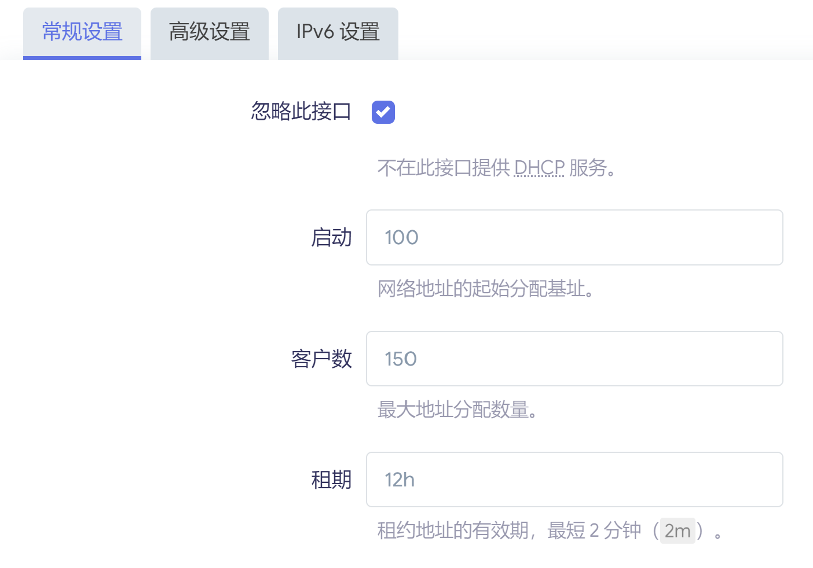
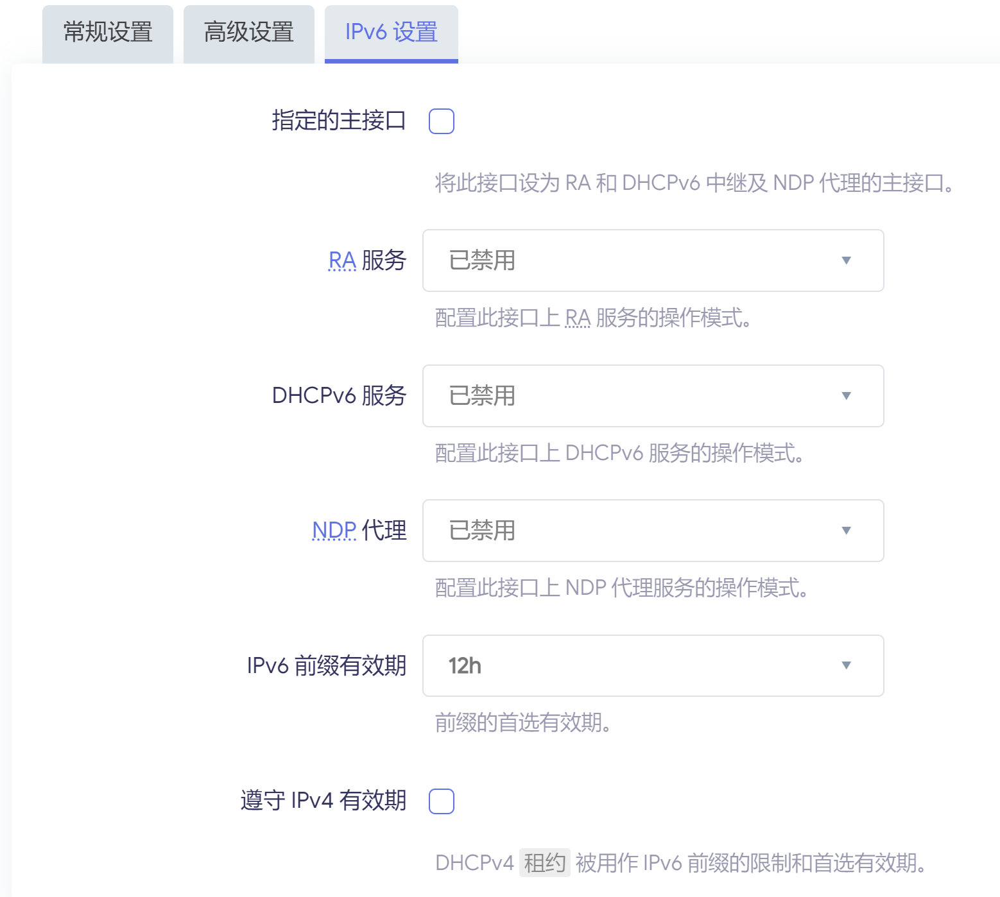
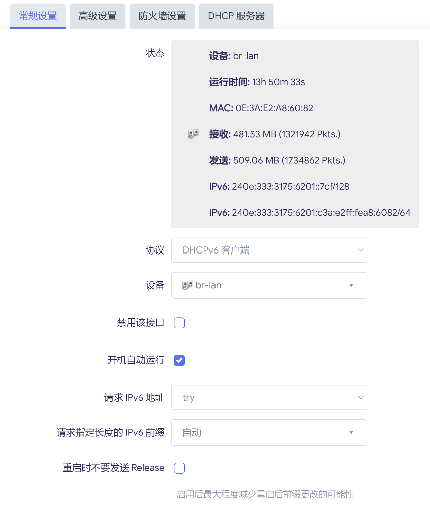
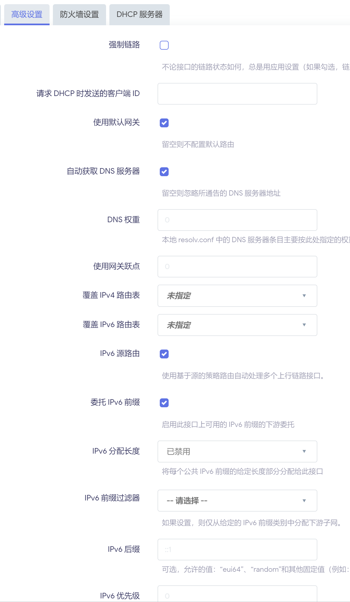
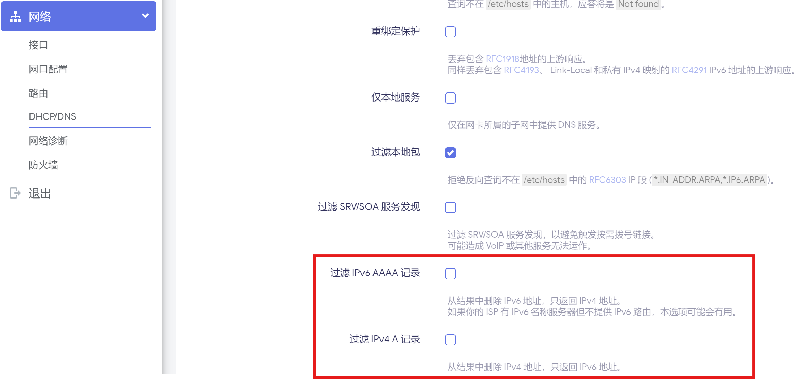
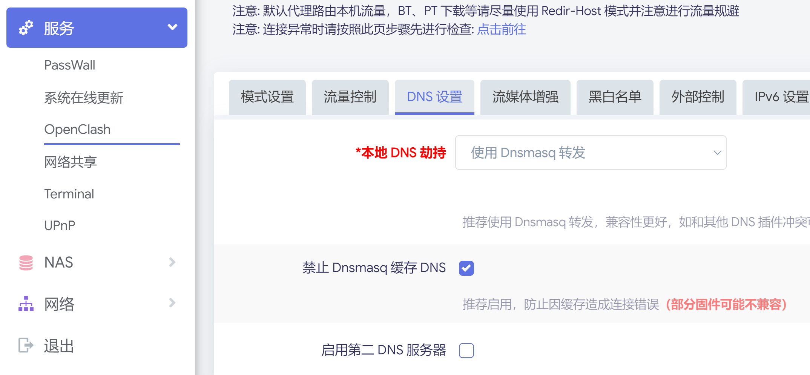

在之前配置旁路由内网穿透的时候，我们在 openwrt 中禁用了 IPv6，这主要是想在实现功能的同时尽可能简化配置过程。然而，工信部在 2023 年发布了 [工业和信息化部等八部门关于推进 IPv6 技术演进和应用创新发展的实施意见](https://www.gov.cn/zhengce/zhengceku/2023-04/23/content_5752858.htm)。要在 2025 年前实现 IPv6 的全面普及，因此，直接关掉 IPv6 并不是一个好的使用方式。

在这里，我将补充讲解如何启用旁路由中的 IPv6。

## 不启用 IPv6 会怎么样？

答案是不会怎么样。目前 IPv4 还是事实标准，并且许多拥有足量 IPv4 的人并不愿意让 IPv6 普及（动了谁的蛋糕？）。因此哪怕不开启 IPv6，对你的上网体验也不会有太大的影响。但是在配置群辉的过程中，我们为了公网访问群辉已经配置好了路由器和主机的 IPv6，如果不把整个家庭的 IPv6 都配置好，那不等于是白折腾了吗？

## 路由器中已经启用了 IPv6 呀，为什么还要在旁路由再启用一次？

原因是所有网关指向旁路由的设备流量都会经过旁路由代理，旁路由不开 ipv6 的话，等于过滤掉所有 IPv6 相关的流量，因此虽然电脑能够获取 IPv6 地址，但只要网关指向旁路由，就等于没有使用 IPv6。

这时候电脑去[ipv6 测试网](https://test-ipv6.com/)的话，也是无法通过测试的，这是因为实际上测试的是旁路由的网络，而不是电脑的，旁路由不支持 IPv6 的话，就无法通过测试。

在配置好旁路由之后，就可以通过测试了：

## 旁路由的配置

首先进入 OpenWRT 的界面，我们主要操作网络部分：

看到这个 LAN 接口，我们需要在这个 LAN 接口中彻底禁用 IPv6。

在下图的设置中禁用 IPv6：

然后新增一个用于 IPv6 的接口：

并按照下图设置：

然后到 DHCP/DNS 页面，选择过滤器设置，确保下图两个选项没有勾选。

记得保存所有的设置，最好重启一下旁路由。

## 测试网络

在网络诊断中使用 IPv6 ping 测试网络连通性。

如果 ping 正常的话就可以了，把主机的网络重新连接一下，进入 [ipv6 测试网](https://test-ipv6.com/) 进行测试，能通过就说明 IPv6 已经开启了。

## openclash 配置

现在的科学软件大多都支持了 IPv6，只通过简单的设置就可以完成。

## 功能测试

进行 IPv6 等功能测试，如果有其他的问题，需要再进行排查。