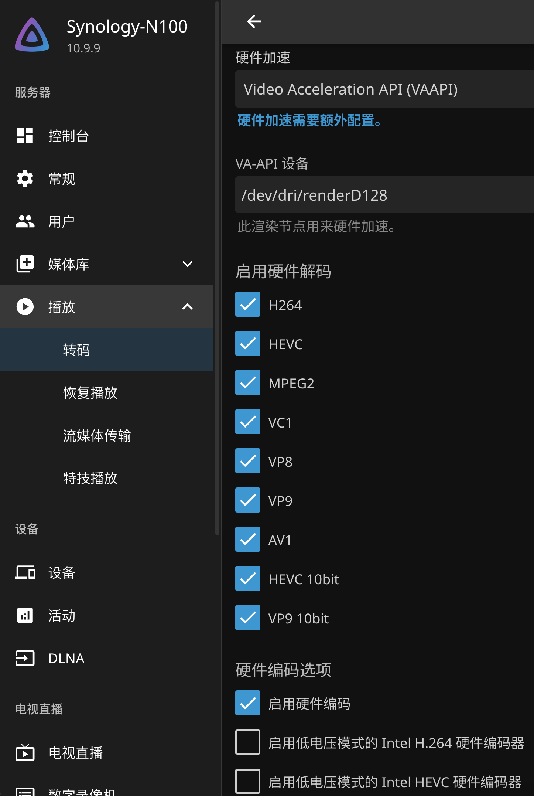
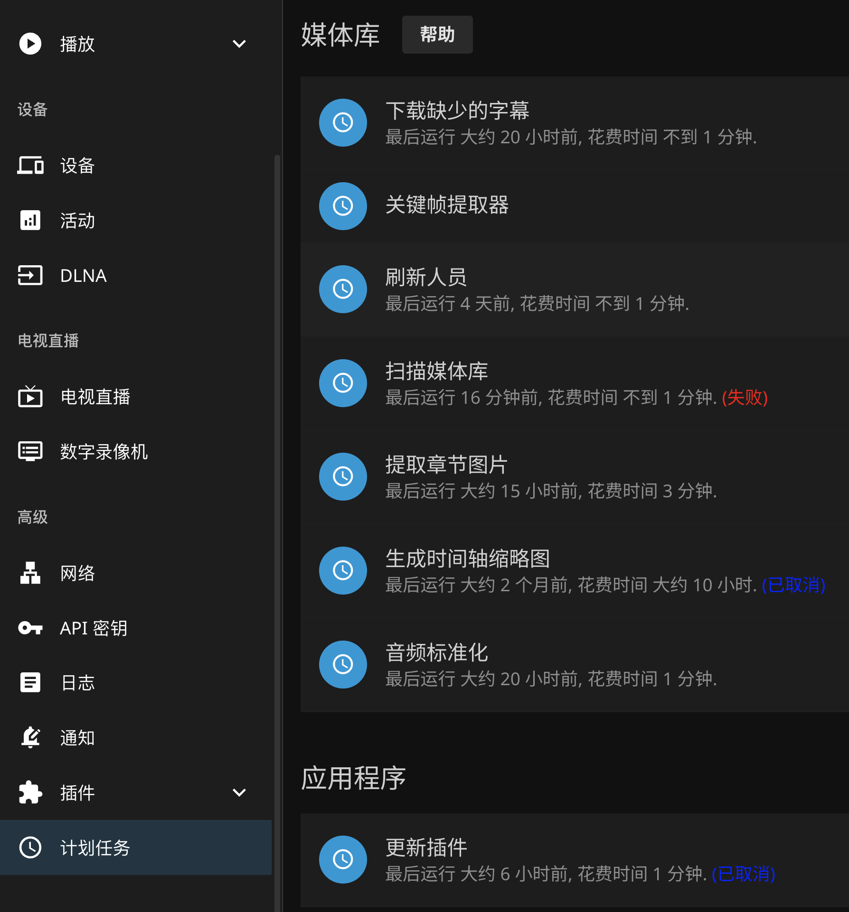

## 占用原因

主要有两点原因：

1. Jellyfin 的转码、缩略图生成等功能需要占用大量的资源，而且这种资源占用是实时的，任何时候都可能进行，表现为 Jellyfin 一直有大量的 CPU 占用和磁盘读取。
2. 目录异常。例如，错误地将监控视频目录添加到了 Jellyfin 的媒体库中，这类视频数量大，体积小，而 Jellyfin 会处理每个视频，导致异常的资源占用。

下面尝试解决这几个问题。

## 启用硬件加速（N100 为例）

## 使用 tinyMediaManager 代替 jellyfin 的刮削

在 tMM 中把刮削格式设置为 jellyfin，第一次打开软件的时候有提示。

tMM 的使用就不在这里讲了，功能比 Jellyfin 自带的强大太多。

## 去除无用的媒体库

我只保留了电影和电视剧两个文件夹。

## 去除无用的定时任务

像提取章节库、时间轴缩略图这些功能可有可无，而且很占资源，建议关闭。

## 总结

说白了，就是让 Jellyfin 做一个媒体服务器该做的事，负责播放和展示就行了。刮削之类的功能应该交给更专业的程序完成。