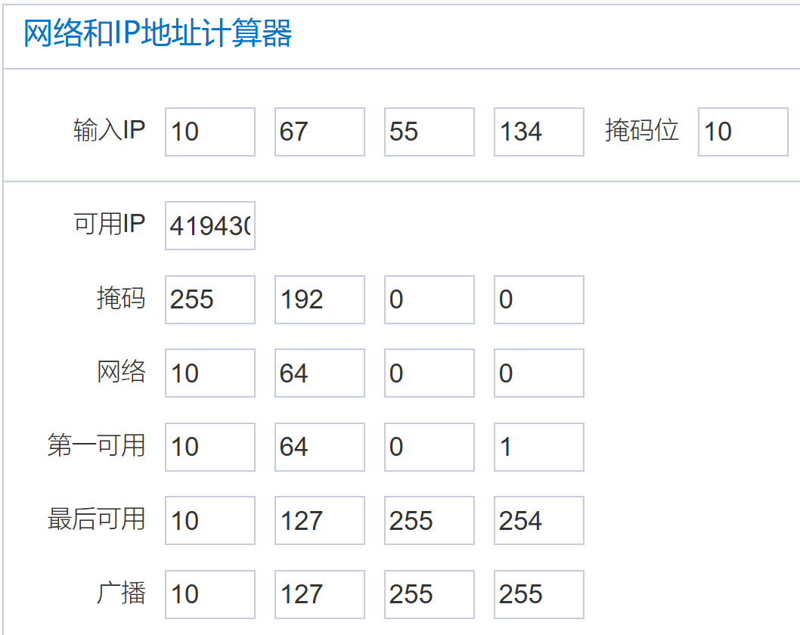
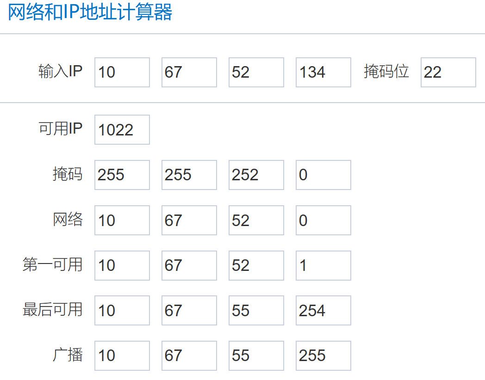
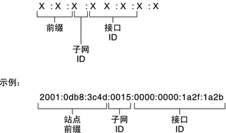

其实在很久以前就有接触过子网掩码，但一直不太理解它具体的使用场景。这段时间闲鱼了一台 j4125 的四口软路由，花了两天时间折腾后，竟然意外地理解了子网掩码和 IPv6 前缀……

其实他们的概念并不算难，但网上的介绍文章大多都是繁杂的概念和计算，让人捉摸不透。在这片文章中，我将用最清晰易懂的语言和示例，带你理解子网掩码和 IPv6 前缀。

## IPv4 和 IPv6 的区别  

IPv4 地址通常表示为 4 个 8 位 2 进制数，也就是 4x8=32 位，比如 192.168.1.1，每个数字范围是 0 到 255(分别对应 00000000 和 11111111)。IPv6 地址更长，通常表示为 8 组 16 位 2 进制数（或 8 组 4 位 16 进制数，一回事），比如 2001:0db8:85a3:0000:0000:8a2e:0370:7334，看起来更复杂。

有些初学者难以理解为什么 IPv6 是 128 位的，他们会疑惑，每一位有 16 种状态，那么总共的位数不是 16 \* 32= 512 位吗？

高手先不要笑话，真的有不少初学者有这样的疑惑。事实上应该把每个：之间的数字拆出来看，例如，4 位 16 进制数 2001。我们将其转换为 2 进制数，也就是 0010 0000 0000 0001，一共是 16 位，这样的 4 位 16 进制数一共有 8 组，因此一共是 16 \* 8 = 128 位。

IPv4 和 IPv6 最大的区别就是地址空间不同，IPv4 一共只有 4 亿个，而 IPv6 是用之不竭的（理论上能用完，但实际很难，后面会再提到相关内容）。

## 从给孩子起名字说起  

IP 地址是网络上设备的一个寻址符，因此，我们先讲公网 IP 可以看成是你在身份证上的名字，私网 IP 则是家里面爸妈叫你的小名。

假设你的爸爸叫**毛利小五郎**，让我们带入他。

在社会上（假设这个社会上每个人姓名不同，且都为 5 字名字），别人叫毛利小五郎，你都会答应，但有一天，你发现，有好几个人一起应答了这个名字。你们几个人都愣住了。

不是说好的不能重名吗？政府怎么登记的？你们去质问有关部门人员，但工作人员很委屈，他说，你们名字确实不一样啊。

你开始了自我介绍：我姓毛利，名叫小五郎

毛利小五郎 B：我姓毛，名叫利小五郎

毛利小五郎 C：我姓毛利小，名叫五郎

毛利小五郎 D：我姓毛利小五，名叫郎

毛利小五郎 E：我就叫毛利小五郎，没有名

原来是这样，难怪大家叫一样的名字。你们一合计，那我们就在名字后面加一个标识符，把姓的字数标记一下，这样的话，即使重名，大家也可以分出来了。政府一听，好主意，当即就给你们改了身份证。于是你们几个的名字变成了：

| 原先名字 | 现在名字 |
| --- | --- |
| 毛利小五郎 (A) | 毛利小五郎/2 |
| 毛利小五郎 (B) | 毛利小五郎/1 |
| 毛利小五郎 (C) | 毛利小五郎/3 |
| 毛利小五郎 (D) | 毛利小五郎/4 |
| 毛利小五郎 (E) | 毛利小五郎/5 |

现在你们都清楚自己姓甚名谁了，以后大家都能分清了。、

这时，你们用奇怪的眼光看着 毛利小五郎/5，问到：“兄弟，你没有名，那你儿子不是起不了名字吗？毕竟这个世界不允许重复姓名。”

毛利小五郎/5 说：“我是女人，孩子不和我姓”。

## IPv4 地址生娃  

上面这个故事引出了今天的主题之一，子网掩码。

不过在 IPv4 世界里，每个单位的名字有 32 位，且每一位只能是 0 和 1。

子网掩码就标识出了这个 IP 地址中，哪一段是爸爸，哪一段是儿子。

回到刚刚的故事，毛利小五郎/2 想要给生一个孩子，在当前社会规则要求下，你最多能生几个呢？

首先，孩子也得姓毛利，这是不变的，所以儿子的名字只能在后面三个字里面选，常用的汉字有 6000 个，因此你最多生下 6000^3 个孩子。再多生的话，政府就没办法帮你上户口了，你只能另想办法（也就是 NAT）。

而毛利小五郎/1 就爽了，他能比你多生 6000 倍的孩子，可以生 6000 ^ 4 个，最惨的是毛利小五郎/5，他已经失去了生孩子的权利。

类比到 IPv4 地址，假设子网掩码为 x，那这个地址的姓就是 x 位，他最多能有 2^(32-x) 个儿子，也就是名称"子网"的来历。

举个例子，对于 IPv4 地址：10.0.0.9/8，则开头的 10.是爸爸，后面的 24 位都是儿子的名字空间，也就是说他可以生 2^24 个儿子，也就是地址 10.0.0.0~10.255.255.255。

由于点分十进制的特殊性，8、16、24、32 是比较重要的子网掩码，因为他们刚好分隔开了每个点号。。利用这一特性，我们可以快速计算子网。记住以下两个特性：

* 子网掩码加 1，儿子减半
* 子网掩码 -1，儿子加倍

例子：给定 IP 地址 10.67.55.134/10，计算其所属网段。

首先找到 8,16,24,32 中最接近 22 的数，显然是 8。先找到 10.0.0.x/8 的网段，为 10.0.0.0~10.255.255.255，将子网掩码 +1，10.0.0.x/9 可以划分为 2 组：

* 10.0.0.0~10.127.255.255
* 10.128.0.0~10.255.255.255

再 +1，10.0.0.x/10 可以划分为 4 组

* 10.0.0.0~10.63.255.255
* 10.64.0.0~10.127.255.255
* 10.128.0.0~10.191.255.255
* 10.192.0.0~10.255.255.255

此时可以发现，10.67.55.134/10 属于第二个网段。

用计算器验算以下，正确，计算器去除了网络地址和广播地址：

例 2：给定 IP 地址 10.67.55.134/22，计算其所属网段。

首先找到 8,16,24,32 中最接近 22 的数，显然是 24。因此，首先计算 10.67.55.x/24 的网段

* 10.67.55.0~10.67.55.255

然后，将子网掩码 -1，计算 10.67.55.x/23 的网段，由前文可知“子网掩码 -1，儿子加倍”，但这里的儿子显然不够用，因此需要向前一位去借，得到一个网段：

* 10.67.54.0~10.67.55.255

这里需要注意，掩码 -1，是在扩容儿子的容量，网段的数量是不变的。那么问题来了，我怎么知道是向 54 借还是 56 借呢？

这里我们要理解，子网范围的分组，都是等分进行的，因此，在 0-255 的范围内，分一次（掩码 +1）必然是 0-127，,18-255，分 2 次（掩码 +2）必然是 0-63, 64-127, 128-191, 192-255，……，分 7 次（掩码 +7），也就是 0-1,2-3,4-5……,254-255，最多分八次（掩码加 8），也就是每个数单独为一组（这时候就要考虑到后面的范围了）。

所以，向前借还是向后借，只要对号入座就可以了。示例中对应的是分 7 次的情况，该条件下，0,2,4……，通项为

$a(n)=2n$

因此显然是 54-55。

这一块可能比较难理解，但学会之后计算很快，不用再去搞位运算了。

然后，我们再减少一次掩码，计算 10.67.55.x/23 的网段，这时对应的是分 6 次的情况，也就是 0-3, 4-7, 8-11，……，252-255。

显然 0，4，8 的通项为

$a(n)=4n$

最接近的是 4\*13=52，因此 10.67.55.x/23 的网段为

* 10.67.52.0~10.67.55.255

这也就是题目中 10.67.55.134/22 所属的网段，因为掩码 -1 属于扩充，因此扩充出的网段内一定是包含原 IP 的。就不用像 +1 那样子去匹配网段了。从示例也可以看出，扩充算法相比分组要难一些，但原理是一样的。

用计算器验算一下：

用这样的计算方法，我们完全规避了位运算，而是用简单的基本运算来实现计算，勤加练习的话，很快就可以掌握。

例 3：苹果手机热点默认分配的子网掩码为 255.255.255.240，问最多可以有多少个设备可以连接该手机？

这里涉及到了子网掩码的点分十进制表示，直接转换为 11111111.11111111.11111111.11110000，数 1 就行了，这里有 28 个，因此子网掩码十进制表示为 28。

也可以用数学公式计算

$N_0=32-(log_2(256-Z_1)+log_2(256-Z_2)+log_2(256-Z_3)+log_2(256-Z_4))$

例中，

$N_0=32-(log_2(256-255)+log_2(256-255)+log_2(256-255)+log_2(256-240)) =32-0-0-0-4 =28 $

可用设备为 $2^4-2=14$ 个，可见苹果真的抠搜。

## IPv6 前缀简介  

IPv6 前缀相比子网掩码就简单多了，首先理解 IPv6 的构成。

  

128 位的地址被分为了三个部分，站点前缀、子网 ID、接口。其中，站点前缀和子网 ID 加起来是 64 位。而接口则是用来标识设备的。

也就是说，在一个子网中，可以接入 2^64 个设备，已经远远超过了 IPv4 的总和（白花花的 IP 地址给穷人）。

并且子网 ID 不是必须的，事实上，在家用宽带中，往往给的前缀都是 64 位的，直接让你划不了子网（不过我家给的 56 位前缀，真神了）。

IPv6 前缀的灵活性非常高，对于两个相同的 IPv6 地址，前缀不同的话，他们寻址到的设备是不一样的。

例子：2001:0db8:85a3:0000:0000:8a2e:0370:7334/64 和 2001:0db8:85a3:0000:0000:8a2e:0370:7334/56 代表的设备是同一个吗？

在 IPv6 中，前缀后面的数字表示网络部分的位数。不同的前缀长度意味着不同的网络范围和不同的地址分配。

**2001:0db8:85a3:0000**:0000:8a2e:0370:7334/64 这个地址的前 64 位是网络部分，剩下的 64 位是主机部分。这意味着这个地址属于一个/64 的子网，这个子网内可以有 2^64 个可能的地址。

**2001:0db8:85a3:00**00:0000:8a2e:0370:7334/56 这个地址的前 56 位是网络部分，剩下的 72 位是主机部分。这意味着这个地址属于一个/56 的子网，这个子网内可以有 2^72 个可能的地址。

标黑的部分就是两个地址各自的前缀。

由于两个地址的网络部分不同（一个是前 64 位，另一个是前 56 位），它们属于不同的网络。即使具体的地址（接口标识符）相同，它们也被视为属于不同的网络，因此代表不同的设备或接口。

通俗来讲，他们虽然名字一样，但他们的爸爸是不一样的，也就类似于毛利小五郎/2，毛利小五郎/4 不是同一个人一样。

基于 IPv6 这一特性，实现去 NAT 化是完全可以的，并且对子网和网络地址的计算量也会远小于 IPv4，因此，早日拥抱 IPv6 吧。

