由于原先的爱快 Q6000 只能放置在家中比较偏的书房，信号覆盖不全，因此给家里添置了一台新的 J4125 软路由，闲鱼 400 块买的，带一个 16G U 盘，性价比不错，随后把 Q6000 放在了家中间的位置。

一开始的想法是，把这台软路由也刷成 iKuai 系统，然后把 Q6000 拿来做无线设备，这样的话界面比较熟悉，配置比较简单，还能无缝衔接之前 Q6000 的配置，但到手之后我傻眼了。

也就是说，虽然爱快识别出了这四个网口，但事实上只能当成一个用。

然后我想到去刷网卡的 MAC，结果一搜索：

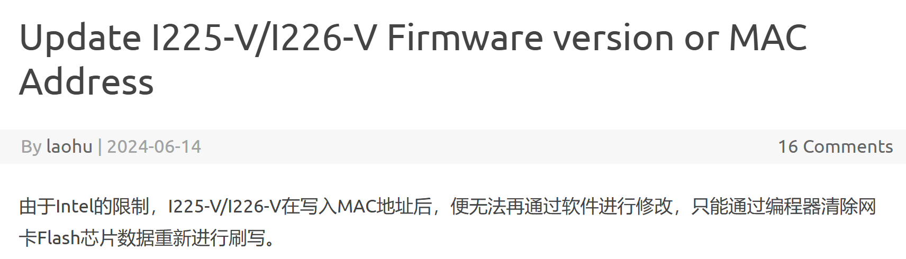

然后我想到了，退货，经过一番协商，卖家最终同意了。但在寄快递之前，我抱着死马当活马医的心态，给机器刷了一个 OpenWRT。

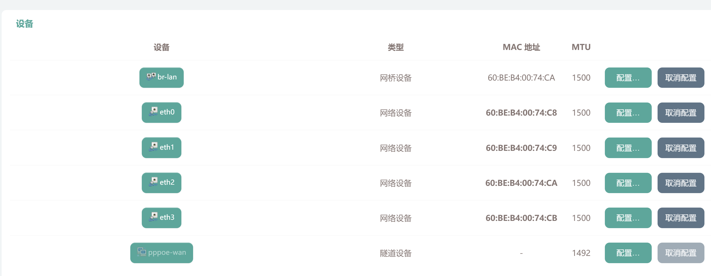

然后我就惊奇地发现，网口 MAC 地址竟然是可以自行更改的。并且哪怕不更改，仍然可以自行分配 LAN、WAN 口。

我心想，那就不退了吧，毕竟这台机器性价比确实还行。

结果万万没想到，在折腾 OpenWRT 的路上，真的没有尽头！各种坑等着你……这两天真是挨了家里人不少骂。但在配置好之后，我发现其实配置还是不难的，主要是网上的信息太杂了，并且没有一个统一的配置标准。A 说该这样，B 说该那样，C 说 A 和 B 的方法可以一起用……他们的方法也许确实没错，但对于初学者来说真的很难分辨哪些内容是适合自己的。

所以我今天就根据自己的需求，来用最简单的方式配置一下 OpenWRT 主路由，以及一些真的很坑的踩坑记录。

## 识别自己的需求

由于自己家有台 NAS，因此对于内网的要求是比较高的，这也是我换软路由的主要原因。但我不建议花太多钱买软路由（对于纯路由器来说，N100、N305 等 CPU 真的有点浪费）。我自己只需要一个 4 网口 2.5G 的 J4125 就行了。

**当然，建议买之前问清楚网口 MAC 地址是否重复**，别买到我这种机器了，否则装不了 iKuai。

我的主要需求比较简单（主路由也不建议太复杂，复杂功能可以用旁路由实现）：

1. IPv4 DHCP 支持，可以固定 IP，自定义 DNS 等，这都是 OpenWRT 的基本功能。
2. IPv6 的完整支持，需要通过公网实现 NAS 服务的访问。
3. 终端功能，方便管理。
4. UPnP，这个对我是可选，因为有 IPv6 了。

从我的经验来看，只有第 2 点比较难配置，其他都是基本功能，因此我主要讲解 IPv6 相关的内容。

## 固件定制

[OpenWRT 固件定制网站](https://openwrt.ai)

这是一个免费的在线 OpenWRT 编译网站，合理利用该工具，可以极大减少后期的配置工作。

首先定制架构和软件包，按需定制，我只需要终端功能，因此添加 `luci-app-ttyd` 即可。

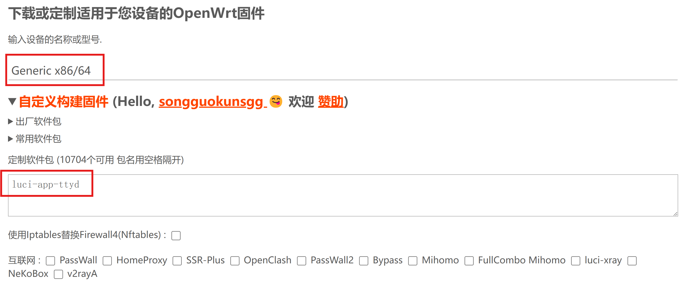

然后定制网络相关的内容：

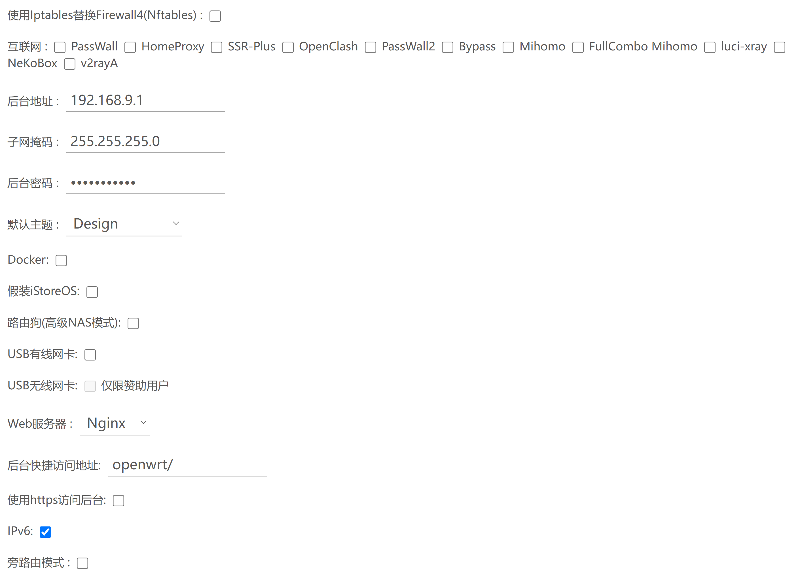

1. 防火墙：使用默认的 Firewall4
2. 互联网：勾选你需要的插件，我这里都不需要
3. 后台地址，子网掩码：可以看我上一篇文章的相关介绍，看了你就知道怎么填了
4. IPv6：我的刚需，勾选
5. 旁路由模式：不勾选

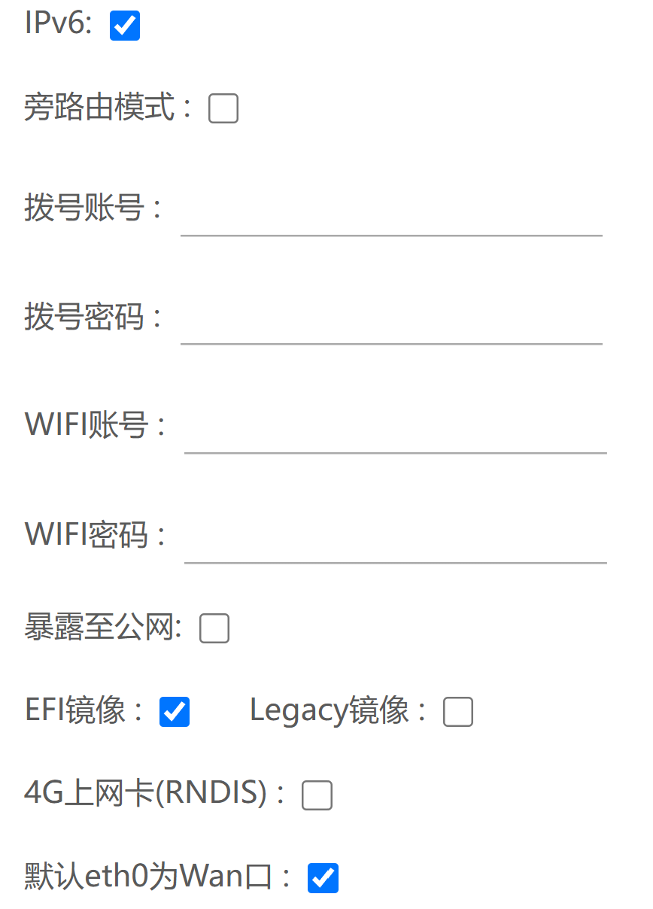

1. 拨号账号、密码：须填写
2. WIFI 账号密码：软路由一般没有无线功能，不用填写
3. 暴露至公网：由于 IPv4 不是公网的，因此开了也没用
4. EFI 镜像，默认 eth0 为 WAN：勾选

然后点击构建新固件，等待编译完成。完成后烧录进 U 盘就安装完成了。

自定义自己固件的好处是，可以在编译阶段就完全绝大多数的网络设置工作。

## OpenWRT 配置

首先进入 OpenWRT 管理端：

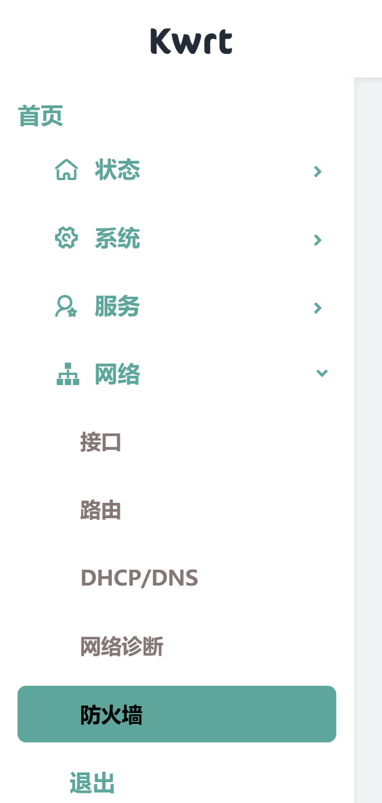

我们主要关注网络部分。

### 网络接口设备配置

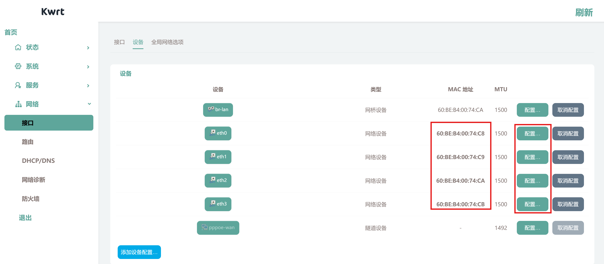

在接口中，我们可以看到有四个网口，分别是 eth0、eth1、eth2、eth3。其中 eth0 是 WAN 口，eth1，eth2，eth3 是 LAN 口。我们可以通过修改 MAC 地址来改变这四个网口的 MAC 地址，这样就可以实现多个网口的功能。

在 OpenWRT 中，不改 MAC 也可以分配 WAN、LAN 接口。但我建议还是修改一下，免得出现莫名其妙的问题。

在配置页面检查接口的 IPv6 是否开启了

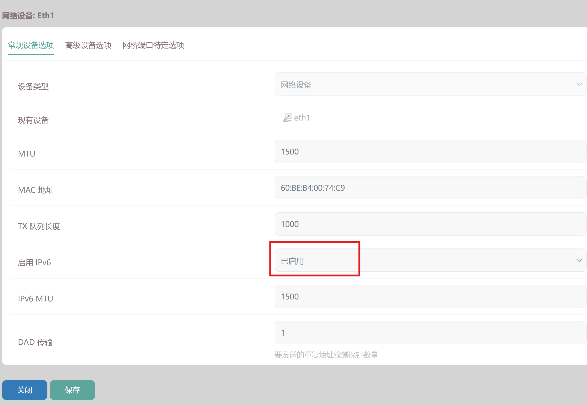

**注意：** 这个地方很有可能默认是——**自动 (已禁用)**，非常坑。并且在这种情况下，你的设备依然能够获取到 IPv6 地址，但无法使用，不能通过 IPv6 测试，也无法访问和被访问 IPv6 网站。并且出问题后很难排查到这一点，非常坑。

### 接口配置

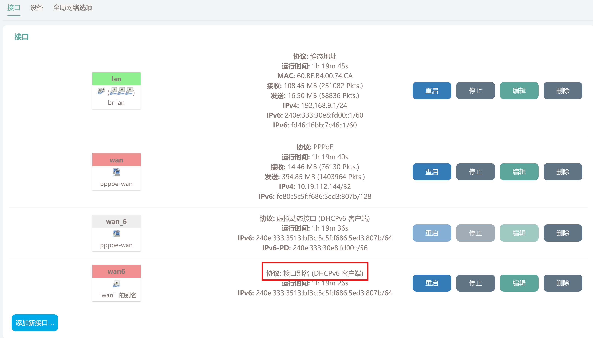

如果拨号正确，你应该会在接口页面得到与该图类似的界面。

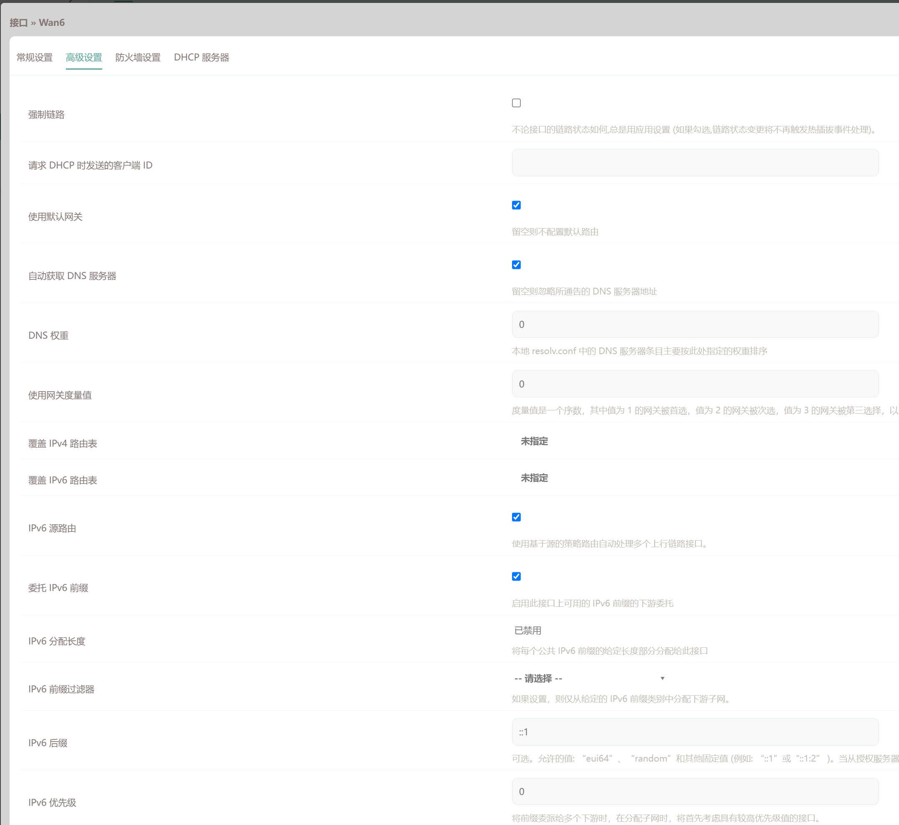

其他设置都是默认即可。

### LAN 口配置，重点

LAN 接口用于分配下级设备的 IP，DNS 等，非常重要。设置不正确的话，会导致下级设备无法访问互联网。

**常规设置**，**高级设置**不用动，这在我们编译固件的时候就已经配置好了。

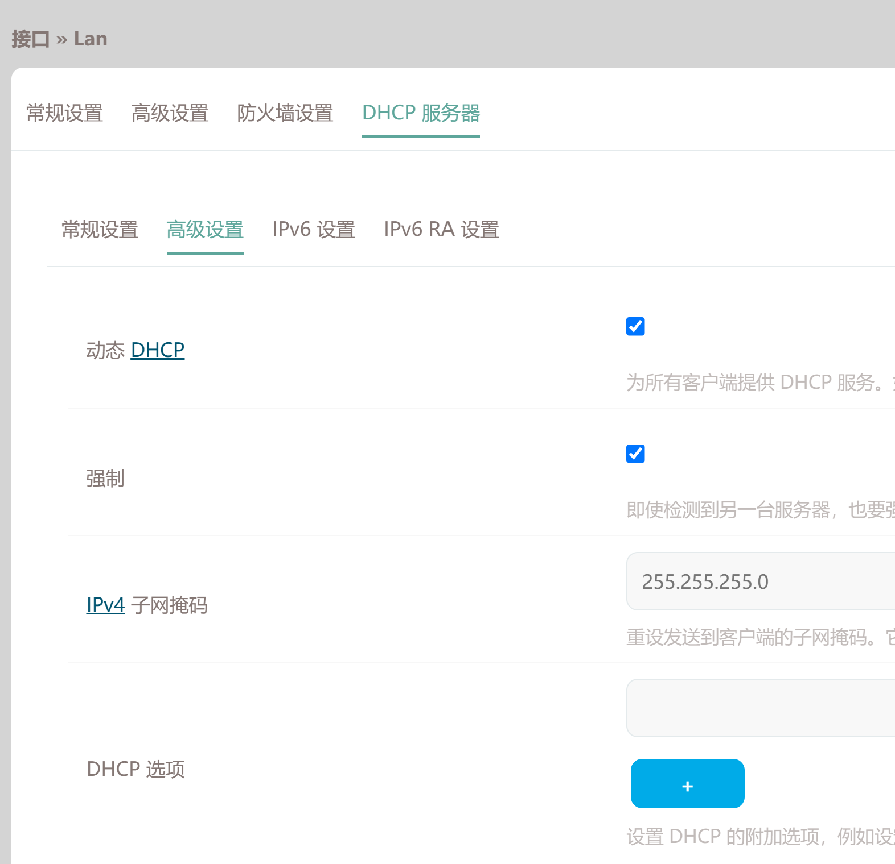

DHCP 服务器的 **常规设置**，**高级设置** 也不用动。

先介绍一下 IPv6 的地址分配方法：得益于 IPv6 庞大的地址空间，过于 IPv4 常用的分配方法 NAT 已经不再适用。IPv6 分配地址的方式主要有两种，SLAAC 和 DHCPv6。下面引用一下别人的介绍：

引用：[OpenWrt 开启 IPv6 公网访问全指南](https://chenhe.me/post/openwrt-config-ipv6-public-access)

SLAAC 是无状态地址自动配置协议，顾名思义，它不再需要 DHCP 服务器来维护状态，而是各个客户端自行生成、协商、通告地址。SLAAC 是唯一全平台支持的协议，Android 明确不会支持有状态 DHCPv6，谷歌认为有状态协议对于终端用户没有明显优点，还会造成隐私问题，属于 IPv4 时代的陋习。

SLAAC 的一个重要数据是路由器定期发送的 RA（路由通告），其包含前缀信息，以及是否应该尝试通告 DHCPv6 请求地址。

DHCPv6 本身也分为有状态和无状态两种

- 有状态：通过 DHCPv6 分配 IP。
- 无状态：IP 依然采用 SLAAC 生成（通过 RA），但其他参数，例如 DNS，网关地址等则通过 DHCPv6 获取。

Android 明确不会支持有状态 DHCPv6：

跟据一些说法，SLAAC 和 DHCPv6 是可以共存的，但我不太理解共存的意义是什么……因此我选择拥抱新技术，只使用 SLAAC。

lan 口的设置 - DHCP 服务器 - IPv6 设置：

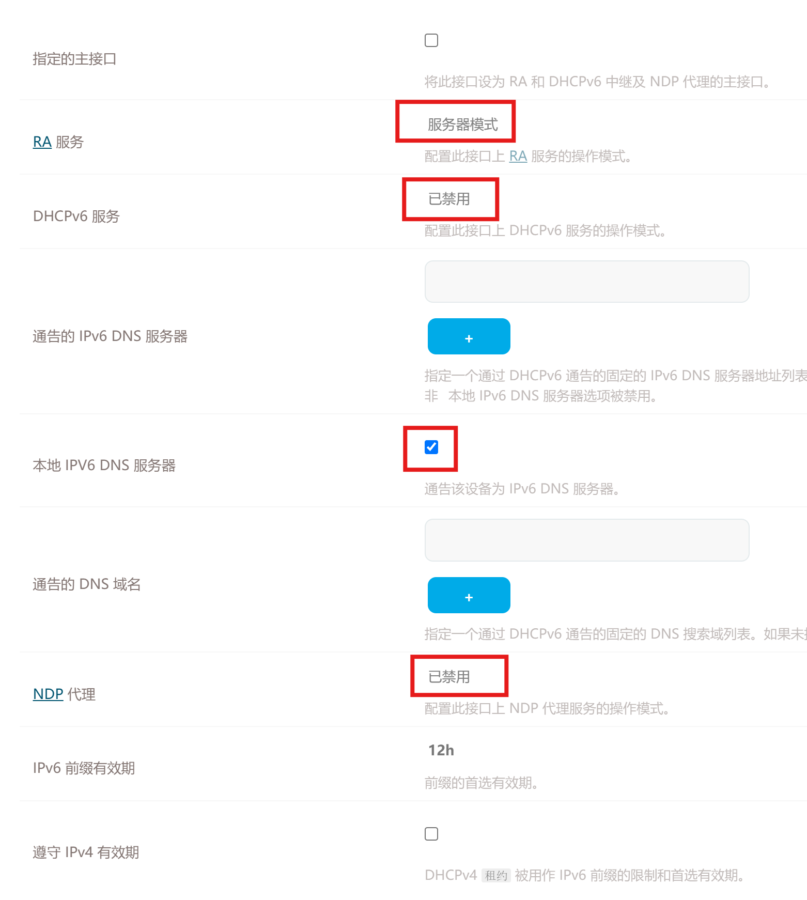

1. 指定的主接口：不勾选
2. RA 服务：服务器模式
3. DHCPv6 服务：禁用
4. 本地 IPV6 DNS 服务器：勾选
5. NDP 代理：禁用

lan 口的设置 - DHCP 服务器 - IPv6 RA 设置：

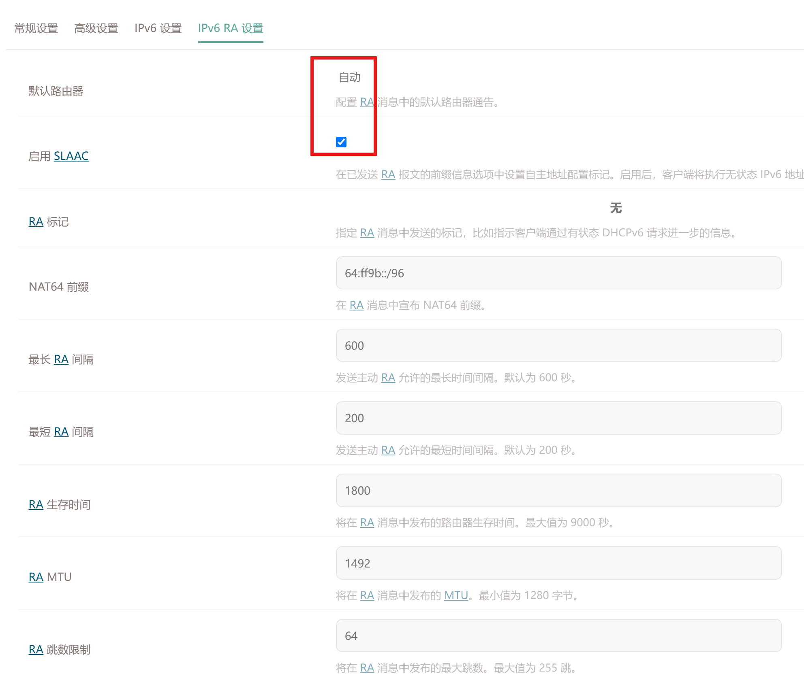

1. 默认路由器：自动
2. 启用 SLAAC：勾选
3. RA 标记：无，因为我们根本没有 DHCPv6 服务器。

这样设置后，下级设备应该都有公网 IPv6 地址了。可以重启一下路由器，在概览可以看到，没有任何的 DHCPv6 租约。

可以用其他设备跑跑 IPv6 测试，应该可以跑通，但目前还无法从公网访问内网设备。

### 防火墙配置

网络 - 防火墙 - 通信规则：

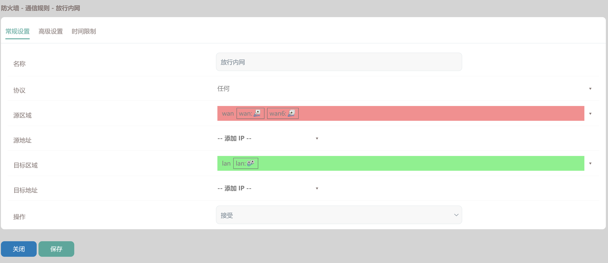

按图上配置即可，还需要在 **高级设置** 中将 **地址族限制** 改为 **仅 IPv6**。

我这里直接全放了，因为 IPv6 还是比较安全的，你也可以选择需要的端口进行放行。

## 一些测试工具

[IPv6 网站检测，检测你能否访问 IPv6 网站](https://ipw.cn/ipv6webcheck/?site=ipw.cn)

[Ipv6 地址查询，查询你当前的 IPv6 地址](https://ipw.cn/ipv6/)

[IPv6 ping，可以测试内网设备能否 ping 通](https://ipw.cn/ipv6ping/)