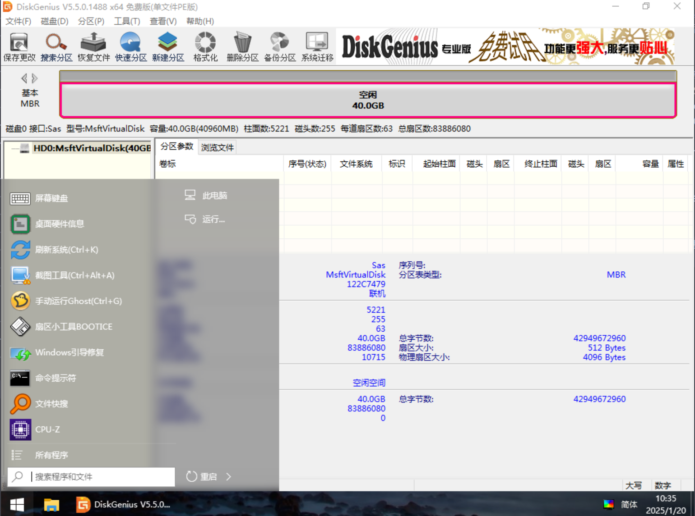
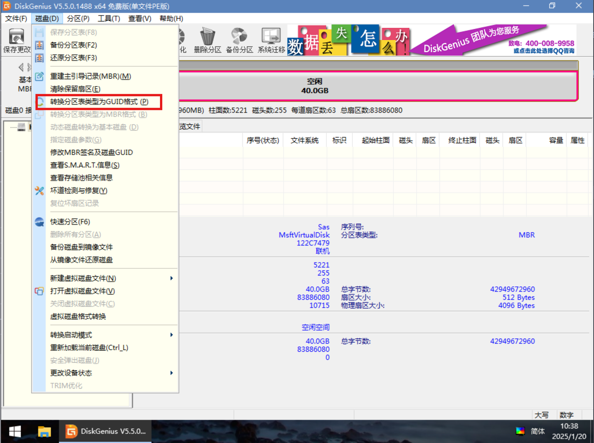
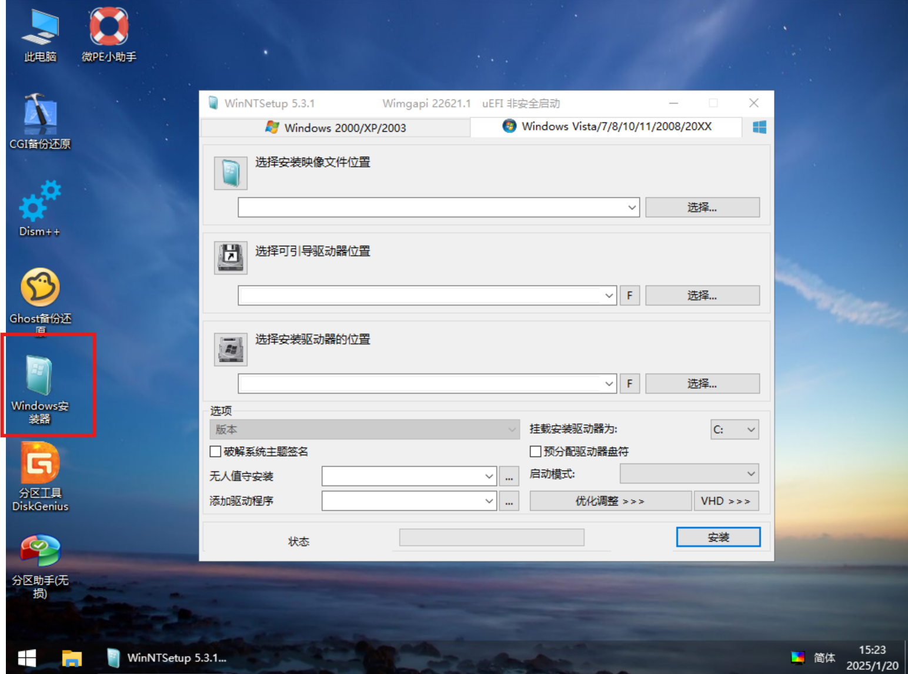
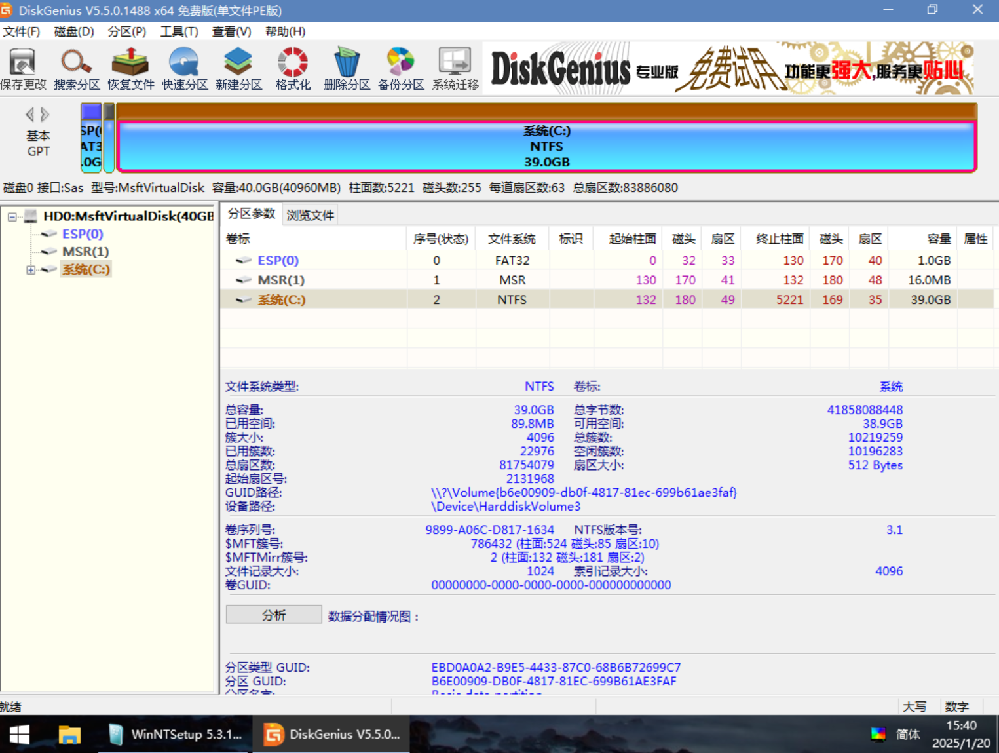
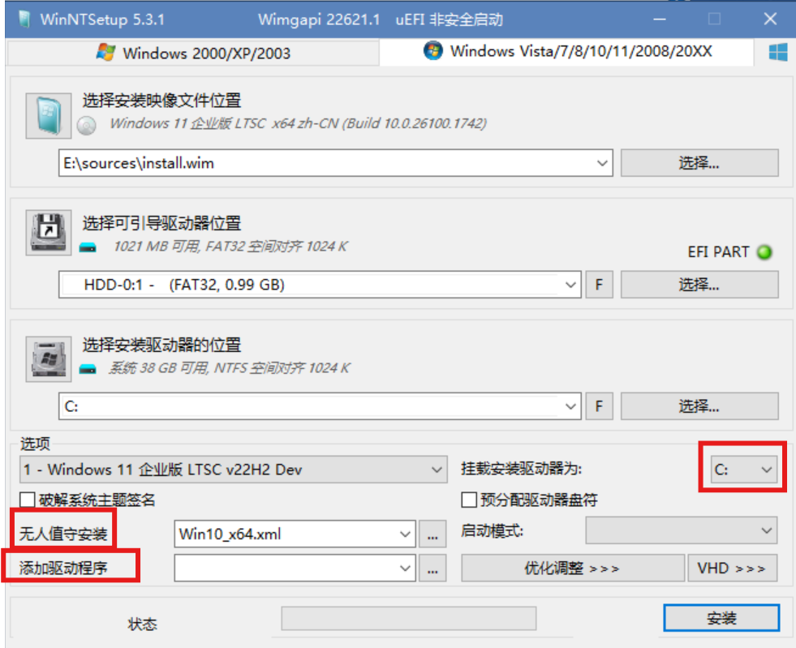
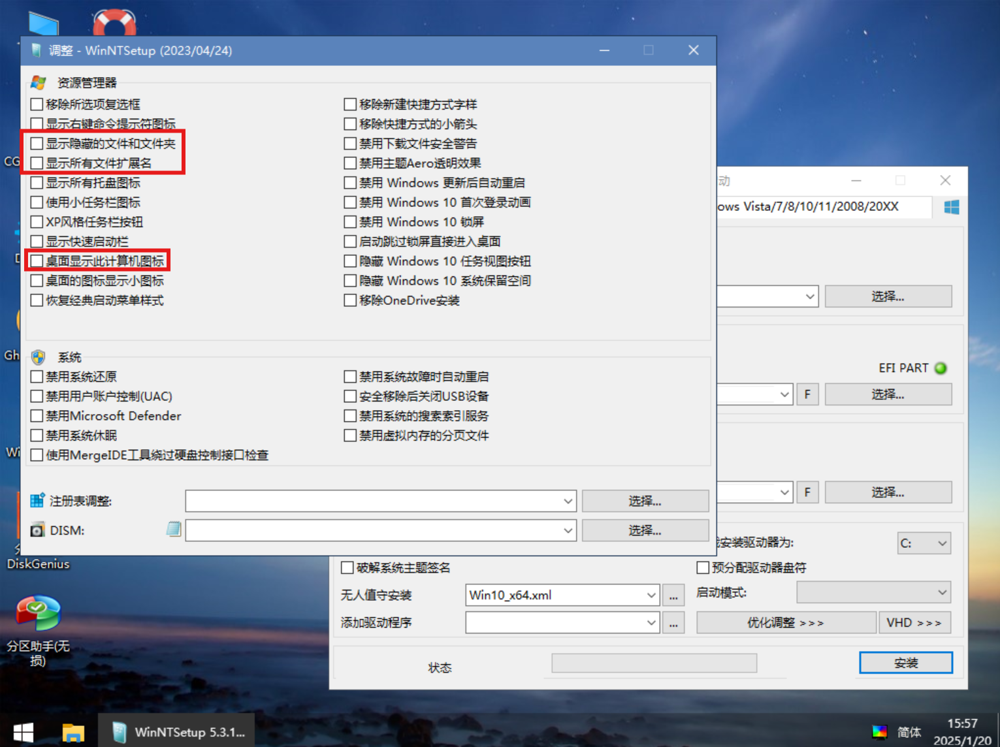
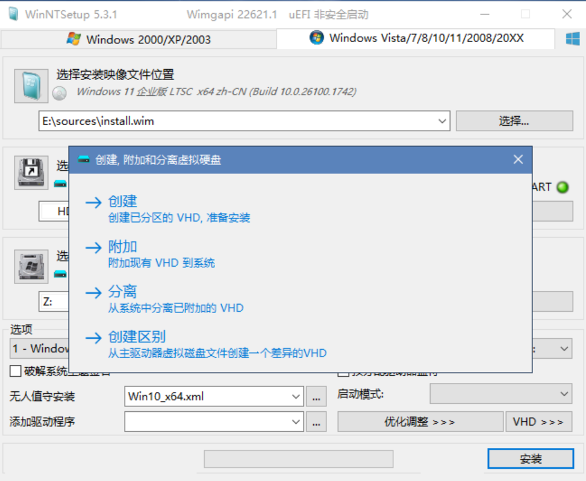
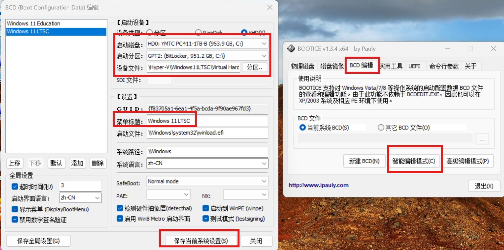
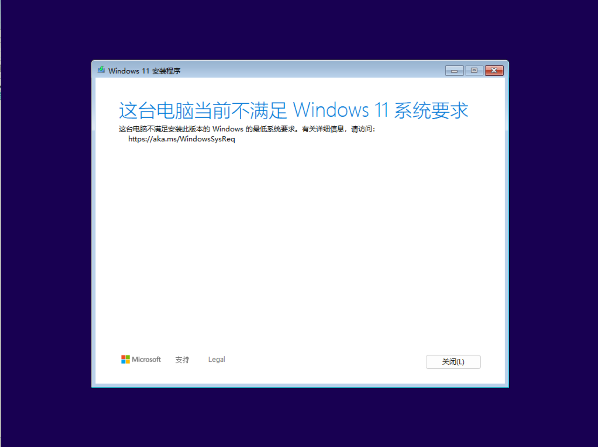
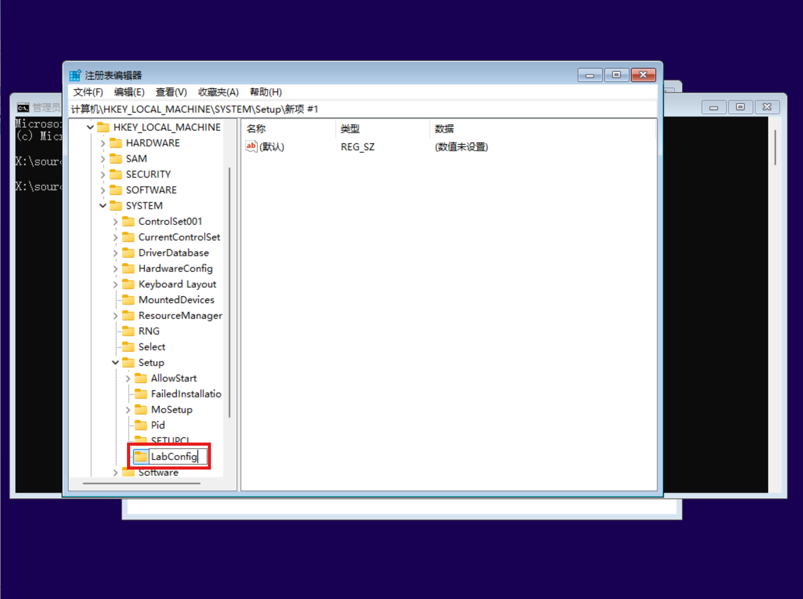

学习一个操作系统，必然要先学会系统安装。在学习初期，因为误操作、错误操作导致系统崩溃的情况常有发生，相对而言，Windows 比 Linux 具有更好的兼容性。即便是发生了误操作，一般不会导致进不去系统（Linux 误操作极容易导致整个系统崩坏）。可能你会觉得，想安装 Windows 这么简单的操作，有什么好学的？的确，安装 Windows 系统很简单，但其中也存在一些可以了解的门道和快捷方式，学会他们，能让你的学习之路更加畅通便捷。

在这一章中，我会讲解 Windows 系统的几种安装和启动方式，并解决一些常见的问题。

## BIOS 启动与 UEFI 启动

（Basic Input/Output System，基本输入输出系统）启动和 UEFI（Unified Extensible Firmware Interface，统一可扩展固件接口）启动是计算机启动过程中两种不同的引导模式，它们在启动方式、兼容性、性能和安全性等方面存在显著差异。BIOS 是一种古老的启动技术，用于初始化硬件并引导操作系统。它最早出现在 20 世纪 80 年代，是计算机启动的默认模式，直到 UEFI 技术的出现。

开机时，当引导加载程序完成后，BIOS 会查找启动设备（如硬盘、U 盘或光驱）。它会在启动设备的**第一个扇区**（通常是第 0 扇区）查找引导记录（MBR，Master Boot Record，主引导记录）。MBR 的大小为 512 字节，包含分区表和引导代码。随后，BIOS 将 MBR 中的引导代码加载到内存中执行，引导代码会进一步加载操作系统的引导程序（如 Windows 的 bootmgr），最终启动操作系统。UEFI（Unified Extensible Firmware Interface，统一可扩展固件接口）是一种较新的启动技术，旨在替代传统的 BIOS。它由 UEFI 论坛开发，首次出现在 2005 年左右，并逐渐被现代计算机采用。UEFI 在开机时也会对硬件进行初始化和检测。但 UEFI 不依赖传统的 MBR，而是使用 GPT（GUID Partition Table，全局唯一标识分区表）分区格式。GPT 支持更大的硬盘容量，并且可以支持超过 4 个主分区。UEFI 会加载启动设备中的 EFI 引导程序（如 Windows 的 bootmgfw.efi），并通过 EFI **系统分区**（ESP）启动操作系统。

可见，BIOS 的启动是从第一个扇区开始，而 UEFI 则使用了一个单独的 EFI 分区（通常为 FAT/FAT32 格式）来进行系统引导，这使得 UEFI 对于系统的启动规划更加容易。

从 2024 年开始，Windows 10/11 的普及率已经非常高，一般用户已经不会再使用 Windows 10 以下的系统，因此，在磁盘初始化方面，你应该直接选择 GPT+UEFI 启动，MBR+BIOS 启动方式已经过时。接下来，我们在 Disk Genius 中查看一块未初始化的硬盘：





可以看到，我们的硬盘默认采用 MBR 分区表，接下来，将它转换为 GPT 分区表。




点击保存更改，可见硬盘已经被转换为了 GPT 分区表。使用类似的方式也可以把分区表格式从 GPT 转换为 MBR。但要注意，分区表转换可能会损坏数据，在做转换之前一定要备份好数据。

接下来，我们就可以在这块硬盘上安装 Windows 11 系统。目前常用的安装方法有两种，分别是使用微软官方的 ISO 镜像安装，另一种是通过 Windows 安装器进行安装。一般来说，如果你没有对系统的定制化需求，直接使用 ISO 文件安装即可。如果你希望进行一些自定义行为，比如自定义 EFI 分区大小，精简应用程序、批量安装系统等等，那么 windows 安装器更适合。

在接下来的示例中，我使用的是 Windows 11 LTSC 2024 的系统镜像，下载地址：

```
电驴：
ed2k: //|file|zh-cn_windows_11_enterprise_ltsc_2024_x64_dvd_cff9cd2d.iso|5287520256|D6E4FE0BA5FD8A2F22FC9C0326481791|/
磁力
magnet:?xt=urn:btih:b84e74c1dbcc88a02c5b24a6f84383f353a2e1dd&dn=zh-cn_windows_11_enterprise_ltsc_2024_x64_dvd_cff9cd2d.iso&xl=5287520256
```

## 从 .iso 文件安装系统

## 从 Windows 安装器安装系统

首先进入 PE 系统，找到





可以看到，安装器顶部划分了 Windows 2000/XP/2003和Windows Vista/7/8/10/2008/20XX 两个模块。左侧代表了 BIOS 启动方法，而右侧则是 UEFI 启动方式。虽然标签没有写明 Windows 11，但 11 的安装方式与 Windows 10 相同。

安装器并不会为我们创建 EFI 分区，因此，我们需要提前在 Disk Genius 中创建 EFI 分区。


点击确定。




在两种安装方式中，我们都没有选择对磁盘进行分区，这是由以下原因决定的：

1. 固态硬盘的普及：SATA 和 NVME 固态硬盘的读写速度都远高于传统的机械硬盘，并且已用磁盘空间对磁盘读写速度影响很小，这使得我们不必像过去的机械硬盘一样通过分区的方式提升磁盘读写能力。
2. 重装系统不需要清除数据：在 Windows 10 以前，重装系统往往需要格式化整个 C 盘，因此用户不得不再重装系统之前备份数据，分盘功能简化了数据备份流程。而现在的 Windows 系统重装已经可以保资料重装，因此分盘功能的作用已经不大。哪怕你的确需要格式化磁盘，固态硬盘的高读取速度也使得备份不再困难。
3. 分盘的缺点：用户对于磁盘的分配往往没有那么精确，极容易出现一个盘已满而其他盘还空闲的情况，这会导致磁盘的空间利用率降低。

所以，建议更改掉过去的磁盘分盘习惯，采用“一盘一盘符”的使用习惯。（也可以通过 RAID 将多块磁盘合并为一块使用，后续会提到）

挂载好安装盘（双击 ISO 文件即可）后，打开 Windows 安装器，选好引导和安装驱动器位置。注意，安装映像的名称是 `install.wim`，文件大小大概为 5GB，与 ISO 映像大小差不多，不要选错了。


如果没有别的需求，直接点击安装即可。

### 定制化需求

Windows 安装器还有一些其他功能。





无人值守安装：在没有用户交互的情况下，自动完成操作系统或软件的安装过程。在 Windows 中，你可以使用 XML 文件来配置无人值守安装。这些 XML 文件通常称为无人值守答案文件（Unattend Answer Files），其中包含了安装过程中所需的各种配置选项。

添加驱动程序：在安装系统之前，可以先用 Dism 备份驱动程序，然后在 Windows 安装器添加备份的驱动文件夹。但我建议进入系统之后再去设备管理器安装驱动，避免出现一些奇怪的问题。

挂载驱动器：一般选择 C，如果有双系统需求，可以选择其他的盘符。但需要注意，有的软件将某些路径写死在 C 盘，如果系统盘使用其他盘符，可能会出现兼容性问题。





这里可以针对系统做一些自定义，例如禁用一些功能、开启文件浏览相关选项、运行一些脚本等。这些选项都可以在进入系统后自行更改。

VHD 功能：Windows 支持将系统安装在虚拟硬盘中并启动，我们先创建一块虚拟磁盘。





安装器会自动帮我们挂载这块虚拟磁盘为 Z 盘。将安装驱动器位置选择为 Z 盘，就可以将系统安装到这块虚拟磁盘上面。

这种安装方式存在弊端：

1. 电脑实体机上需要存在一个物理 Windows 系统，通过这个物理系统才能引导加载虚拟磁盘上的系统。
2. VHD 格式已经过时，使用 VHDX 虚拟磁盘是更好的选择。

也就是说，对于裸机而言，安装器的 VHD 功能并没有实质性作用。

## 从 .vhdx 启动系统

在 Windows 系统中，我们可以很方便地创建和管理 vhdx 虚拟磁盘，此外，你也可以使用 Disk Genius 工具更加专业便捷地管理 vhdx 磁盘。

这种虚拟磁盘有什么用呢？

1. 挂载到 Hyper-V 虚拟机中：Hyper-V 虚拟机使用的磁盘格式就是 vhdx。
2. 挂载为盘符：可以将 vhdx 磁盘挂载为 D 盘等盘符使用。有些应用程序必须要存在 D 盘才能使用，还有一部分程序喜欢在 D 盘中产生一些垃圾文件，增大了磁盘管理难度。将 vhdx 挂载盘符，可以在不分区的情况下正常使用这些软件。当你不需要该盘符之后，可以直接取消挂载这块虚拟磁盘，然后将 vhdx 文件删除即可，不会存在任何的垃圾残留。
3. 启动双系统：在已存在一个物理 Windows 系统的基础上，可以直接启动 vhdx 上的系统（仅支持 Windows，并且安装要求与电脑本身相同，如果你的电脑仅支持 Windows10/11，那么这块虚拟盘也必须安装 Windows10/11 才能启动）。这种启动方式相比物理机几乎没有性能损失。

也就是说，在 Hyper-V 中安装一个 Win 系统，在物理机上可以直接启动这个系统。

那么如何启动 vhdx 上的系统呢？

假设你已经在物理机上安装好了 Windows，虚拟磁盘上也已经通过 Windows 安装器进行了初始安装。接下来我们使用 BOOTICE 工具添加虚拟磁盘引导即可。





首先选择 BCD 编辑中的智能编辑模式。

点击添加，然后选择启动磁盘、启动分区。设备文件选择不带盘符 vhdx 磁盘路径即可，因为盘符在启动分区处已经选好了。

设置一个自定义的菜单标题，保存系统设置即可。

重启系统后，选择你创建的启动项，就可以进入这个系统了，成功引导后的剩余工作与重装系统是一样的。这个系统中，物理机上的磁盘会被映射为其他盘符，例如 D 盘等。

在强调一下，直接引导 vhdx 系统，与直接安装在物理机是完全一样的，如果你的电脑不支持旧系统，那么在 vhdx 上安装旧系统也是不能成功开机的，因此，不必尝试在现在的电脑上安装 XP、Win7 等系统。如果你有旧系统的需求，必须通过 Hyper-V 虚拟机来实现。

## Windows 11 跳过配置检测

大多数这两年出厂的电脑都满足 Windows 11 的最低安装要求，但也有一些老电脑有升级需求。其实 10 年前的 i7-4790K 跑 Windows 11 也没啥大问题，但没有 TPM2.0 这点确实成为了很多旧电脑的拦路虎。





这种情况建议直接使用 Windows 安装器进行安装，可以不进行配置检查。如果必须通过 ISO 文件安装的话，可以通过以下方式绕过 Windows 11 的配置检测。

**注意，截至 25 年 1 月，以下修改注册表绕过配置检测的方法已经失效，建议使用 Windows 安装器安装。**

首先，按住键盘上的 shift+ F10，在命令提示中输入：regedit 回车。打开注册表。




然后在 LabConfig 的目录中，点击右键--新建 - 然后单击“DWORD（32 位）值”。将此 DWORD 命名为“BypassTPMCheck”。接着继续新建一个“DWORD（32 位）值”。将此 DWORD 命名为“BypassSecureBootCheck”。一定要注意大小写，保证大小写和屏幕上的命令是一样的。双击这两个 DWORD，并将其“数值数据”更改为“1”。


然后关闭注册表和命令提示符。在安装程序中点击左上角的返回，选择版本后，点击下一页。成功跳过了 TPM 和安全启动的验证。

## 各个系统版本的区别

家庭版、专业版、教育版、企业版是最常用的几个 Windows 版本，他们的主要区别如下：

| 功能/版本 | 家庭版 | 专业版 | 教育版 | 企业版 |
|-----------|--------|--------|--------|--------|
| **适用人群** | 家庭用户、轻量级办公 | 专业人士、小型企业 | 教育机构、学生 | 大型企业、组织 |
| **价格** | 约 1088 元 | 约 1500 元 | 批量许可 | 批量许可 |
| **功能特点** | 基础功能，适合日常使用 | 高级功能，适合专业需求 | 针对教育需求优化 | 最全面的功能，适合企业 |
| **远程桌面** | 不支持作为主机 | 支持 | 支持 | 支持 |
| **Hyper-V 虚拟化** | 不支持 | 支持 | 支持 | 支持 |
| **Windows 沙盒** | 不支持 | 支持 | 支持 | 支持 |
| **BitLocker 加密** | 不支持 | 支持 | 支持 | 支持 |
| **内存支持上限** | 128GB | 2TB | 2TB | 6TB |
| **CPU 支持** | 单插槽，最多 64 核心 | 双插槽，最多 128 核心 | 双插槽 | 双插槽 |
| **组策略编辑器** | 不支持 | 支持 | 支持 | 支持 |
| **Windows 信息保护 (WIP)** | 不支持 | 支持 | 支持 | 支持 |
| **更新策略** | 自动更新 | 自动更新 | 自动更新 | 可自定义更新 |

那么，对于个人用户，怎么选择系统版本呢？

家庭版系统一般随品牌机附赠，缺少了远程桌面、Hyper-V、BitLocker、组策略等非常关键的功能，因此在非必要条件下（比如你一定要用正版），我都不建议使用家庭版系统。有些功能在终端中可以调出来，但总归是比较麻烦，不如直接上其他版本系统。

专业版系统功能完善，价格合适，非常适合用作个人或家庭操作系统。

教育版是我最喜欢的版本，功能相比专业版非常全面，几乎解锁了所有 Windows 功能（有些功能专业版都是没有的），如果你是学生的话，存在白嫖可能（你的学校购买了教育版系统）。

企业版支持 6T 内存，并且可以自定义更新策略，对于家庭服务器或者不想频繁更新系统的人来说是个不错的选择。不过我更建议家庭服务器使用 Server 系统。

Windows 的版本转换很容易，设置中更改密钥即可。

## 小结

在本章中，我们学习更加进阶的 Windows 安装方式，包括物理磁盘上的安装、虚拟磁盘上的安装以及安装过程中的常见问题。最后还学习了各版本 Windows 的大致区别。