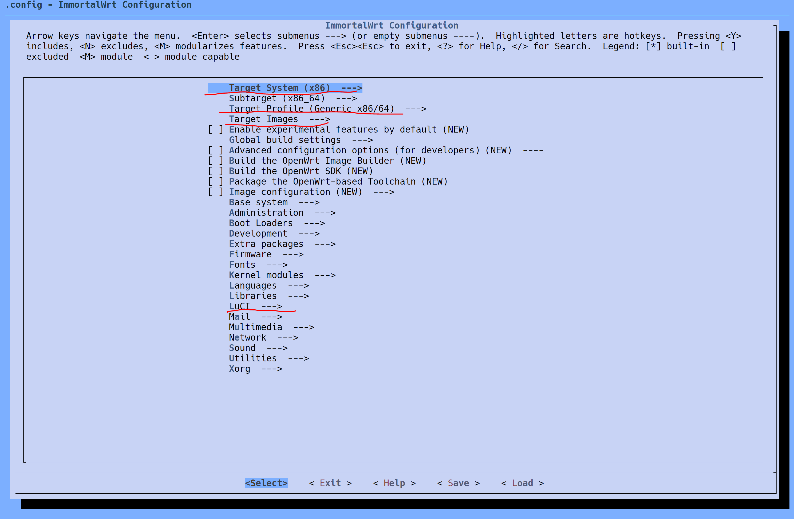
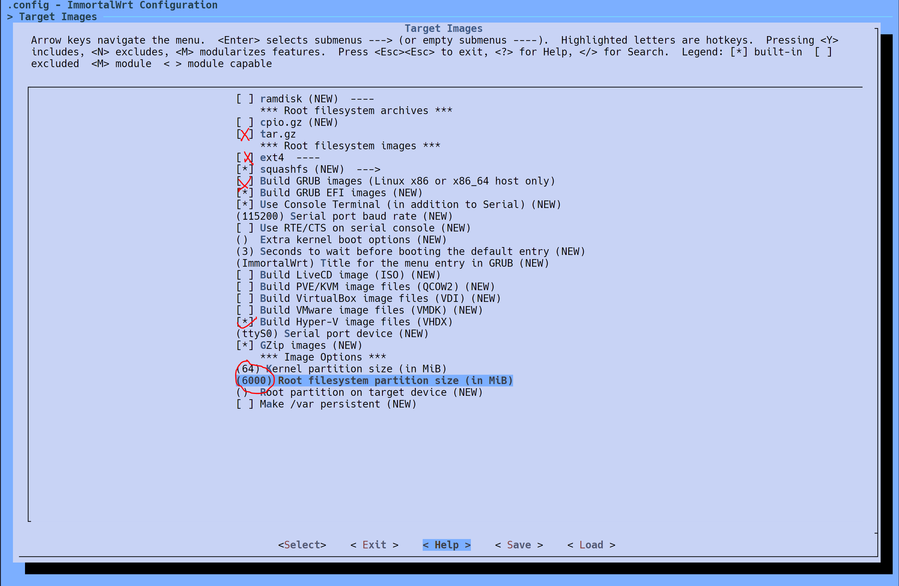

## 使用 podman 搭建 immortalWRT 编译环境

使用 dockerfile 构建镜像

```dockerfile
# podman build -t openwrt: latest -f Containerfile
FROM ubuntu: 22.04
LABEL maintainer = "songguokunsgg<fansong_yan@icloud.com>"

ARG DEBIAN_FRONTEND = noninteractive
ENV TZ              = Asia/Shanghai

RUN sed -i 's@archive.ubuntu.com@mirrors.tuna.tsinghua.edu.cn@g' /etc/apt/sources.list && \
    apt update && \
    apt upgrade -y && \
    # 部分软件包是编译 immortalwrt 所需的
    apt install -y ack antlr3 asciidoc autoconf automake autopoint binutils bison build-essential \
        bzip2 ccache clang cmake cpio curl device-tree-compiler ecj fastjar flex gawk gettext gcc-multilib \
        g++-multilib git gnutls-dev gperf haveged help2man intltool lib32gcc-s1 libc6-dev-i386 libelf-dev \
        libglib2.0-dev libgmp3-dev libltdl-dev libmpc-dev libmpfr-dev libncurses-dev libpython3-dev \
        libreadline-dev libssl-dev libtool libyaml-dev libz-dev lld llvm lrzsz mkisofs msmtp nano \
        ninja-build p7zip p7zip-full patch pkgconf python3 python3-pip python3-ply python3-docutils \
        python3-pyelftools python3-setuptools qemu-utils re2c rsync scons squashfs-tools subversion swig texinfo uglifyjs \
        upx-ucl unzip vim wget xmlto xxd zlib1g-dev zstd file && \
    # 新建一个普通用户，openwrt 不能用 root 用户编译
    useradd -m user -s /bin/bash

USER user
RUN git config --global user.name "songguokunsgg" && \
    git config --global user.email "fansong_yan@icloud.com"

CMD echo "=========="
CMD echo "podman-compose up -d"
CMD echo "To enter the container:"
CMD echo "podman exec -it OpenWRT bash"
CMD echo "请使用普通用户 user 进行编译"
CMD echo "-----end----"
```

使用 podman-compose 构建容器

```yml
version: '3.8'
services:
  RK3568:
    image: openwrt
    container_name: OpenWRT
    # volumes:
    #   - "/user/openwrt:/home/openwrt/openwrt"
    network: bridge
    user: user
    command: bash
    tty: true
    stdin_open: true
```

进入容器，默认使用普通用户 `user`

## clone immortalWRT 仓库

```bash
git clone -b openwrt-24.10 --single-branch --filter=blob:none https://github.com/immortalwrt/immortalwrt
```

输出如下：

```txt
Cloning into 'immortalwrt'...
fatal: unable to access 'https://github.com/immortalwrt/immortalwrt/': GnuTLS recv error (-110): The TLS connection was non-properly terminated.
openwrt@fcfcdf766fb1:/home/openwrt$ git clone -b openwrt-24.10 --single-branch --filter=blob:none https://github.com/immortalwrt/immortalwrt 
Cloning into 'immortalwrt'...
...............
remote: Compressing objects: 100% (4299/4299), done.
remote: Total 9496 (delta 1565), reused 1071 (delta 1071), pack-reused 4126 (from 2)
Receiving objects: 100% (9496/9496), 12.91 MiB | 4.40 MiB/s, done.
Resolving deltas: 100% (2055/2055), done.
warning: unable to access '/root/.config/git/attributes': Permission denied
Updating files: 100% (9699/9699), done.
```

成功 clone，如果出现网络错误请自行解决。

进入仓库 `cd immortalwrt`，相比 openwrt，immortalwrt 已经内置了大量软件包，因此不需要添加三方软件源。

保证网络通常，获取软件包列表

```bash
./scripts/feeds update -a
./scripts/feeds install -a
```

## 修改默认网络配置（可选）

```bash
vim package/base-files/files/bin/config_generate
```

搜索 192.168，可以定位到 IP 地址所在的位置，修改为 10.0.0.1 和 10.0.$((addr_offset++)).1，我习惯使用 10.0.0.1/24 网段

## 配置 immortalwrt

```bash
make menuconfig
```

我的配置：






Luci -> Thems 和 Apps 根据需求定制即可。

## 下载与编译

建议先下载再编译，避免因为网络问题而编译卡住。

```bash
make download V=s
make -j$(nproc)
```

下载使用单线程，因为国内的网络环境很有可能需要随时调试。编译可以使用多线程，如果遇到报错的话使用单线程编译 `make -j1 V=s` 排错。

推荐第一次编译使用单线程，确保可以编译成功后，再使用多线程编译。已经编译过的代码不会重复编译，因此第一次编译会比较慢，后面就会快很多。

编译结果保存在 `bin/targets/x86/64/` 目录下。