在大众的心中，Windows 毫无疑问是非常易用的系统，但易用并不代表开箱即用。在写这篇文章之前，也正值春节期间，我便走访了几位亲戚朋友，发现他们都存在一些共同点，归纳起来就是——我觉得电脑不好用，但能用就行，不知道怎么优化，也懒得去优化。然后，我选择了一个比较熟悉的亲戚，并将我的个人电脑借给她们一家用了，她们对我的电脑系统给出了很高的评价，并惊叹于，明明都是 Windows 系统，为什么我的电脑用起来就是很舒服呢？

简单说明一下，我给她们三个人每人设置了一个独立的账户，她们这些天共用我的这台电脑，并且做的都是不同类型的工作（Office，做海报，刷剧）。在此之前，她们并不知道 Windows 还能够添加多个用户。在此之前，她们从不共享彼此的电脑，因为每个人或多或少都会有一些不想让人看见的隐私信息。在我的电脑上，她们每个人的工作内容都被保护得很好，完全不用担心隐私问题。

并且在我的电脑上，没有任何的弹窗广告，刷剧的体验感也拉满了。

因此，建议大家不要把电脑水平停留在“能用就行”的阶段，而是要好用，并且用好。这是一个漫长的学习过程，但现在出发，总有一天可以成功。

## 系统激活

以前上学的时候，遇到过不少朋友，顶着未激活的神舟电脑用了 4 年。其实 Windows 不激活也能用，但部分功能会受到限制（例如个性化功能）。

### 通过密钥激活

检查当前 Windows 版本：右键点击“此电脑”——“属性”，查看是“家庭版”、“专业版”还是其他版本。确保密钥与版本兼容，密钥版本与系统版本需要对应，例如，家庭版密钥无法激活专业版系统。


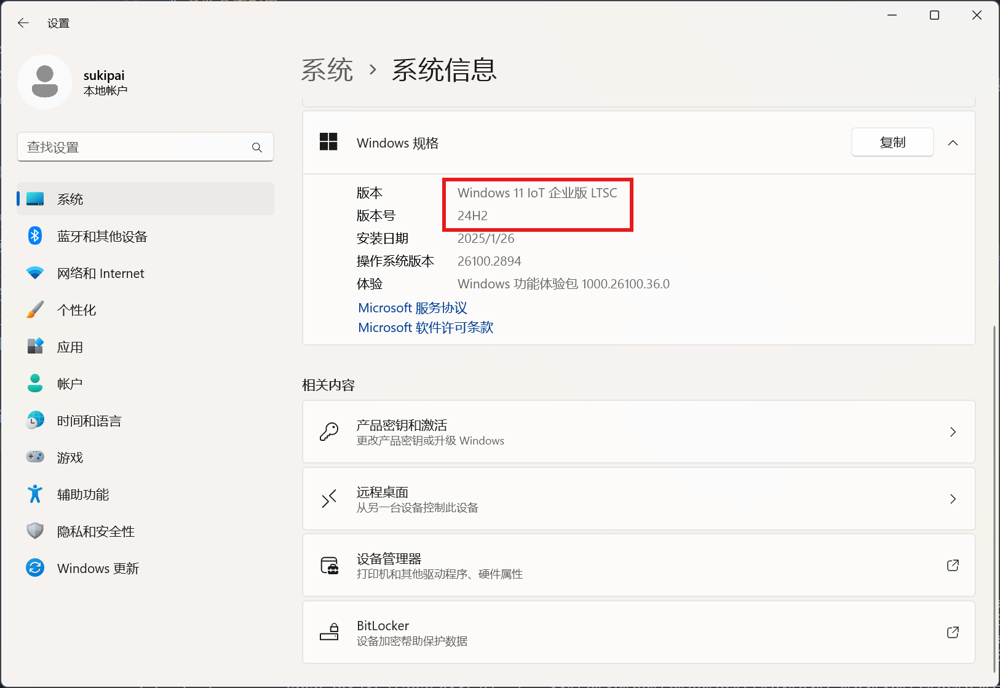


然后进入“产品密钥和激活”界面，确保设备已联网，点击“更改产品密钥”。在弹出的窗口中输入 25 位密钥（格式如：J8WVF-9X3GM-4WVYC-VDHQG-42CXT

7Y64F-88DCY-Y6WTC-H33D2-64QHF，括号中的两个密钥可用于激活或升级专业版，但不代表永久有效）。点击“下一步”，系统会自动联网验证密钥。如果提示“Windows 已成功激活”，就代表激活成功，关闭窗口即可。如果激活失败，就需要根据提示代码排查（如 0xC004C060 可能表示密钥已被使用）。有时可能需要重装对应版本系统，或更换正确密钥。


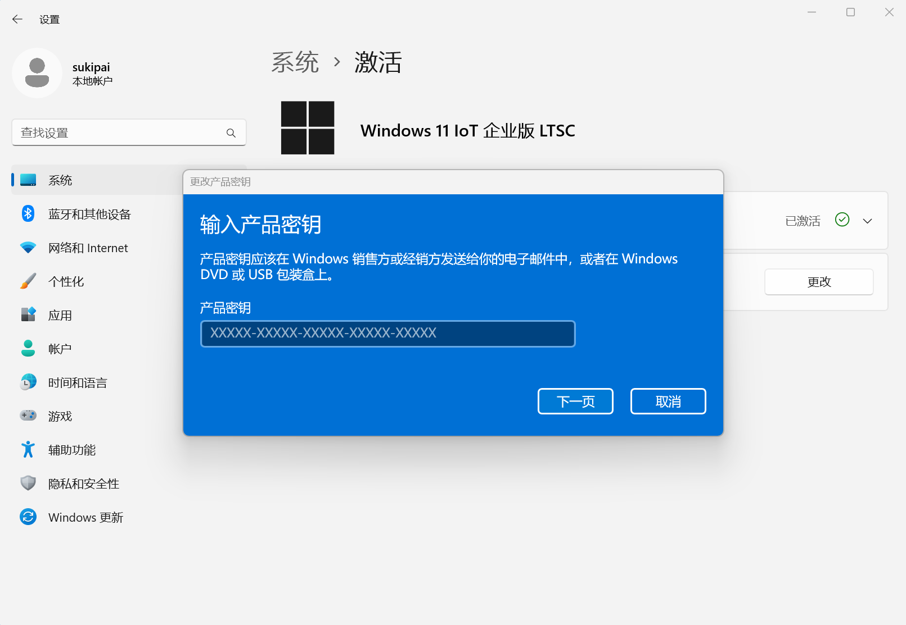


如果不是全新安装的系统，可能激活不会很顺利，但只要耐心查看报错提示，并借助搜索引擎或 GPT 等工具，可以很快找到对应的解决办法。

### 通过命令行进行 KMS 激活

先讲解一下 KMS 激活的原理。KMS（密钥管理服务）激活是一种用于激活软件（如 Windows 系统）的机制。其原理是通过客户端与 KMS 服务器进行通信。客户端将自身硬件信息和密钥请求发送给 KMS 服务器，服务器根据预设的策略验证请求的合法性。如果验证通过，服务器会生成一个激活响应，返回给客户端，客户端据此完成激活。这种方式适用于企业等环境中批量管理软件激活，但需注意，未经授权的 KMS 激活可能涉及侵权或安全风险。

```powershell
# 将 KMS 服务器设置为地址 kms.03k.org
slmgr /skms kms.03k.org
slmgr /ato
```

你也可以使用其他的 KMS 服务器地址，将命令中的 kms.03k.org 进行替换即可，激活有效期为 180 天，180 天之后需要重新激活。

从 KMS 激活原理可知，使用其他人搭建的 KMS 服务器是有风险的，虽然很低，但总归是有，那么，我们能不能自己搭建一个 KMS 服务器呢？

这里用到全球最大同性交友网站 Github 的一个开源项目 vlmcsd（https://github.com/Wind4/vlmcsd），该项目允许你自己搭建私人的 KMS 服务器，但你需要一台拥有 docker 功能的 linux 电脑，真是一个悲伤的故事。但好消息是，Windows 系统原声支持 Hyper-V 虚拟机，并且还有基于 WSL 的容器功能，因此我们只需要在 Windows 上开启 WSL 功能，安装 docker 或者 podman，就可以很方便地搭建自己的 KMS 服务器了。如果你有一台软路由的话，在软路由上通过 docker 搭建 KMS 也很不错。

### 通过第三方程序激活

第三方程序激活非常方便，几乎是小白式的一键激活，我只推荐一个软件 [HEU_KMS_Activator](https://github.com/zbezj/HEU_KMS_Activator/releases)。该软件完全免费，可用于激活 Windows 和 Office 等。但与 KMS 激活类似，风险同样存在。


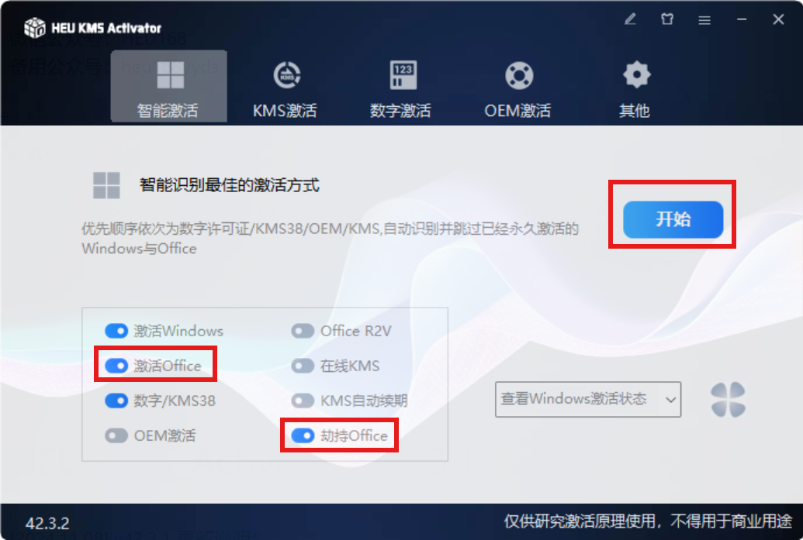


没有特殊需求的话，直接一键激活即可，如果不想激活 Office，可以把红框中两项 Office 相关选项去掉。

## 桌面图标管理

再过去我们使用电脑的过程中，你一定会知道，在安装应用程序之后，往往会在桌面上生成一个图标文件，让我们看看这些图标文件究竟是什么？


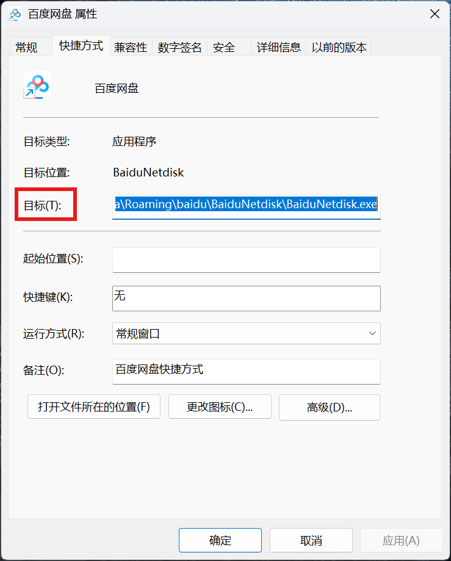


可以看到，这个快捷方式其实是某个文件的指向，例如，百度网盘的快捷方式指向了：

```
C: \Users\<username>\AppData\Roaming\baidu\BaiduNetdisk\BaiduNetdisk.exe
```

双击这个快捷方式，我们就可以运行该路径下的程序，打开百度网盘。

可是，快捷方式本身不也是一个文件吗？那么这个快捷方式又是存在哪里的呢？打开资源管理器，选择左侧的桌面，可以看到，百度网盘的图标正处在这个文件夹下。


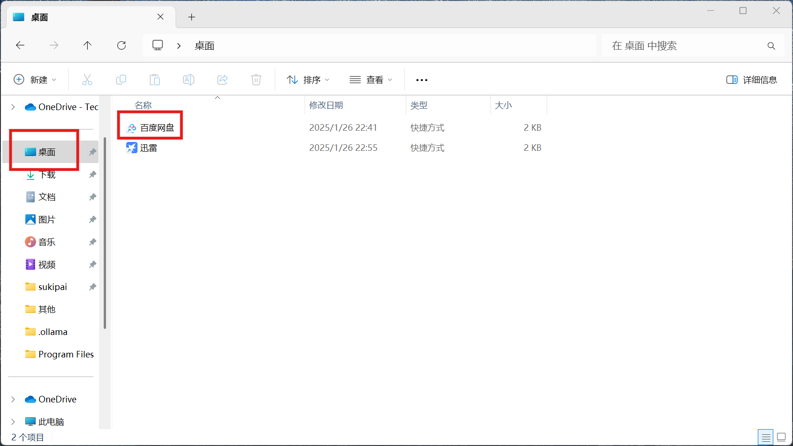


但新的问题又出现了，明明我桌面上存在那么多的应用程序图标，为什么这个“桌面”文件夹下只有两个图标呢？


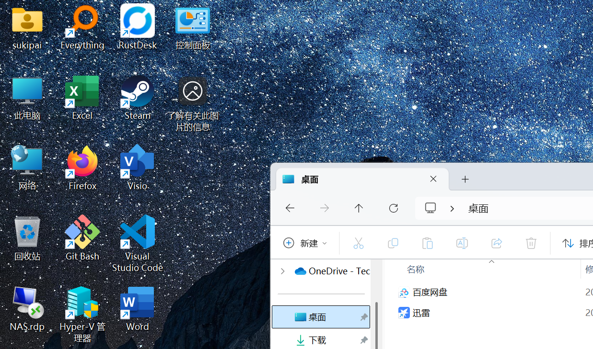


在资源管理器中的导航栏输入：`C:\Users\Public\Desktop`，可以发现，一些桌面上存在但“桌面”文件夹不存在的图标在这里找到了。

### 普通用户与公共用户

在 Windows 中， `C:\Users(用户)` 文件夹下一定存在一个“公用”用户，以及你自己的用户文件夹，假如用户名为 username，我们使用 username 用户登录 Windows 系统后，实际上桌面会同时显示来自当前用户（也就是 username 用户）和公用用户桌面上的文件。

而这个公共用户文件夹，是所有登录这台电脑的用户都可以读取的，“公共”就是意味着“公用”。

在安装程序的过程中，程序一般会安装在 `C:\Program Files` 或者 `C:\Program Files (x86)` 两个文件夹下。这两个文件夹是微软定义的程序公共安装目录，也就是说，每位用户都可以使用安装在它们下的程序。为了方便使用呢，可以手动将安装在这两个目录下的快捷方式移动到公共用户桌面 `C:\Users\Public\Desktop`，这样的话，每位用户都可以方便地找到这些应用程序。事实上，大多数默认安装在 Progrma Files 的程序会默认将快捷方式创建在 `C:\Users\Public\Desktop`，从而方便用户使用。但仍有一部分程序并不会这样做，需要用户手动进行管理。

需要注意的是，应用安装程序需要使用管理员权限才能将软件安装在 Program Files 目录下，因此存在一类特殊的应用程序，它们为了避免安装时使用到管理员权限，会将应用程序以“仅当前用户可用”的方式进行安装，也就是安装在 `C: \Users\<username>\AppData\Roaming` 下面的某个子目录中，例如百度网盘和迅雷就是这样的一类应用程序。对于这类应用程序，快捷方式无需手动移动到公共桌面下，因为其他用户并不能访问安装用户的目录和文件，也就无法访问这两个应用程序。

因此，给大家提出几点建议：

1. 安装应用程序时，要考虑这个程序是只给当前用户使用，还是给所有用户使用。如果只给当前用户使用，就安装到`C: \Users\<username>\AppData\Roaming`下，如果给所有用户使用，就安装到 `C:\Program Files` 下。
2. 确保快捷方式在它应在的位置，并且安装好软件后就应马上确认快捷方式的位置，将有必要移动到公共桌面`C:\Users\Public\Desktop`的快捷方式尽快进行移动，以免后续遗忘。
3. 偶尔检查一下用户桌面，是否存在管理不当的应用程序。

### 几个特殊的图标

<username>、此电脑、网络、回收站、控制面板不会出现在任何 desktop 文件夹，需要在设置中调整才能显示。


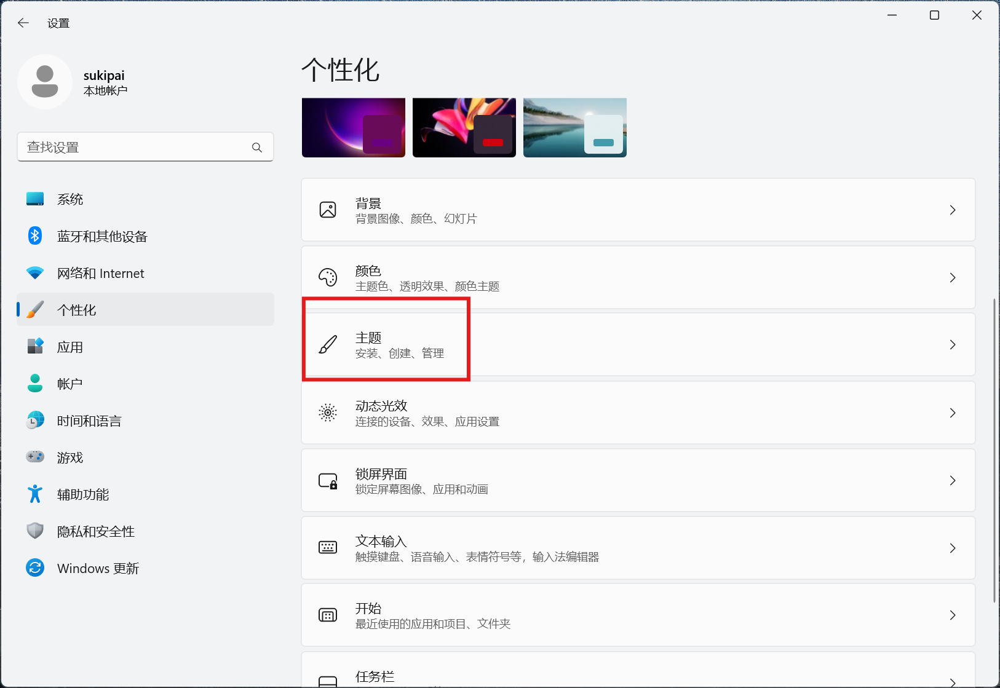
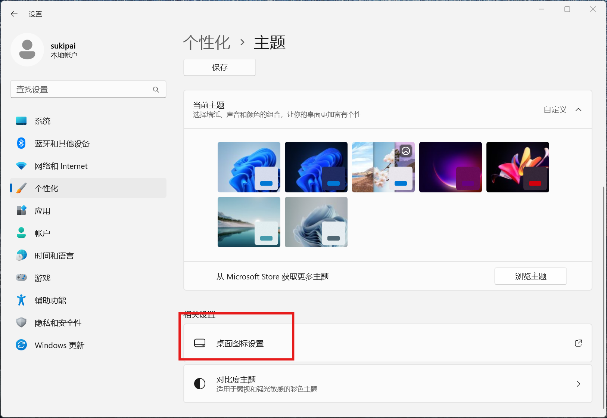


勾选你需要显示的图标即可，每位新建的用户都需要进行这一步骤才能显示这些图标。

## Windows 11 右键菜单

Windows 11 的右键菜单从一级菜单改为了二级，许多用户不习惯，但我们可以将右键菜单修改为 Windows10 的样式，方便使用。

在应用程序中打开终端：

```powershell
reg.exe add "HKCU\Software\Classes\CLSID\{86ca1aa0-34aa-4e8b-a509-50c905bae2a2}\InprocServer32" /f /ve
```

重启资源管理器

```powershell
taskkill /F /IM explorer.exe
explorer.exe
```

就可以修改右键菜单样式为 Windows 10。输入以下命令可以还原为 Windows 11 样式：

```powershell
reg.exe delete "HKCU\Software\Classes\CLSID\{86ca1aa0-34aa-4e8b-a509-50c905bae2a2}\InprocServer32" /va /f
```

重启资源管理器即可。

## Windows Defender 配置

Windows Defender 是一款优秀的安全应用，但有时候它的存在会有些烦人，因此可以通过一些方法禁用 Defender 或禁用它的某些功能。

事先声明，在现在的 Windows 系统中，只有 Windows Server 系列可以彻底关闭 Defender，消费级系统都只能禁用某些功能。


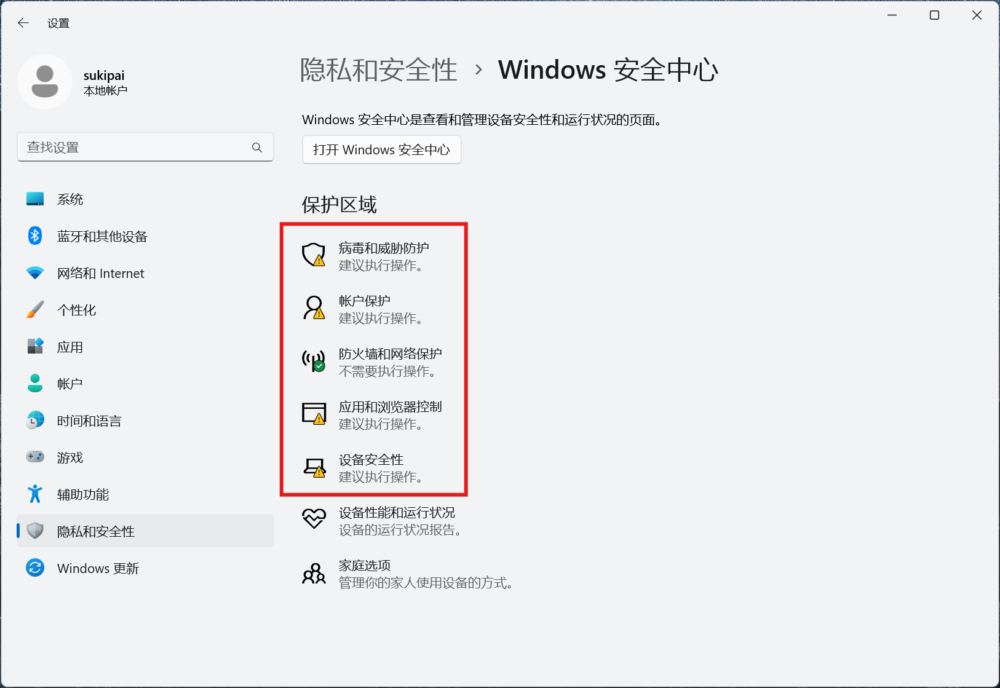


我们只关注红框中的几个功能。

### 病毒和威胁防护

在 Windows 11 系统中，“病毒和威胁防护”功能提供了多种设置，用于保护设备免受病毒、恶意软件和其他安全威胁的侵害。但你下载的破解程序和激活程序也会受到拦截，一些个人文件也可能被误删除（小概率事件）。


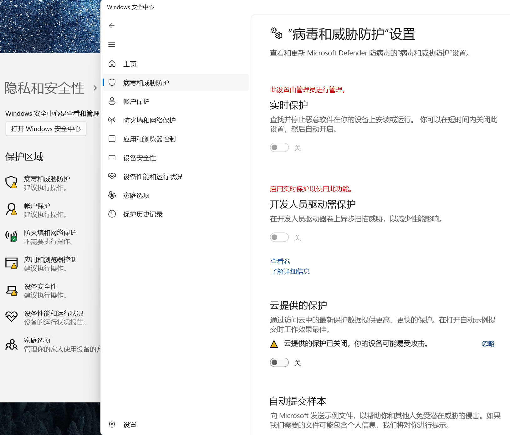


在“病毒和威胁防护”设置下面的管理设置中，可以配置保护策略。以下是各项主要设置的含义：

1. 实时保护：核心功能之一，能够持续监控设备中的潜在威胁，如病毒、恶意软件和间谍软件。当您访问或执行文件时，实时保护会自动扫描这些文件，检测是否存在可疑活动。如果发现威胁，它会立即发出警报并采取措施阻止威胁。可以通过切换按钮打开或关闭实时保护。但需要注意的是，关闭实时保护会使设备更容易受到威胁，且计划扫描仍会继续运行，此外，在重新启动系统之后，实时保护选项会重新开启，如果需要永久关闭，需要使用**组策略**功能。如果某些文件或文件夹被误判为威胁，可以通过添加排除项来避免它们被扫描。
2. 开发人员驱动器保护：开发人员驱动器保护是 Windows 11 为开发者提供的一个特殊功能，它为开发人员提供了一个安全且隔离的环境，用于存储和开发代码。性能模式：该功能包括一个性能模式，可以异步扫描开发人员驱动器。这意味着安全扫描会在文件操作完成后进行，而不是在文件操作过程中同步进行。这种异步扫描模式可以在保护安全的同时，避免因扫描而引起的性能延迟。
3. 云提供的保护：允许 Microsoft Defender 从云端获取最新的安全更新和改进。这有助于更准确地识别、阻止和修复威胁。
4. 自动提交样本：如果启用此功能，Microsoft Defender 会自动将可疑文件发送给 Microsoft 进行分析。用户也可以手动提交文件样本，以确保某些文件被检查。
5. 篡改防护：可以防止恶意应用程序更改重要的 Microsoft Defender 设置，例如实时保护和云提供的保护。通过确保这些设置保持不变，篡改防护有助于维护设备安全配置的完整性，防止恶意应用程序禁用关键安全功能。
6. 受控文件夹访问：可以保护指定文件夹中的文件免受未知或不受信任应用程序的更改。默认情况下，许多常用文件夹已经受到保护，用户也可以添加更多文件夹到受保护列表中。
7. 网络保护：可以防止用户访问钓鱼网站、恶意软件网站以及下载潜在恶意文件。它与 Microsoft Defender for Endpoint 和 Microsoft Defender for Cloud Apps 集成，能够阻止恶意 URL 和 IP 地址。
8. 勒索软件防护：通过受控文件夹访问来防止未知应用程序更改受保护文件夹中的文件。此外，它还提供了从勒索软件攻击中恢复的选项。
9. 排除项：用户可以将特定的文件、文件类型、文件夹或进程添加到排除列表中，避免它们被实时扫描。但需要注意的是，添加排除项可能会使设备和数据面临风险。

## 组策略管理

Windows 策略组（Group Policy）是微软 Windows 操作系统中的一项功能，它允许管理员对计算机和用户进行集中管理。通过策略组，管理员可以控制用户和计算机的配置、安全设置、软件安装、网络访问等。以下是 Windows 策略组的一些主要功能：

1. **集中管理**：策略组允许管理员在单个位置配置和管理多个计算机和用户的设置。

2. **安全性管理**：管理员可以设置密码策略、账户锁定策略、安全选项等，以增强系统的安全性。

3. **软件部署**：通过策略组，管理员可以控制软件的安装、更新和卸载。

4. **桌面管理**：管理员可以配置桌面环境，如开始菜单、任务栏、桌面背景等。

5. **网络配置**：策略组可以用来管理网络设置，如 VPN、无线网络、代理服务器等。

6. **远程安装服务**：管理员可以使用策略组远程安装操作系统。

7. **用户配置文件管理**：策略组可以帮助管理用户配置文件，包括漫游配置文件和强制配置文件。

8. **脚本执行**：管理员可以设置启动和关机脚本，以自动化某些任务。

9. **事件日志管理**：策略组允许管理员配置事件日志的大小和保留策略。

10. **远程桌面服务管理**：管理员可以控制远程桌面服务的设置，如连接权限、会话超时等。

11. **系统服务管理**：管理员可以配置系统服务的启动类型和状态。

12. **软件限制策略**：管理员可以设置软件限制策略，以控制哪些程序可以运行。

13. **文件夹重定向**：管理员可以将用户的文件夹（如文档、桌面）重定向到网络位置，以便于备份和集中管理。

14. **BitLocker 驱动器加密**：策略组可以用来管理 BitLocker 加密，保护数据安全。

15. **应用程序兼容性**：管理员可以配置应用程序兼容性设置，以解决旧应用程序在新操作系统上运行的问题。

策略组通过组策略对象（GPO）实现，这些对象可以链接到 Active Directory 中的组织单位（OU）、域或站点。当策略组设置更改时，这些更改会自动应用到链接到 GPO 的计算机和用户。策略组是 Windows 管理中一个强大的工具，它简化了大型企业环境中的 IT 管理任务。

### 使用示例：在组策 略中永久关闭实时保护功能

1. 使用 `win+R` 开启运行菜单，输入 `gpedit.msc` 打开组策略。


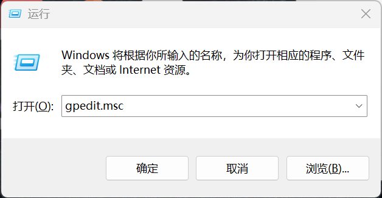
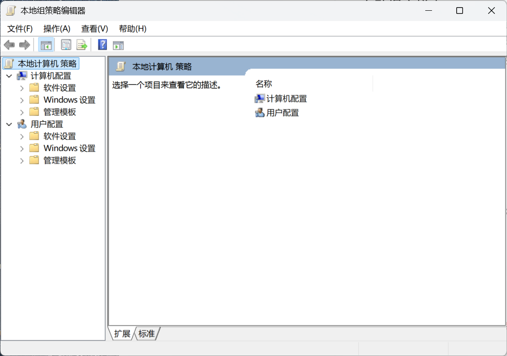

在路径 **计算机配置 - 管理模板-Microsoft Defender 防病毒** 下面找到 **实时保护** 选项

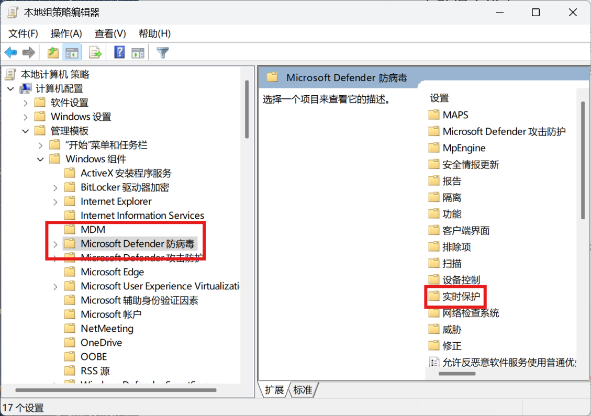


点击**关闭实时保护**，启用它（一定注意是启用“关闭实时保护”）


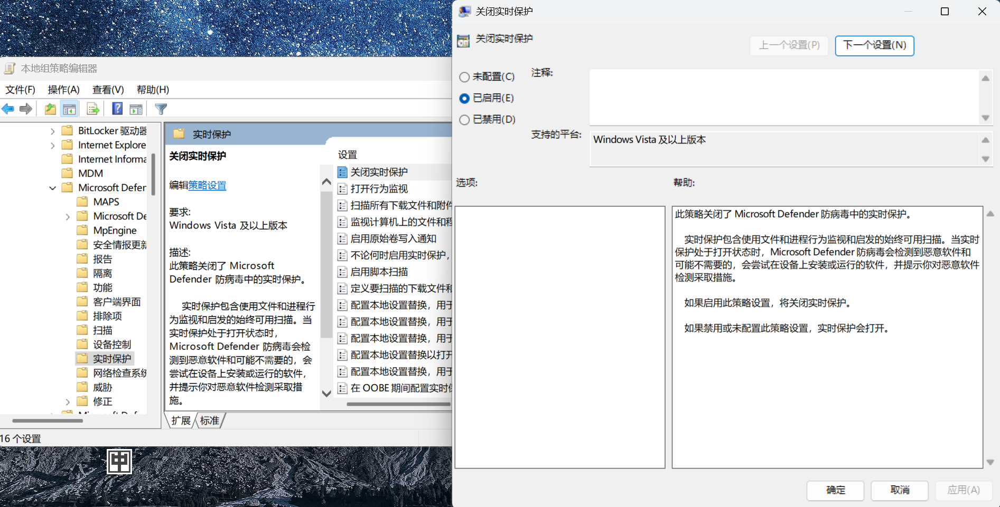

重启电脑或重新登录，实时保护就被彻底关闭了。

组策略是一个方便且功能强大的管理工具，但千万不要随便修改里面的配置，一定要充分了解某功能之后再去修改该功能，此外，家庭版系统没有组策略功能。

## 开关机

开关机也是有学问的，这里主要介绍关机、休眠和睡眠三种模式的区别。它们分别是三种不同的电源管理状态，存在不同的特点和用途：

1. **关机（Shutdown）**：完全关闭计算机，停止所有硬件的运行，包括 CPU、内存、硬盘等。关机后，计算机不会消耗任何电力，所有运行的程序和打开的文档都会关闭，系统状态不会被保存。
2. **休眠（Hibernate）**：将计算机的当前状态（包括打开的程序和文档）保存到硬盘上的一个文件（hiberfil.sys）中，然后关闭计算机。从休眠状态恢复时，计算机会从硬盘加载之前保存的状态，恢复到休眠前的工作状态。这个过程比从关机状态启动要快，但比睡眠状态恢复要慢。
3. **睡眠（Sleep）**：将计算机的当前状态保存到内存中，然后关闭大部分硬件，但保持内存供电，以便快速恢复。从睡眠状态恢复时，计算机会从内存中加载之前保存的状态，恢复到睡眠前的工作状态。这个过程非常快，通常只需要几秒钟。

休眠和睡眠的主要区别在于，将计算机状态存储到硬盘（休眠）还是内存（睡眠）。这也导致了一些特性：休眠状态下被断电，运行状态理论上可以恢复，睡眠状态下被断电，由于内存中数据丢失，工作状态将无法恢复。此外还有以下三方面的区别。

- **恢复速度**：睡眠 > 休眠 > 关机。
- **功耗**：关机 < 睡眠 < 休眠。
- **硬件状态**：关机状态下，所有硬件都停止工作；休眠状态下，硬盘工作，其他硬件停止；睡眠状态下，只有内存和一些基本硬件（如网络接口）保持工作状态。

了解这些区别后，你可以根据实际需要选择合适的电源管理状态。一般来说，长期不用（数日）就关机，短期不用（数小时）就睡眠即可。