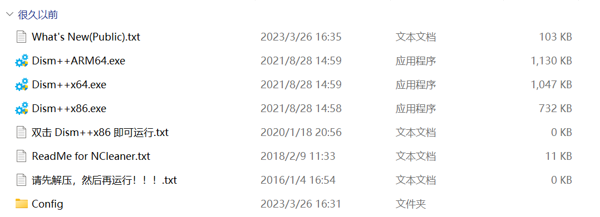
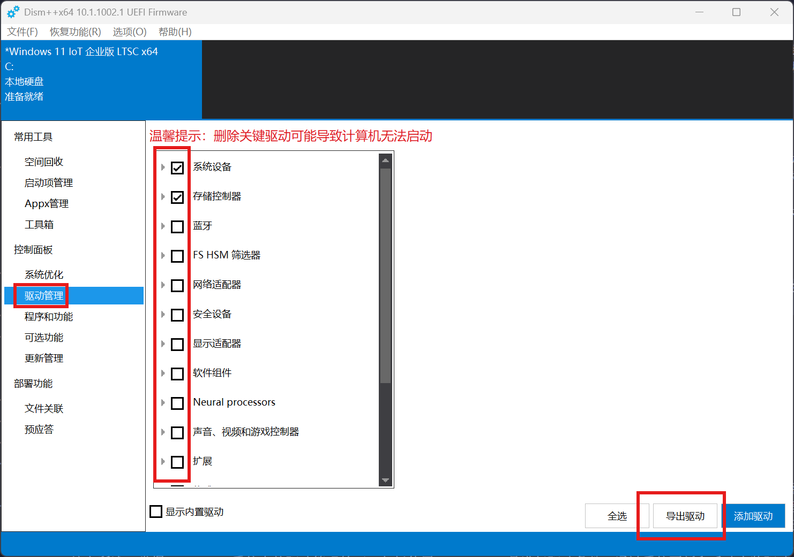
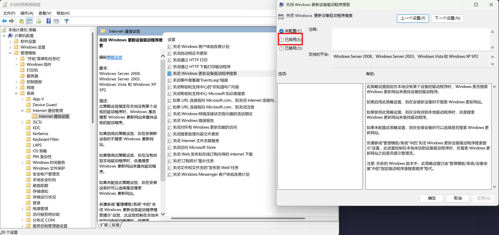
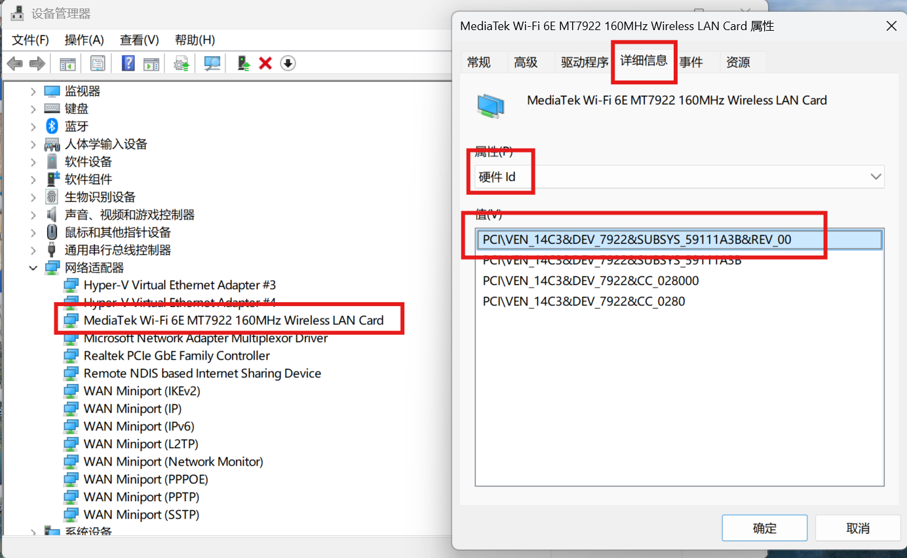
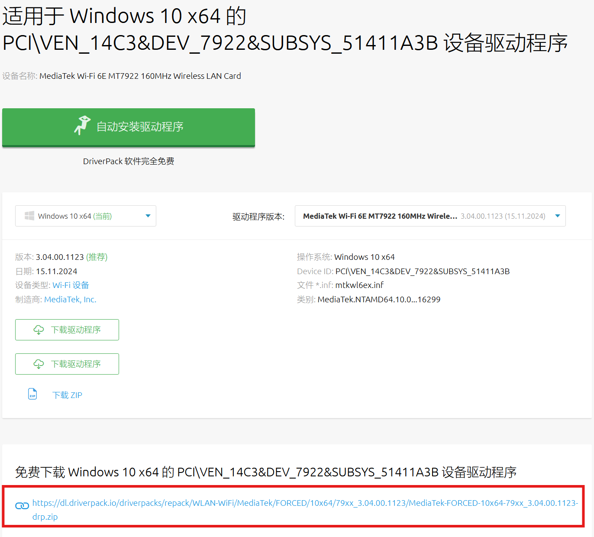
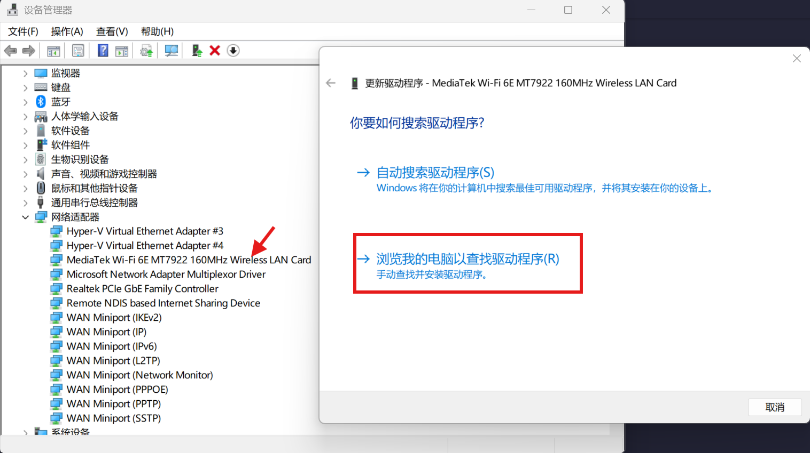

本章主要讲解 Windows 系统中的驱动安装、备份以及如何在网络上寻找所需的驱动。在 Windows 系统中，驱动程序是连接硬件与操作系统的重要桥梁，其正常运行直接关系到硬件设备能否稳定、高效地工作。本章将详细介绍 Windows 系统中驱动的安装、备份以及获取驱动的途径，帮助用户更好地管理驱动程序，确保系统的顺畅运行。

## 驱动备份

在互联网上，绝大多数的驱动都可以找到，但有一部分小众的硬件驱动是难以寻觅的，比如说小厂做的电脑的网卡蓝牙驱动、触屏驱动等。买这种类型的电脑，应该养成备份驱动的习惯，否则系统出现问题，重装之后可能会找不到一部分硬件驱动，导致设备管理器中长期出现未知设备，影响电脑使用。

Dism++ 是一款功能强大的系统管理工具，可以实现垃圾清理、驱动备份恢复、系统备份恢复等功能。首先，从官方网站下载并安装 Dism++ 工具。

[Dism++ Github Release](https://github.com/Chuyu-Team/Dism-Multi-language/releases)

Dism++ 已经停止更新多年，但目前还没有比它更好用的程序。随着 Windows 的更新，Dism++ 的部分功能出现了小 BUG，但总的来说，对用户的体验影响不大。点击程序目录中的 `Dism++x64.exe`，打开软件。

然后在左侧的驱动管理中，选择需要的驱动进行备份即可。除了备份驱动之外，Dism++ 也可以很方便的还原驱动。

那么，我应该备份那些驱动呢？其实并非所有的硬件驱动都要备份，根据我的使用经验，一般来说显卡驱动驱动是无需备份的，无论是 inter 还是 AMD、Nvidia 的显卡，都能很方便的在官网上找到驱动，有些显卡驱动 Windows 甚至会自动安装，并且显卡驱动往往占用空间较大，备份的话会导致备份时间延长、占用磁盘空间变大等。

最省空间的办法：可以先重装一遍微软官方的系统，在系统更新中等待驱动自动安装，然后在设备管理器查看有哪些设备是没有驱动的，仅备份这些硬件的驱动即可。（备份好驱动之前，别把原厂系统给删了）

## 我应该去哪找驱动？

许多国人喜欢用驱动精灵、驱动人生、360 驱动等软件安装驱动，但这些软件往往比较毒瘤，不仅限速下载，还可能在系统中添加一些垃圾软件，因此我非常不推荐使用国产驱动软件。

[DriverPack](https://driverpack.io/zh-cn/catalog) 网站是一个非常可靠的驱动网站。它拥有庞大的驱动程序数据库，涵盖了几乎所有主流硬件设备的驱动程序。用户只需在网站的搜索框中输入**硬件设备的 ID**，网站就会自动匹配并显示相应的驱动程序下载链接。这些驱动程序都经过了严格的测试和筛选，确保其稳定性和兼容性。此外，DriverPack 网站还提供了驱动程序的版本信息、发布日期等详细资料，方便用户根据自己的需求选择合适的驱动版本进行下载安装。

可以看到，DriverPack 主页非常干净，没有任何广告，只有一个驱动搜索框。搜索到所需驱动后，下载的文件也只是一个 zip 驱动压缩包，不会带任何的第三方程序，非常推荐使用。

## 驱动安装

### 通过系统更新安装驱动

Windows 系统自带的更新功能为用户提供了便捷的驱动安装方式。用户只需点击“开始”菜单，选择“设置”选项，进入“更新和安全”界面。在该界面中，点击“检查更新”按钮，系统会自动连接到微软的更新服务器，搜索适用于当前系统的最新驱动程序和其他更新内容。如果系统检测到有新的驱动程序可用，会自动下载并安装这些驱动。安装完成后，系统可能会提示用户重启计算机，以使新的驱动程序生效。通过系统更新安装驱动的优势在于，它能够确保用户获取到微软官方认证的、与系统版本完全兼容的驱动程序，大大降低了因驱动不兼容而导致的系统故障风险。

但 Windows 系统自带的更新功能可能出现以下问题：

1. 驱动装不全：部分硬件设备不在微软的驱动库中，更新完成后，设备管理器仍然显示“未知设备”。
2. 瞎装驱动：显卡驱动为重灾区——微软驱动库更新并不及时，这导致 Windows 更新程序误降级你的驱动。例如，你安装了版本号为 15.0.3 的驱动，但微软的库中，这个硬件的驱动版本只有 13.0.0，在这种情况下，Windows 会认为你的驱动不是最新版本，导致驱动被误降级到 13.0.0 旧版。一半的硬件被强制降级并不会影响使用，但显卡驱动这种需要经常更新且十分影响用户体验的硬件，就会导致使用体验下降。

但还好，我们可以禁用驱动更新。

使用组合键`Win+R`打开运行，输入`gpedit.msc`，点击确定打开组策略编辑器。进入**计算机配置 - 管理模板 - 系统 - Internet 通信管理 - Internet 通信设置**，找到并双击关闭 **Windows 更新设备驱动程序搜索**，勾选已启用，如下图：

推荐使用方案：装好系统后，进行一次完整的系统更新，然后通过策略组关闭驱动更新。此后再安装未知设备驱动、更新显卡驱动。

### 手动安装驱动

当系统更新无法提供所需的驱动程序，或者用户需要安装特定版本的驱动时，手动安装驱动就显得尤为重要。

1. 从硬件制造商的官方网站下载对应型号的驱动程序安装包。下载完成后，双击安装包文件，启动安装向导。按照安装向导的提示，用户可以选择驱动程序的安装路径、安装组件等选项。
2. 从 DriverPack 下载驱动安装。

提供一个 DriverPack 使用示例：

首先，打开设备管理器，右键未知设备（我已经装好驱动了所以不演示这一步），在详细信息 - 属性中选择硬件 id，复制第一项。

在 DriverPack 中搜索这个硬件 id，

这里需要注意，一定要选择下载 zip 文件，不要选择下载自动安装程序。下载好之后解压，右键设备管理器中的未知设备，选择更新驱动程序。

然后选择刚才解压出的文件夹即可。这里选择的文件夹可以是递归的，什么意思呢？我们可以先把所有需要的驱动 zip 包下载好，然后全部解压在下载文件夹中，然后安装每个未知设备驱动时，浏览本地驱动这一步都选择下载文件夹即可，无需精准到每个驱动包。