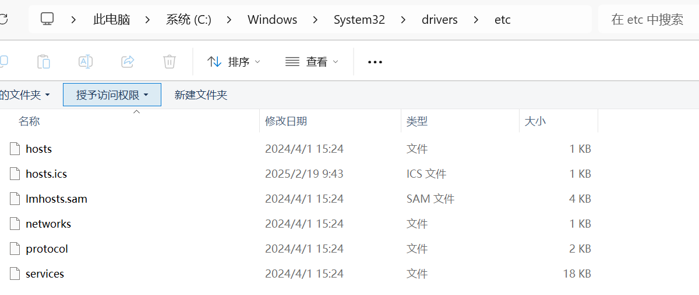

我们的个人资料都是存储在一块块硬盘上的，这些硬盘会以 C: /D: /E: 这样的形式（被称为驱动器）在资源管理器中展示给我们。驱动器中是一个个的文件与文件夹，在这一章中，我们来重新认识它们。

## 资源管理器

大家对资源管理器肯定不陌生，它就像我们电脑里的“大管家”，管理着各种文件和文件夹。打开资源管理器，可以看到一些文件和文件夹图标。

右侧红框圈出的部分是导航栏，可以快速选择想去的文件夹，不在其中的文件夹也可以从右侧的文件浏览页面中拖入。此外，导航栏还提供了“Onedrive”、“Linux”等快捷方式。资源管理器实际上只负责存储，并不负责管理，C 盘中的目录结构是微软帮助我们设定好的，如果没有特殊需求，按照默认使用即可，也就是图片存放“图片”文件夹，文档存放“文档”文件夹等等。但许多中国用户并不习惯这样子做，而常常是将文件随意地防止在桌面，或是新建一个 D 盘分区，放置在新分区里面，但这样做是不推荐的，会造成严重的资源浪费。

举个例子：一块 1T 的硬盘，分 300G 给 C 盘做系统，700G 给 D 盘做资料盘，随着你的使用，C 盘很容易被占满空间，这时候，如果 D 盘中已经存储了大量的资料，那么将 D 盘的空间分出一部分给 C 盘是很困难的。假如分出了 200G 给 C 盘，此时，虽然 C 盘暂时多了 200G 空间，但说不准哪天又被占满了……因此，不妨直接把所有的 D 盘都分给 C 盘，也就是不分区。

如果仍然被占满，这说明磁盘已经把所有空间都利用起来了，此时要做的只能是换一块更大的硬盘。

因此，我们最好按系统默认的方式存放文件：

纠正大家一个小误区，“桌面”是用于存放经常使用的资料的目录，比如每天都要打开的文件。“文档”用于存放偶尔打开的资料文件。把所有文件全放在桌面是不可取的，也不利于文件管理。

点击“查看” - “显示”，可以打开“文件扩展名”与“隐藏的项目”，从而看到系统隐藏的扩展名和一些隐藏文件。注意，不要随意修改文件的后缀，除非你清晰地知道自己在做什么。

资源管理器还能显示文件的详细信息，比如文件大小、类型、创建时间和修改时间等等。这些信息可都是有用的线索，能帮我们更好地管理文件。比如，你想要找一个很久以前创建的文档，就可以通过创建时间来筛选，是不是很方便？

## 磁盘

说到存储管理，就不得不提磁盘。磁盘可是存储数据的“大本营”，我们的各种文件、照片、视频都存放在里面。

现在的磁盘主要有机械硬盘和固态硬盘两种。机械硬盘就像一个旋转的盘子，数据存储在盘子上，通过读写头来读取和写入数据。它的优点是容量大、价格相对便宜，但缺点是速度较慢，而且容易受到震动的影响。

固态硬盘则是一种新型的存储设备，它使用闪存芯片来存储数据，没有机械部件。所以它的速度非常快，能让我们电脑的开机速度和程序运行速度都大幅提升。不过，它的价格相对较高，容量也比机械硬盘小一些。

右键此电脑，点击“管理”，再点击“存储”下的“磁盘管理”，可以打开磁盘管理页面：

该页面向我们展示了磁盘的数量和分区情况。如图，放置了一块硬盘，硬盘上有三个分区。

这个页面展示了多块磁盘的分区情况。右键某块磁盘，可以打开详情页。

从详情页可以看到磁盘的运行情况、分区形式、容量空间等信息。如果需要更加专业的磁盘管理，可以采用国产软件 DiskGenius。

## RAID

RAID 是一种把多个磁盘组合在一起，以提高存储性能和数据冗余的技术。

在磁盘管理中，右键某块磁盘，可以看到以下界面：

红框中的选项就代表新建 RAID，RAID 有好几种类型，并且这些类型在 Linux 中的名字与 Windows 有所不同，下面我们来一一介绍，括号中代表 Linux 下的 RAID 名称。

1. 跨区卷（JOBD）
跨区卷就像是把**几个磁盘** 拼成一个“大磁盘”，数据可以存储在多个磁盘上，这样做的好处是可以增加存储容量。数据的存放机制是由第一颗硬盘开始依序往后存放，即操作系统看到的是一个大硬盘 (由许多小硬盘组成的)。

但如果硬盘损毁，则该颗硬盘上的所有数据将无法救回。若第一颗硬盘损坏，通常无法作救援 (因为大部分文件系统将磁盘分割表 (partition table) 存在磁盘前端，即第一颗)，失去磁盘分割表即失去一切数据，若遭遇磁盘阵列数据或硬盘出错的状况，危险程度较 RAID 0 更剧。

它的好处是不会像 RAID 0，每次访问都要读写全部硬盘。但在部分的 JBOD 数据恢复实践中，可以恢复未损毁之硬盘上的数据。同时，因为每次读写操作只作用于单一硬盘，JBOD 的传输速率与 I/O 表现均与单颗硬盘无异。

2. 带区卷（RAID-0）
带区卷也是把多个磁盘组合在一起，但它会把数据分成多个部分，分别存储在不同的磁盘上。由于数据分散到多个磁盘上存取，这导致系统的数据请求就可以被多个磁盘并行执行，每个磁盘执行属于它自己的那部分数据请求。由于带宽加倍，读写 IO 速度也会加倍，所以这种数据上的并行操作可以充分利用总线的带宽，显著提高磁盘整体存取性能。

就像你有几条传送带，把数据分成几份，分别通过不同的传送带传输，速度肯定比一条传送带快多了。不过，带区卷也有数据冗余的问题，如果一个磁盘坏了，数据也会丢失。

理论上，N 块硬盘组成的 RAID0，读写速度会是单盘的 N 倍，但实际上有差距。

3. 镜像卷（RAID-1）

镜像卷就是把数据同时写入**多个磁盘**，组成 RAID1 的所有磁盘上的数据是完全一样的。如果其中一个磁盘坏了，另一个磁盘还可以继续工作，保证数据不间断服务。

这就像是给数据找了个“备份”，就像你有两本书，内容完全一样。如果一本书丢了，你还有另一本可以看。

许多人把 RAID1 当作备份来使用，但注意，RAID1 并不是真正的备份，RAID1 的作用也不是做“数据备份”，而是保障服务的不间断运行，这一点一定要区分清楚。

4. RAID-5 卷
RAID-5 卷是一种更高级的 RAID 类型，它把数据分成多个部分，分别存储在多个磁盘上，同时还存储了数据的奇偶校验信息。这样即使有一个磁盘坏了，也可以通过奇偶校验信息来恢复数据。
可以把它想象成一个团队合作的项目，每个人都有自己的任务，同时还记录了一些关键的信息。如果一个人出了问题，其他人可以根据这些信息来完成项目。

这四种类型的 RAID 的最常见的，此外还有 RAID6，RAID10 等等类型，他们都有着各自的作用和优缺点，这里就不赘述了。

## C 盘目录结构

C 盘可是我们电脑里的“心脏地带”，它的目录结构非常重要。我们来介绍一下 C 盘中的几个主要的文件夹：

`C:\Windows\` 文件夹：这是存放操作系统文件的地方，包括系统文件、驱动程序、系统设置等等。这个文件夹非常重要，不要随便删除里面的文件，否则可能会导致系统崩溃。

`C:\Program Files`，`C:\Program Files (x86)` 文件夹：这个文件夹是用来存放已安装的程序的。我们平时安装的各种软件，大部分都会安装在这个文件夹里。

`C:\Users\<username>`：这个文件夹是用来存放用户的数据和设置的，包括文档、图片、视频、音乐等等。我们可以在这个文件夹里创建自己的文件夹，方便管理自己的数据。

`C:\Users\<username>\AppData\`，`C:\Users\<username>\AppData\Roaming\`：原本用于存放应用程序的数据文件，但有部分软件为了跳过管理员权限，会将软件本体安装在这些目录下，例如百度网盘、迅雷等。

`C:\Windows\Fonts\`：系统的字体文件目录，将字体文件拖放到这个目录，就等于给整个系统安装了该字体。注意，字体文件有“为当前用户安装”和“为所有用户安装”两个选项，“为当前用户安装”的字体只有安装的用户可以使用，安装文件放置在`C:\Users\<username>`下面的某个文件夹中，而“为所有用户安装”则是把字体文件放在了`C:\Windows\Fonts\`，所有用户都可以使用。

`C:\Windows\System32\drivers\etc\`：

存放了一些网络相关的配置文件，常用的 hosts 文件就在这个文件夹中。

## BitLocker

BitLocker 是 Windows 系统自带的一种磁盘加密工具，它可以保护我们的数据安全。通过 BitLocker 加密磁盘后，即使磁盘被盗或者丢失，数据也不会被轻易泄露。

BitLocker 的加密过程非常简单，只需要设置一个密码或者使用智能卡就可以完成加密。而且，它还可以自动加密新添加的文件，保证数据的安全性。

启用过程中，会提示你保存恢复密钥，请注意，这个恢复密钥非常重要，直接关系到数据安全，一旦系统出现问题，没有恢复密钥的话，神仙也是救不了 BitLocker 加密数据的，因此一定一定要保管好这份文件。如果实在担心数据安全，可以不启用 Bitlocker。

Windows 11 开始，BitLocker 会在品牌机 OEM 系统和家庭版/专业版中默认启用，请务必注意数据安全，保管好 Microsoft 账户的密码和恢复密钥。

## 总结

存储管理是一个非常重要的话题，它关系到我们的数据安全和电脑性能。通过了解这些知识，我们可以更好地管理自己的电脑，保护自己的数据。