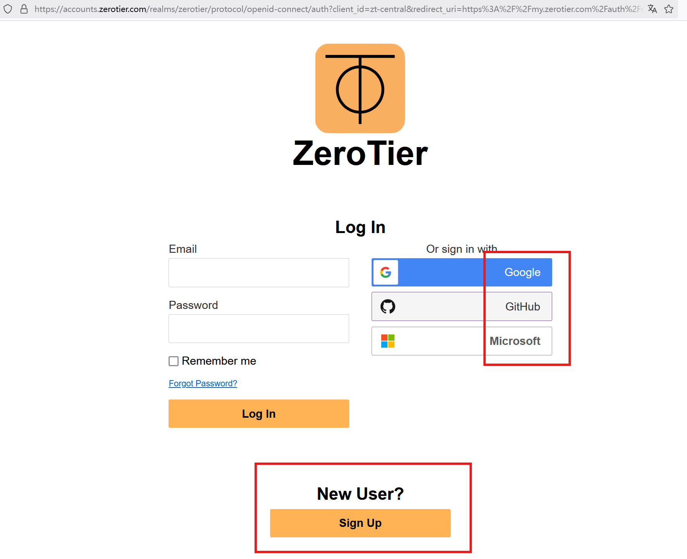
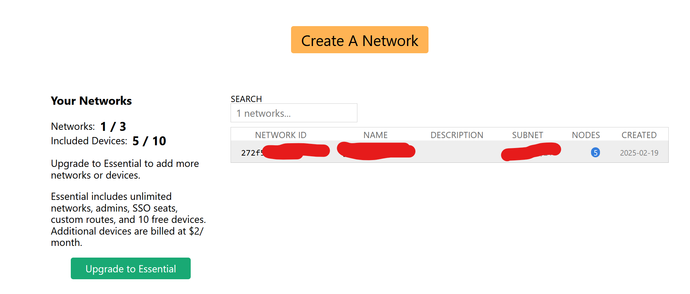
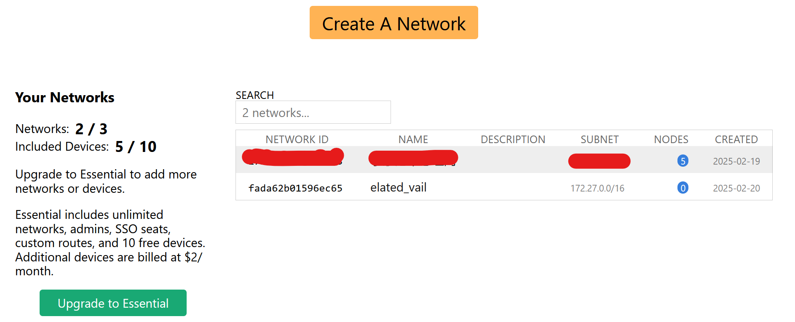
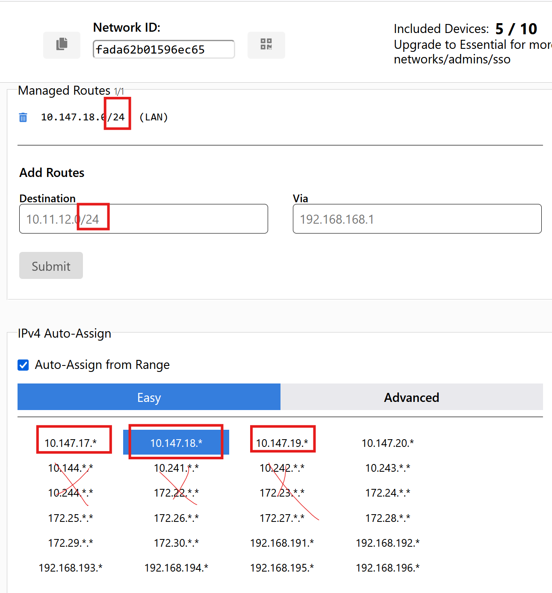
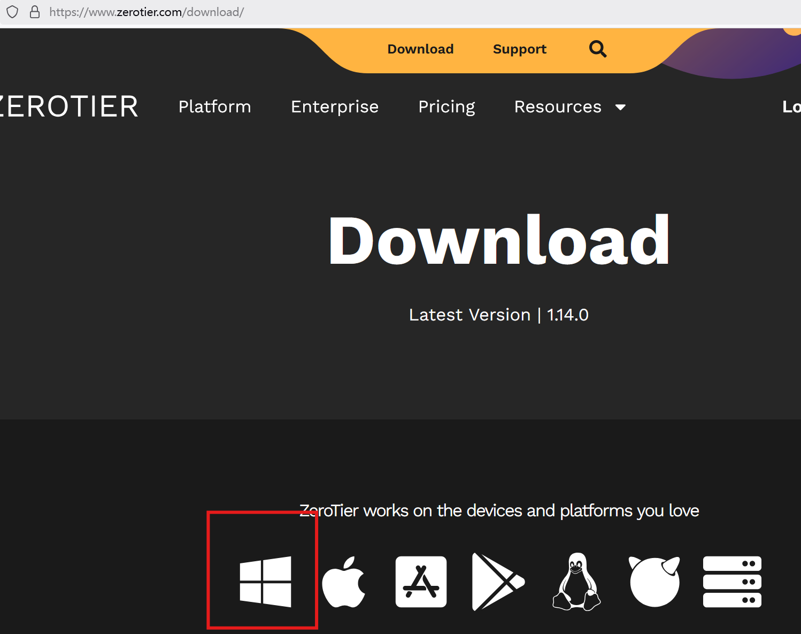
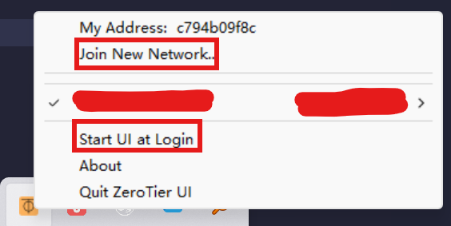
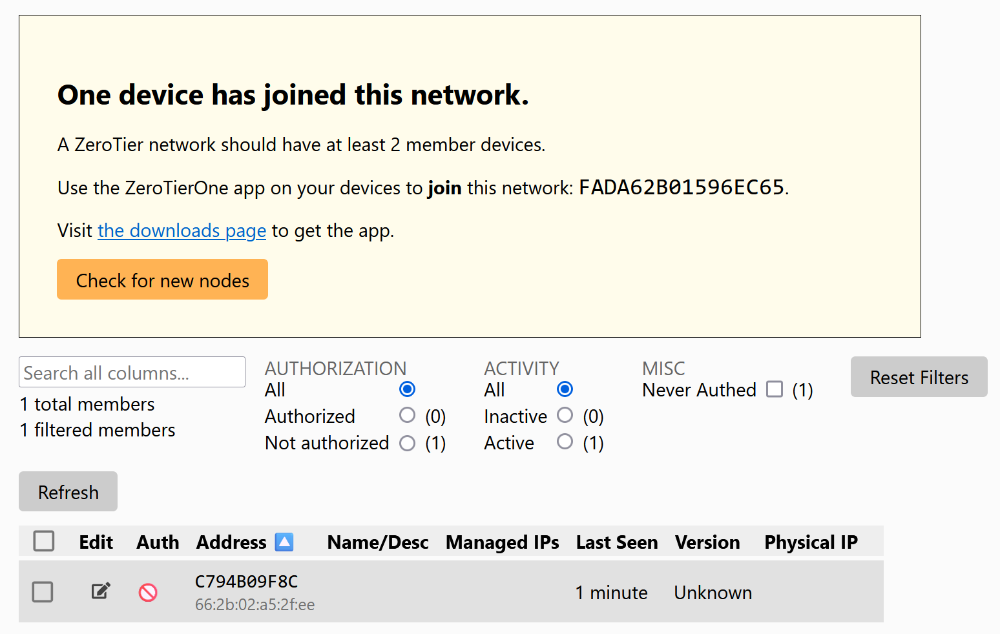
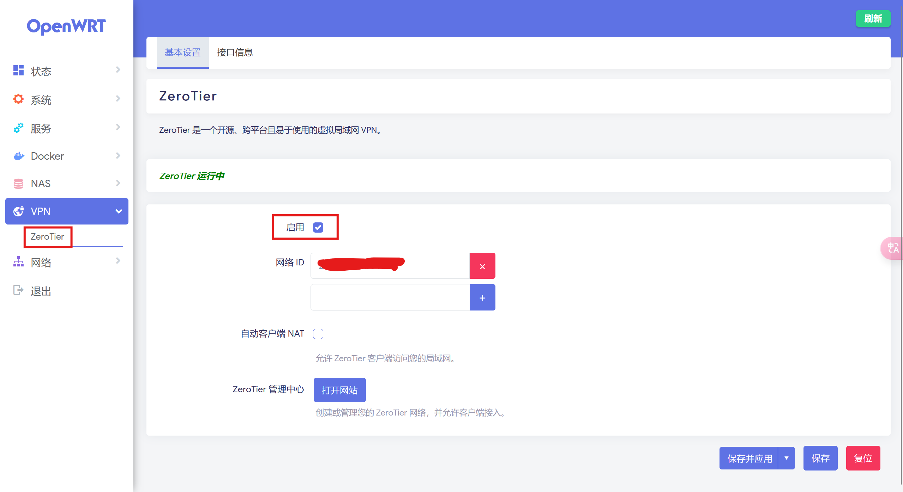
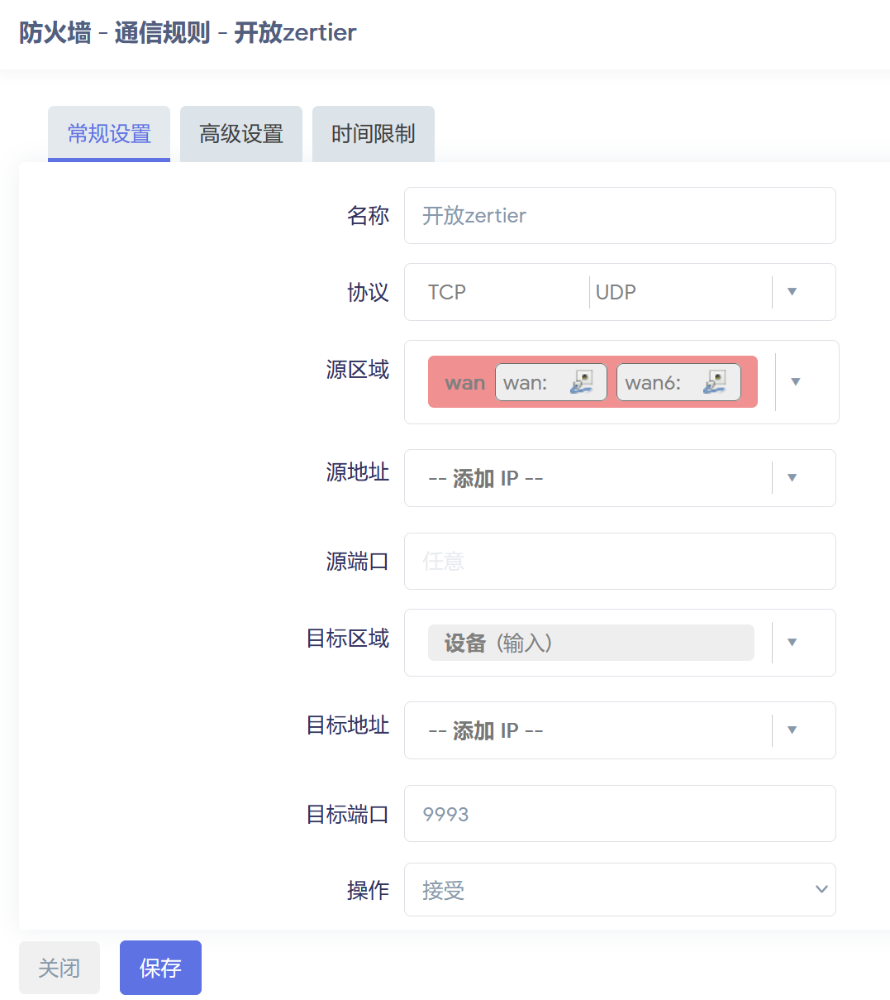
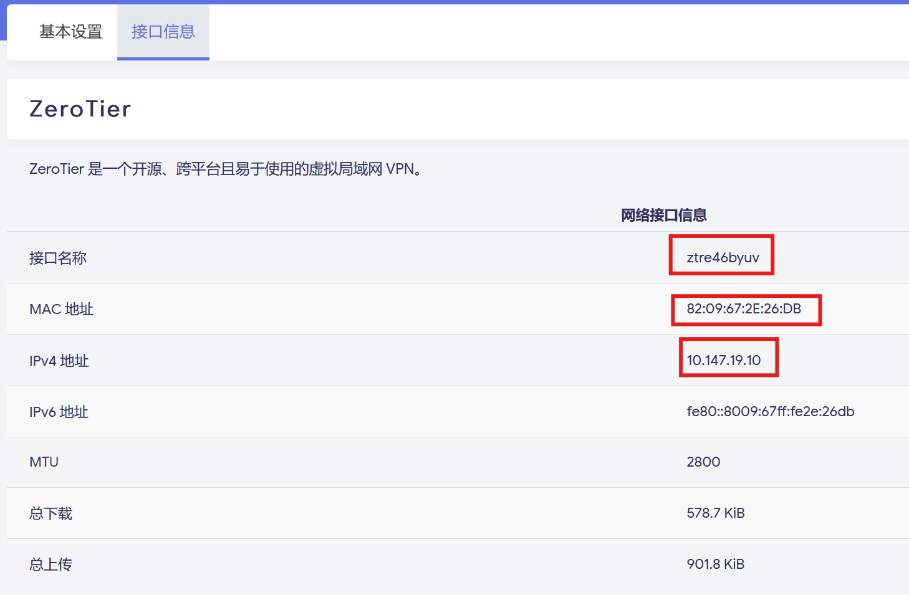

之前在 NAS 系统上一直使用 IPv6+ 端口号的形式来使用各项服务，日常使用倒是没有什么问题。但是，在需要远程维护路由器和服务器功能，外网仅 IPv6 的使用方式就存在一个大问题了——每次重启路由 wan/wan6，所有机器的 IPv6 地址都会变化，光是变化也还算好，毕竟我们还做了 ddns 服务，等十来分钟，新的 IPv6 地址就会被解析到 DNS 服务器。但是，解析之后，由于 DNS 缓存等等原因，域名仍然会存在一些问题……总之，每次重启之后，想要正常使用服务，需要等待一段较长的时间，并且由于连不上设备，只能坐在电脑前干等，挺煎熬的。所以我就想着再做一个 VPN，保留一个 IPv4 的远程访问接口。

## 内网穿透与异地组网

异地组网是指将地理位置不同的网络或设备通过专用网络（如 MPLS
、VPN、SD-WAN 等）连接起来，形成一个虚拟的统一网络环境，使远程的设备和用户能够像在同一局域网内一样进行数据通信。异地组网广泛应用于企业的分支机构互联、跨地域办公等场景中。常见的异地组网方式有 ZeroTier 等。

内网穿透（NAT Traversal）是一种通过中间服务器或代理服务器使位于不同内网环境中的设备可以直接通信的技术。其原理是将内网中的设备数据转发到公网上，允许外部设备访问内部网络资源。内网穿透通常用于远程访问内网服务（如家庭摄像头、局域网服务器）或便捷地连接内网中的特定设备。常见的内网穿透方式主要是 FRP。

我的个人理解如下：内网穿透主要用于暴露某个端口（也就是某项服务）到公网上，具有明确的指向性。异地组网则是把各个设备通过 VPN 组成一个私有的虚拟局域网，这个局域网内的设备可以访问其它设备的所有服务，在服务方面不具有指向性，但对于连接设备具有针对性（只有虚拟局域网内的设备可以相互访问）。

内网穿透很简单，以前也有讲过，这里就不赘述了，此文主要讲 zerotier 组网。

## ZeroTier 配置

进入[ZeroTier 官方网站](https://www.zerotier.com/)，注册一个新账户。



也可以使用社交帐号登录，登录之后创建一个 Network。




点击新创建的 Network，进入配置页面，基本上不用改配置，把 Network 名字改改就行，然后选择一个/24 的网段，我实测/16 的网段稳定性较差。



其它就不用动了，记下这个 Network 的 ID，后面需要用这个 ID 来加入这个局域网。

## Windows 安装 ZeroTier

进入 Download 页面，下载 Windows 版本的 ZeroTier，下载安装。




安装后的 ZeroTier 不会在桌面创建快捷方式，但可以在开始菜单中找到，快捷方式可以自行创建（右键 ZeroTier，选择“打开文件位置”，将快捷方式复制到桌面即可）。

打开 ZeroTier 后，右下角可以看到它的图标，点击图标，“Join a Network”来加入一个虚拟局域网。如果这个设备很常用，那么要把“Start UI at Login”选上。



回到 zerotier 网页端，同意该设备加入。



然后我们打开终端，查看 `ipconfig`，可以看到类似下面的输出

```txt
以太网适配器 ZeroTier One [272f5********]:

   连接特定的 DNS 后缀 . . . . . . . :
   本地链接 IPv6 地址。. . . . . . . : fe80::f25d:1cdc:b591:f44c%19
   IPv4 地址 . . . . . . . . . . . . : 10.147.19.12
   子网掩码  . . . . . . . . . . . . : 255.255.255.0
   默认网关。. . . . . . . . . . . . : 25.255.255.254
```

能获取到 IPv4 地址就可以了，保险起见的话，还可以核对一下网页端的 IP 地址。

## OpenWRT 安装 ZeroTier

路由器异地组网可以说是整个家庭网络的核心，只要路由器不出事，其它问题都好解决，因此 OpenWRT 安装 Zerotier 我觉得很有必要，但 OpenWRT 的安装相对 Windows 要困难许多。

1. 编译安装

在源码中 `make menuconfig`，luci-application 里面勾选 zerotier 即可。

2. 包管理器安装

```bash
opkg update
opkg install zerotier
```

有条件的话，我非常建议所有软件都通过编译安装，不容易出问题，不方便的话就用包管理器安装也行。



填入自己的网络 ID，然后启用。

接下来，我们来配置防火墙，首先将“常规设置”里面的“转发”改为“接受”，然后新建一个防火墙区域。


规则按图上即可，“涵盖的网络”这一项暂时选不了，因为我们还没有创建网络接口。

然后来到“接口”，添加一个新接口，协议选择 DHCP 即可（也可以选择无协议，自行配置 IP，但一定要与管理页面上的 IP 对上，还是 DHCP 更方便）：


然后回到防火墙设置，将“涵盖的网络”这一项选择 ZeroTier 接口，此外，还要添加一条通信规则：



回到 ZeroTier 界面，查看接口信息，能获取到 IPv4 地址就可以了。



最后，可以做一下 ping 测试，两台设备进行相互 ping，都能 ping 通的话即 OK。

## Zerotier 原理

下面简单讲解一下 Zerotier 的原理。

ZeroTier 使用一个中央服务器来管理网络成员的身份验证和授权。每个加入网络的设备都需要一个 ZeroTier 身份（ZTID），这是一个类似于公钥的标识符。用户在 ZeroTier 中心服务器上注册，获取一个身份，并为设备分配 ZTID。每个设备在加入网络时，都会通过中心服务器来发现网络中的其他成员。中心服务器维护一个成员列表，包括每个设备的 ZTID 和网络地址。

ZeroTier 通过路径选择算法来确定数据在网络中的最佳传输路径。如果两个设备之间没有直接的网络连接，ZeroTier 会通过中继节点来转发数据。中继节点是网络中的一些设备，它们允许其他设备通过它们来转发数据。

在设备中，ZeroTier 会创建一个**虚拟网卡**。在 Windows 中，这个网卡是自动创建的，在 OpenWRT 则需要我们手动配置，这个网卡的上游就是 ZeroTier 的某个服务器，该服务器具有 DHCP 功能，可以自动为接入局域网的设备分发 IP 地址。通过这个上游服务器，所有接入的设备形成了一个虚拟局域网，从而实现相互访问。

如果你退出 ZeroTier 软件，这个虚拟网卡也就失效了，那么你就无法再访问其它设备。

我们不需要关注 ZeroTier 的具体实现原理，只要了解一下数据的流向就行了。