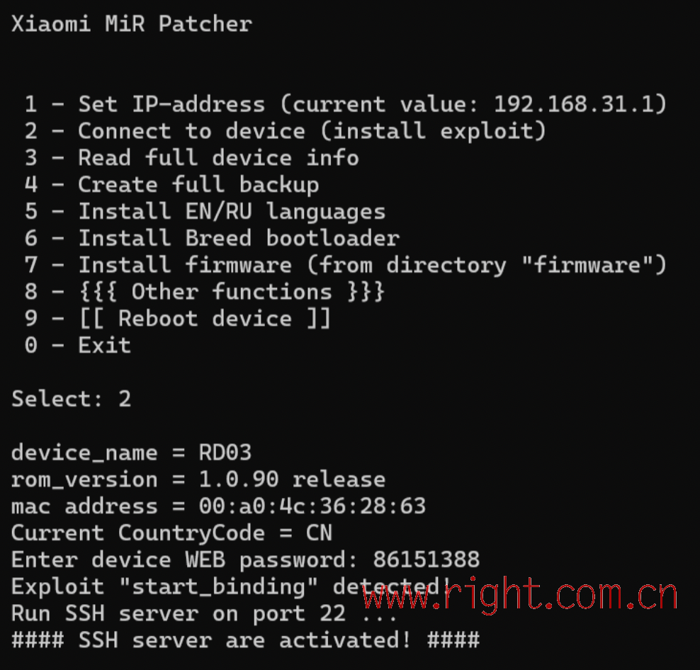
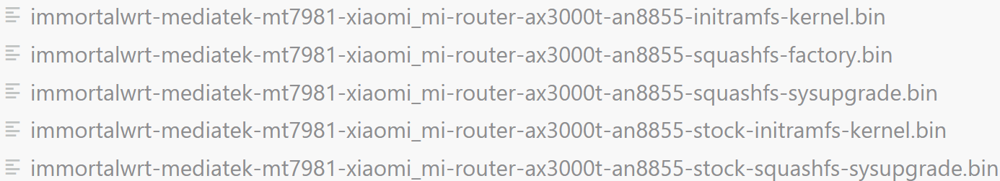
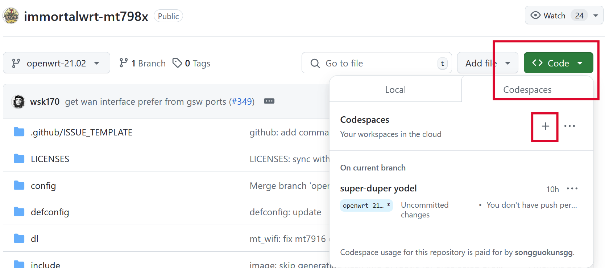

恩山上面已经有较多的刷机教程，但始终没有一个相对完整的系统性教学，往往在过程中会漏掉那么几个步骤，让我也吃了不少苦头。今天一狠心把路由器也刷成 ImmortalWRT 了，并在这里记录一下详细的刷机过程。当然，这篇文章更像是一个系统性的整理，并非小白教学，必然是给懂一些网络的人看的，所以不会有过多配图。

## 参考

1. 恩山文章

[](https://www.right.com.cn/forum/forum.php?mod=viewthread&tid=8416935&highlight=ax3000t)

[](https://www.right.com.cn/forum/forum.php?mod=viewthread&tid=8395187&highlight=ax3000t)

[](https://www.right.com.cn/forum/forum.php?mod=viewthread&tid=8405671&highlight=ax3000t)

[](https://www.right.com.cn/forum/forum.php?mod=viewthread&tid=8404780&highlight=ax3000t)

[](https://www.right.com.cn/forum/forum.php?mod=viewthread&tid=8409864&highlight=ax3000t)

[](https://www.right.com.cn/forum/forum.php?mod=viewthread&tid=8404955&highlight=ax3000t)

2. Github 798x 相关项目

[](https://github.com/hanwckf/immortalwrt-mt798x)

[](https://github.com/hanwckf/bl-mt798x)

## 确保系统版本为 1.0.84

小米近期推送了 1.0.90 的系统更新，如果你不幸进行了升级，那么可以洗洗睡了。

幸运的是，根据网友测试，1.0.90 刷机方法和 1.0.84 一样，但还是建议先降级到 1.0.84 再操作。

首先，下载小米的救砖工具和系统包，包含以下两个文件：

1. 固件：miwifi_rd03_firmware_f85f9_1.0.84.bin
2. 刷机工具：MIWIFIRepairTool.x86.zip

将路由器从光猫上拔下，路由器 LAN 口与电脑网口对插，并将路由器和电脑设置为同一网段，小米默认为 192.168.31.0/24 网段。

解压刷机工具 MIWIFIRepairTool.x86.zip，运行刷机工具，根据提示操作即可。只有一个地方需要注意，最后一个步骤需要按住 reset 按钮重启，重启时 LED 灯会变黄，变黄后过几秒松掉 reset 键，黄灯闪烁，同时电脑屏幕会显示出刷机进度条。如果电脑没有任何弹窗出来，则路由器为正常开机，需要重新尝试操作。

刷机之后需要手动把网段设置为 192.168.31.0/24，访问192.168.31.1，进行初始化设置。这里的设置不需要连上外网，只要把 webui 的密码设好就行了。

## 解锁临时 SSH

来源：[](https://www.right.com.cn/forum/forum.php?mod=viewthread&tid=8417892&highlight=ax3000t%2B1.0.90)

1. 有线连接路由器后，打开 192.168.31.1 检查路由器可以正常访问并进行初始化设定
2. 打开 xmir-patcher-main 目录中的 run.bat，选择【2】Connect to device，输入刚才初始化路由器时写的登陆密码

3. 选择【4】Create full backup，备份并下载分区
注意：我进行到这一步时并不能备份原厂分区，由于我并不会刷回官方系统，就懒得操作这一步了。
4. 最后再选择【8 - {{{ Other functions }}}】，再选择【2】修改 root 密码，并且固化 SSH，选择【7 - Install permanent SSH】
注意：这一步也是可选，刷完 OpenWRT 之后，系统都变了，这时候固化 SSH 有什么用呢？

## 将 uboot 上传到路由器并刷入

这里可以选择用图形 SSH 工具 mobaxterm 进行，也可以直接使用系统 ssh 和 scp 命令进行，由于上传的文件就一个，所以就不演示 mobaxterm 了，道理都是相通的。

起一个终端，拷贝 uboot 文件到`/tmp/`目录下

```bash
scp mt7981_ax3000t_an8855-fip-fixed-parts-multi-layout.bin root@192.168.31.1:/tmp/
# passwd: root
```

另起一个终端，ssh 到路由器上

```bash
ssh root@192.168.31.1
# passwd: root
```

刷入 uboot：

```bash
mtd write /tmp/mt7981_ax3000t_an8855-fip-fixed-parts-multi-layout.bin FIP
```

## 进入 uboot 并刷机

1. 进入 UBOOT：拔掉电源，卡针顶入 reset 孔并保持，连接电源，保持 reset 键 5 秒，路由器显示灯亮白色。
2. 手动将电脑网段调整到 192.168.1.0/24，访问 192.168.1.1，进入 UBOOT 界面
3. 因为我们要刷入的是 immortalwrt，所以选择 mtd layout 为 immortalwrt-112m

这里注意，在网上，你有可能下载到 4 种类型的固件：



factory 的固件表示固件通过 uboot 进行刷入。
sysupgrade 的固件表示，在 immortalwrt 安装完成之后，在系统内进行 OTA 升级所用的固件。
stoke 固件表示适用于官方分区布局。
带 initramfs 的固件一般用不上，这种固件貌似用于特殊用途，在这种固件中进行的配置更改并不会保存（ramfs 特点），应该仅用作调试，这一块我也不是很了解，当我没说。
推荐在 uboot 中刷入不带 stoke 的 factory 固件，当然，后续的系统 OTA 升级也必须使用不带 stoke 的固件，也就是看好这俩：

1. immortalwrt-mediatek-mt7981-xiaomi_mi-router-ax3000t-an8855-squashfs-factory.bin
2. immortalwrt-mediatek-mt7981-xiaomi_mi-router-ax3000t-an8855-squashfs-sysupgrade.bin

uboot 刷机用 1.，后续系统升级用 2.。

## 刷完后的配置

一定要看固件发布者定下的默认网关地址，如果发布者没有说到，那么就把 IP 地址设置为自动，这些固件应该默认有启用 DHCP，会自动分发一个 IP 地址下来。在网页浏览器输入网关地址进行配置。

immortalwrt 对 WAN/WAN6 的默认配置是 DHCP/DHCPv6，适用于光猫拨号，如果你是路由器拨号，就把 WAN 改成 PPPoE 即可。

后续的配置就跟 OpenWRT 一样了，不再赘述。

## 系统洁癖？折腾党？固件定制党？

这一部分讲解如何自己编译 ImmortalWRT 固件，但这里太小了写不下，等有时间了我再来。

有时间了，写一下。

首先打开网址：[](https://github.com/hanwckf/immortalwrt-mt798x)，这是 hanwckf 发布的适用于 798x 芯片硬件的源代码。

还有一个比较新的版本，不过我没试过：[](https://github.com/NekokeCore/immortalwrt-mt798x-24.10)。



我已经创建了一个，所以你的界面可能与我有所不同。

codespace 里面会包含一套完整的开发环境，整体编译步骤可以看我以前文章，搜索 immortalwrt 即可。

主要区别在两点，一是选择配置，二是选择机型：

以下引用 README.md

### Quickstart

  1. Run `git clone --depth=1 https://github.com/hanwckf/immortalwrt-mt798x.git` to clone the source code.
  2. Run `cd immortalwrt-mt798x` to enter source directory.
  3. Run `./scripts/feeds update -a` to obtain all the latest package definitions defined in feeds.conf / feeds.conf.default
  4. Run `./scripts/feeds install -a` to install symlinks for all obtained packages into package/feeds/
  5. Copy the configuration file for your device from the `defconfig` directory to the project root directory and rename it `.config`
     
     ```
     # MT7981
     cp -f defconfig/mt7981-ax3000.config .config

     # MT7986
     cp -f defconfig/mt7986-ax6000.config .config
     
     # MT7986 256M Low Memory
     cp -f defconfig/mt7986-ax6000-256m.config .config
     ```
     
  7. Run `make menuconfig` to select your preferred configuration for the toolchain, target system & firmware packages.
  8. Run `make -j$(nproc)` to build your firmware. This will download all sources, build the cross-compile toolchain and then cross-compile the GNU/Linux kernel & all chosen applications for your target system.

第 5 步，针对 AX3000Tv2，使用 `cp -f defconfig/mt7981-ax3000.config .config`，第 7 步，将除 AX3000Tv2 以外的机型全部去掉。


然后定制 luci 软件包，编译即可，codespace 不存在网络问题，应该可以一次成功。

也可以本地搭建编译环境，需要使用 ubuntu20.04 系统