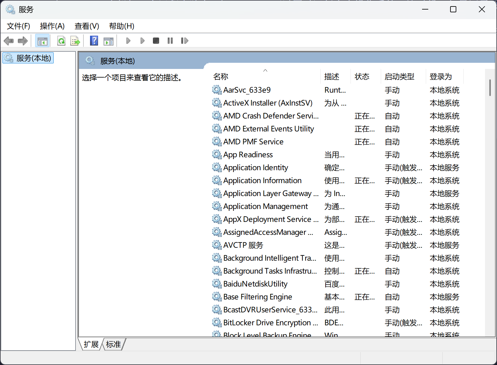
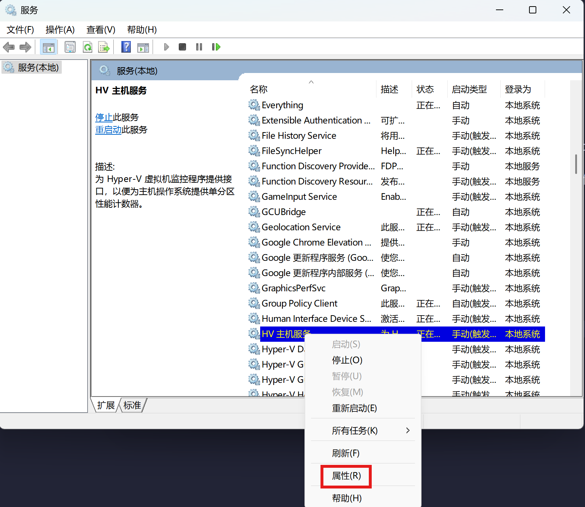
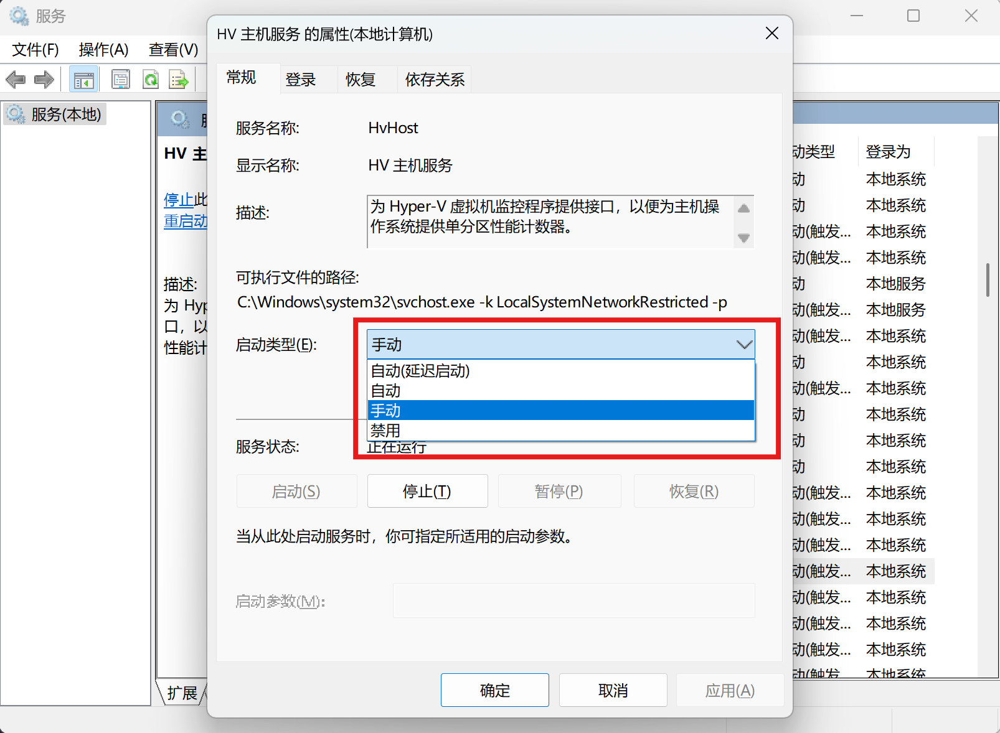

```txt
Windows 服务是 Windows 操作系统的核心。它们控制着操作系统的运行，定义了图形用户界面（GUI）与系统硬件之间的通信以及其他许多功能。没有这些服务，Windows 操作系统将无法正常运行。

对普通用户而言，可以简单将 Windows 服务视为没有界面的普通应用程序，无需用户干预即可启动和停止。它们是 Windows 操作系统所必需的，用于创建和执行需要长时间运行的进程，以执行不同的任务。

虽然 Windows 服务独立运行且无需用户干预，但它们也可能遇到问题。它们可能会损坏，或者在需要时停止运行。在某些情况下，由于资源利用率或其他原因，您可能希望禁用、停止或暂停某项 Windows 服务。

在这种情况下，可以手动安全地管理 Windows 服务，而不会影响操作系统本身。
```

以上是 Windows 服务的定义，说白了，服务就是从开机时就默默在后台运行或者是待运行的程序，在你使用 Windows 的过程中，你很难注意到它们，但如果它们都罢工了，那你的计算机系统就难以运行下去了。

有点像我们的社会，外卖员、网约车司机、清洁工……也许我们平时连正眼看他们一眼都不会，但如果没有他们，社会真的有可能停摆，花点钱就有人来伺候的日子更是不再可能出现。

说回咱们的 Windows 系统，事实上，所有的操作系统中，程序自启动都是很重要的一环。在 Linux 中，现在许多的主流发行版都使用了 systemd 来进行一站式管理。那么用户如何使用 systemd 来管理程序自启动呢？

首先，我们需要编写一份 `.service` 文件，它通常类似这个样子：

```txt
[Unit]
Description=example systemd service unit file
After=network.target

[Service]
ExecStart=/bin/bash /usr/sbin/example.sh

[Install]
WantedBy = multi-user.target
```

将这份文件保存为 `<serviceName>.service` 后，使用 `systemctl daemon-reload` 命令重载所有的服务，再使用 `systemctl start <serviceName>.service`，如果需要服务自启动的话，就使用 `systemctl enable <serviceName>.service`。

这不是 Windows 教程吗？为什么在这里我要详细介绍 Linux 服务？

因为虽然两个操作系统的设计完全不同，但在服务这一块，两者相似之处比较多。在 Windows 中，我们仍然需要指定程序的路径、程序运行的参数、自启动方式等等。只不过这些操作我们可以在图形界面中完成，相对来说更加直观。

## 先来说说自启动

在 Windows 系统中，程序可以通过多种方式实现自启动，这些方式主要利用了系统启动时加载的特定位置或机制。以下是两种主流的程序自启动方式：

1. 开始菜单的“启动”文件夹

位置：`C:\Users\<用户名>\AppData\Roaming\Microsoft\Windows\Start Menu\Programs\Startup`。

将程序的快捷方式放置在该文件夹中，系统启动时会自动运行这些程序。简单易用，适合普通用户手动添加启动项。容易被用户发现并手动删除。打开你电脑的该文件夹，就可以找到哪些应用程序在这里偷偷自启动。

2. 注册表启动项

位置：

```txt
HKEY_CURRENT_USER\Software\Microsoft\Windows\CurrentVersion\Run（当前用户）
HKEY_LOCAL_MACHINE\SOFTWARE\Microsoft\Windows\CurrentVersion\Run（所有用户）
```
在注册表中添加程序的路径，系统启动时会根据这些路径加载程序。程序可以隐藏得更深，适合需要隐蔽启动的应用程序。需要一定的技术知识来操作注册表，且容易被安全软件检测。一些过于流氓的软件，可能会把启动项放置在这里。

此外，还有 DLL 劫持和驱动程序加载等等方式可以使程序自启动，但我们一般把这样的程序叫做病毒（正常设备驱动程序除外。

## 程序自启动的另一种方式——服务

程序以服务的形式安装到系统中，通过 Windows 服务管理器（services.msc）控制。服务可在系统启动时自动运行，甚至在**用户未登录的情况下运行**常用于后台程序（如杀毒软件、系统监控工具等）。高度自动化，适合需要长期运行的后台程序。

事实上，**可在用户未登录时**就开始持续运行，是服务的精髓。

Windows 操作系统中有许多不同的 Windows 服务，每个服务都具有不同的功能和启动类型。启动类型可以进行更改，它定义了服务是否启动以及将何时、如何启动。

以下是 Windows 服务的四种启动类型：

自动：服务会在 Windows 启动时自动启动。通常，这些是在计算机引导过程中所需的关键服务。
自动（延迟启动）：这些服务会在登录 Windows 后的一小段时间自动启动。通常，这些是非关键服务，并设置为在等待一段时间后启动，以加快系统启动时间。
手动：这些服务需要在用户方便的时候手动启动或停止。
禁用：这些 Windows 服务会在不更改启动类型的情况下永久禁用。

那么服务究竟可以用在什么现实的地方呢？

1. 远程桌面：如果远程桌面需要某个用户登录才能使用，那么远程开机功能将成为无用功能，因为开了你也连不上。你也可以通过设置自动登录用户来启动它，但这会降低电脑的安全性，随便某个人都可以访问你的资料了。
2. hyper-v 虚拟机：在远程电脑上，hyper-v 可以同时运行多个操作系统，这时候，如果还需要登陆某个用户才能使用的话，是不是很不方便，平白多了一个连接远程桌面的步骤。
3. 用户自己的后台服务：比如说你搭建了一个网站，或者是装了一个管理面板，如果需要登陆某个用户的话，也是非常麻烦的。

总结起来就是，如果某个程序，你希望它按一下开机键就能用，那么服务就很适合这样的程序。

## 使用服务管理器管理服务

「服务」管理器是 Windows 操作系统中内置的 MMC（Microsoft 管理控制台），它列出了所有的 Windows 服务及其详细信息，是管理 Windows 服务的图形用户界面工具。



使用 Windows + R 快捷键打开「运行」- 运行 `service.msc` 打开服务管理器，或者在 Windows 搜索框中搜索 `服务`。

启动类型决定了服务是否能够启动（如果已停止）。如果某个服务的启动类型设置为「禁用」，则无法使用常规方法启动它。要启动某个服务，它的启动类型必须设置为「手动」、「自动」或「自动（延迟启动）」中的一种。

以下是更改 Windows 服务启动类型的步骤：

1 在`服务`管理器中双击某项服务，或者鼠标右击选择`属性`

2 在`启动类型`下拉菜单中选择其中一项 – 然后点击`应用`和`确定`关闭窗口。




也可以手动启动或重新启动某项服务，右键单击要启动的服务 – 然后选择`启动`或`重新启动`。

但这时候你会发现，服务管理器只能管理已有的服务，无法新增或者删除某项服务，那么如何实现这个需求呢？

## 使用 `sc` 管理服务

## 使用 `nssm` 管理服务