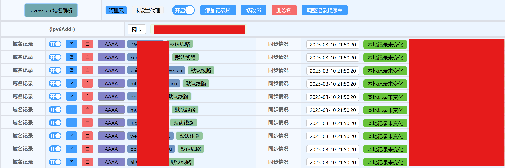

由于 IPv6 地址的充分性与广泛性，我一直认为公网 IPv6 裸奔是相对安全的，因此在之前一直使用的是 IPv6+ 正向代理的方式使用 NAS。前不久我一个同事买了台极空间，跟他进行了一些友好的交流——主要针对公网 IPv6 是否安全的问题进行了深入探讨。

我的观点是：IPv6 地址池那么庞大，并且是动态变换的，黑客要在这么庞大且不定的地址池中精准找到你的服务端口，并破解密码，根本就不可能。

但他否认了我这个观点：现在网络攻击根本就不是靠猜，它只需要进行网络劫持就能把你传输的数据拿到，HTTP 是明文传输，一旦被拿到，又没有进行 IP 拦截或者两步验证的话，你的 NAS 直接就肉鸡了。

后来我自己进行了一些简单的实验，发现确实数据，包括密码在内都是明文传输的，非常不安全。

然后我就对 NAS 进行了改造：

1. 将常用端口的防火墙设定为局域网 IP 段（10.0.0.1/24）
2. 关闭飞牛的远程访问功能（这个其实没必要，主要是我用不上）
3. 用在路由器上用 Lucky 做反向代理。

## 正向代理与反向代理

### 正向代理

想象一下，你在一个公司上班，公司网络对外是有限制的，比如不能直接访问某些外部网站。这时候，公司设置了一个“中间人”，我们叫它“正向代理服务器”。当你想访问外部网站时，你先把请求发给这个“中间人”，“中间人”再去访问外部网站，拿到内容后再转给你。这样做的好处是，外部网站看到的访问请求是来自“中间人”的，而不是你自己的电脑，这可以隐藏你的身份，同时也可以对访问进行一些控制，比如限制访问某些不安全的网站。

### 反向代理

再想象一下，你有一个自己的小网站，但是你担心直接暴露服务器的 IP 地址会有安全风险，或者你希望提高网站的访问速度。这时候，你可以在你的服务器前面设置一个“中间人”，我们叫它“反向代理服务器”。当用户访问你的网站时，他们其实是先访问这个“中间人”，“中间人”再去你的服务器获取内容，然后把内容返回给用户。这样做的好处是，用户看到的网站地址是“中间人”的地址，而不是你的服务器地址，这可以隐藏你的服务器，同时“中间人”还可以缓存一些内容，加快用户访问的速度。

### 总结
- **正向代理**：主要是帮助客户端（比如你）去访问外部资源，隐藏客户端的身份。例如，通过 8063 端口访问 MT-Photos，通过 8096 端口访问 Jellyfin 等等，通常访问形式为 http://{ip}:{port}。
- **反向代理**：主要是帮助服务器（比如你的网站）对外提供服务，隐藏服务器的身份，同时可以优化性能。代表性的用法是，通过不同的域名访问某个反向代理服务器，反向代理服务器通过域名来返回不同的服务给用户。

## Lucky 与 Nginx

在过去，最常见的反向代理服务器是 Nginx，Nginx 可以在部署静态网站的同时兼做反向代理，而它的某个替代品 Uhttpd 则没有反向代理功能。

但使用 Nginx 进行反向代理，通常需要进行配置文件的编写，常见的形式如下：

```
server {
    listen 80;  # 监听外部请求的端口
    server_name example.com;  # 你的域名

    location / {
        proxy_pass http://192.168.1.100:8080;  # 后端服务的地址
        proxy_set_header Host $host;  # 传递原始请求的 Host 头
        proxy_set_header X-Real-IP $remote_addr;  # 传递客户端的真实 IP
        proxy_set_header X-Forwarded-For $proxy_add_x_forwarded_for;  # 传递客户端的真实 IP
        proxy_set_header X-Forwarded-Proto $scheme;  # 传递原始请求的协议
    }
}
```

对于没接触过的人来说还是比较复杂的（其实熟悉了之后也没那么难，多尝试就好）。

而 Lucky 是一个开源的 Ruby Web 框架，它旨在提供一个简单、快速且高效的开发体验。Lucky 的设计灵感来源于其他流行的框架，如 Ruby on Rails，但它在某些方面进行了简化和优化，以减少样板代码，提高开发效率。

目前已经实现/集成的主要功能模块有

1. **端口转发**
2. **动态域名 (DDNS)**
3. **Web 服务**
4. Stun 内网穿透
5. 网络唤醒
6. 计划任务
7. **ACME 自动证书**
8. 网络存储

标黑的 1、2、3、7 项是 Lucky 的核心功能。


## 部署 Lucky

Lucky 可以部署在内网的任何一台设备上，对于部署，我的建议如下：

尽可能优先部署在路由器上，路由器实在无法安装，例如没有 docker 功能，无法 ssh 的话，再考虑装在路由器下面的设备。

### OpenWRT 编译安装

最推荐的安装方式，见 github：[luci-app-lucky](https://github.com/sirpdboy/luci-app-lucky)

这个包没有集成在 openWRT 和 immortalWRT 的官方仓库中，因此需要手动添加一下，很简单，就几行命令。

### 直接安装

[官网安装教程](https://lucky666.cn/docs/install)

建议尽量不要使用 docker，使用自动化安装最好，如果一定要用 docker 的话，务必要把网络设置为 bridge。

## 配置 Lucky

### 动态域名功能


主要关注红圈的地方，一项任务可以添加很多条动态域名记录。



### Web 服务功能

在 Web 服务功能中，可以进行反向代理配置。


这张图看着比较复杂，我们来拆解一下。

首先关注到“添加 Web 服务规则”，这个选项添加的是一个整体规则，相当于是一个规则的“模板”。


在“子规则列表”中添加的子规则，才可以精准地把你想要的服务添加进去。


在我的路由器上，我添加了两个服务：“反向代理 NAS 服务”以及“强制 https”。在“反向代理 NAS 服务”中，我将迅雷、qb 等等服务进行了反向代理，使得我可以使用 https 协议来访问 NAS 中的服务（NAS 中安装的迅雷等软件，不一定都直接支持开启 https，这种时候，要想安全访问，就只能通过反向代理服务来进行）。

通过 Lucky 可以更为简单的进行反向代理，不需要修改纯文本配置文件了。

那么强制 https 是什么呢？当我在网页上不加 http/https 访问网站 `qb.xxx.xx:port` 时，浏览器可以解析为 http 协议，这就导致我们无法访问该网站，必须手动添加 https:// 前缀才行，比较麻烦。

“强制 https”服务通过通配符 *.xxx.xx 将所有的 http 浏览重定向到了相应 https 的网站上，这样的话，无论浏览器中加不加 https，我们访问到的都是 https 网站。

当然别忘了还重要的时候，启用 https，还需要一个域名证书，Lucky 可以很方便地帮助我们申请证书。

### ACME 自动证书


这个功能比较简单，证书机构选择“Let's Encrypt”，其他选项就根据你的服务商进行选择即可。


据说这个证书会自动续签，挺方便的。申请完成之后就可以通过 https 访问所有的 NAS 服务了。

## 飞牛 OS 防火墙

最后说一下防火墙，如果我们已经配置好了反向代理服务，那我们可以通过 `域名:固定端口`的方式来访问内网的服务了。注意，我们的端口只有一个，假设为 8888，那么我们只需要暴露 8888 在公网上就可以了，是不是非常安全。


贴出来我的配置供大家参考。

首先，务必把入站规则的不符合规则改为“拒绝访问”，没有特别需求的话，就该这一项即可。

出于安全考虑，我还拒绝了所有的外网访问端口，仅允许我的内网网段 10.0.0.1/24访问，这样的话，外网直连无论如何也连不进我的设备。

不过我觉得一般用户也没必要做得这么过，只要在外网不使用 http 裸奔，还是比较安全的。

出站规则的话默认是全部放通，保持默认即可。